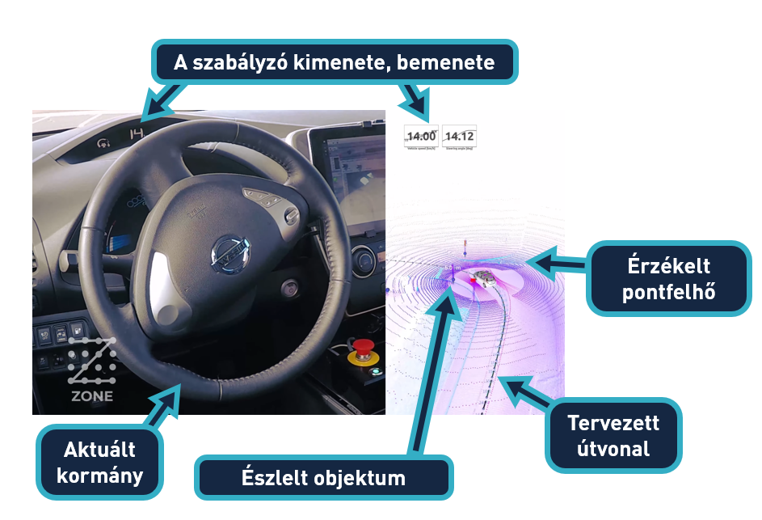
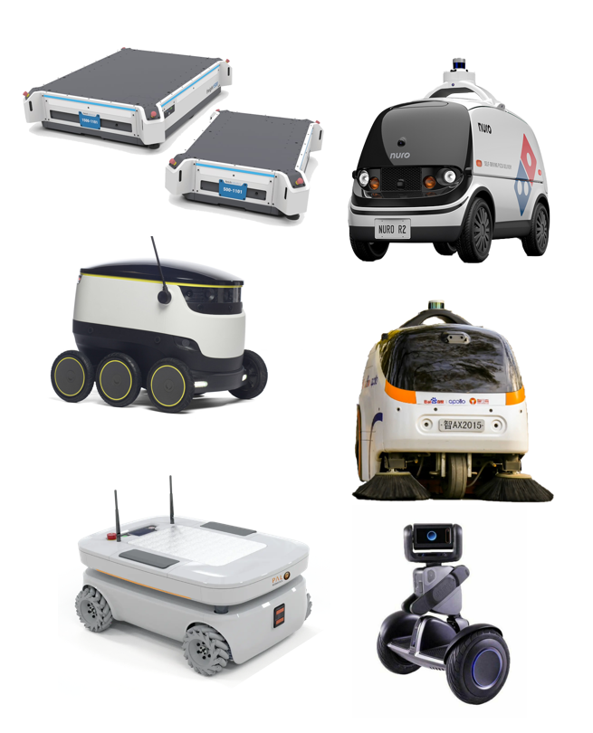
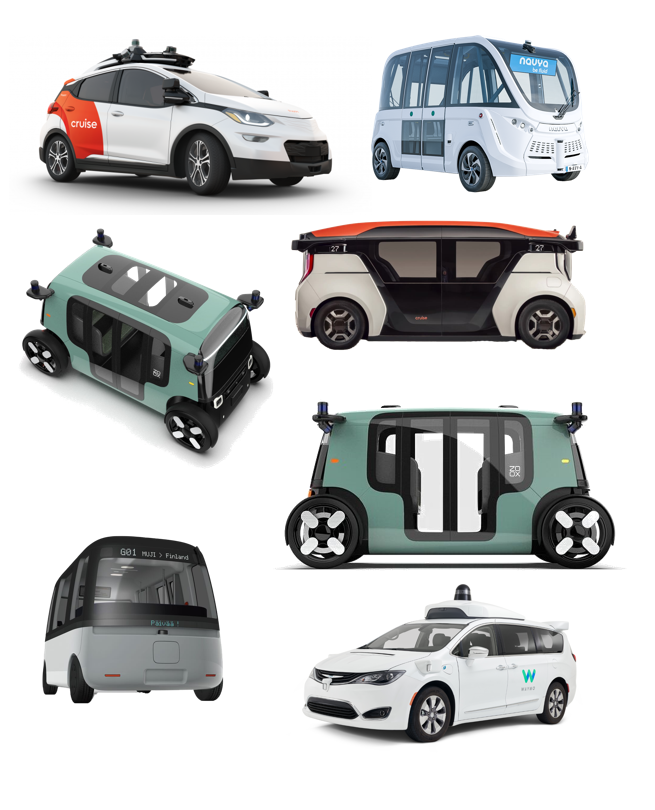

{: .no_toc }

  

    Tartalom
  

  {: .text-delta }
1. TOC
{:toc}

---

# Bevezetés

Rendszerszinten az önvezetés a következő alfunkciók összegeként írható le: 

Irodalom: [[TU München](https://github.com/TUMFTM/Lecture_ADSE)], [[Autoware](https://github.com/autowarefoundation/autoware)]

1. **Érzékelés**: egyszerű driver-program szintű nyers adatok előállításával foglakozik, pl egy kamera szenzorból a kép előállítása a rendszer számára
2. **Észlelés**: ez már összetettebb folyamat, a bemeneti adatokból kinyerni a rendszer számára fontos információkat, pl. a kamera képből a gyalogos felismerése
3. **Tervezés**: a jármű útját vagy trajektóriáját tervezi meg globális szinten (a szenzorok érzékelési tarományán túl) illetve lokális szinten (a szenzorok érzékelés tartományán belül)
4. **Szabályozás**: a tervező által előállított útvonal vagy tarjektória lekövetése, pl Pure-pursuit szabályzó, Modell Prediktív Szabályzó (Model Predictive Control, MPC) stb. segítségével
5. **Aktuálás**: a rendszer által előállított referenciajelek (kormányszög, gáz és fékpedál) kiadása (pl [CAN bus](https://en.wikipedia.org/wiki/CAN_bus) rendszeren)

Nézzünk minden részfeladatra egy szemléltetést, ahol az egyetemünk egyik önvezető funkciókkal rendelkező autóján, a zalaegerszegi tesztpályán:

<iframe width="560" height="315" src="https://www.youtube.com/embed/9eFqsei1J70" title="YouTube video player" frameborder="0" allow="accelerometer; autoplay; clipboard-write; encrypted-media; gyroscope; picture-in-picture; web-share" allowfullscreen></iframe>

# Önvezetés vs vezetéstámogatás 
## SAE szintek

A SAE J3016 szabvány definiálja a sofőr és a jármű rendszere közötti munkamegosztást. 

- **0. szint**: L0 - No Driving Automation, azaz a vezetésautomatizáció teljes hiánya. 
- **1. szint**: L1 - Driver Assistance, itt bizonyos vezetéstámogató funkciók már beleszólhatnak a jármű mozgásába.
- **2. szint**: L2 - Partial Driving Automation, azaz mindkét irányba történő manővert elvégzi az autó, a felügyelet az emberé.
- **3. szint**: L3 - Conditional Driving Automation, itt ha a jármű kéri, a sofőrnek vissza kell vennie az irányítást.
- **4. szint**: L4 - High Driving Automation, itt már minden felelősség a járművé, de hagyományos üzemmódban is használható még.
- **5. szint**: L5 - Full Driving Automation, Autonomous, itt is a jaárműé a feleősség, sőt nem is lehet hagyományos kormánnyal használni.

## Példák

Ahogy láthattuk önvezető (autonomous) járművekhez (L5) hasonló technológiák találhatók a vezetéstámogató (automated) szinteken (L2/L3) is. Azonban a feladat komplexitásban teljesen más szintet jelent.

| Szint: | L2/L3 | L5 |
|---:|:---:|:---:|
| Elnevezés: | Automatizált, vezetéstámogató | Autonóm, önvezető |
| Jellemző szenzorok:| Kamera, radar | Kamera, radar, LIDAR, GPS |
| Példák: | Tesla, Audi, BMW | Waymo, Zoox, Cruise |

# Önvezető járművek és robotok

| Robotok | Robotaxik |
|---|---|
|  |  |
| Nuro, Segway, Turtlebot, Clearpath, Starship  | Zoox, Cruise, Waymo, Navya, Sensible4 |

Nézzünk egy példát, ami a Zoox önvezető robotaxit mutaja be működés közben:

<iframe width="560" height="315" src="https://www.youtube.com/embed/2sGf_3cAwjA" title="YouTube video player" frameborder="0" allow="accelerometer; autoplay; clipboard-write; encrypted-media; gyroscope; picture-in-picture; web-share" allowfullscreen></iframe>