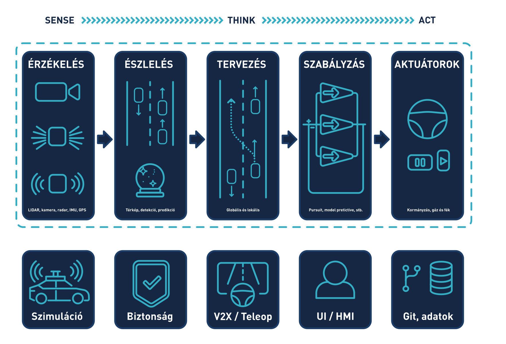

# Bevezetés

Rendszerszinten az önvezetés a következő alfunkciók összegeként írható le: 

Irodalom: [[TU München](https://github.com/TUMFTM/Lecture_ADSE)], [[Autoware](https://github.com/autowarefoundation/autoware)]

