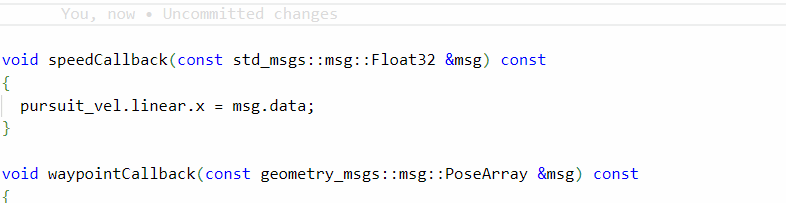

 

  

    Tartalom
  

  {: .text-delta }
1. TOC
{:toc}

---

# Coplilot

A GitHub Copilot egy programozást segítő eszköz: [github.com/features/copilot](https://github.com/features/copilot). AI technológiákon alapul, hasonlóan a ChatGPT-hez. Kifejezetten hasznos kezdő programozóknak, de tapsztalt fejlesztőknek is nagy segítség lehet. A GitHub Copilot segítséget nyújt a fejlesztőknek a kód írásában, kiegészítésében és javításában, javaslatokat tesz a kódolási mintákra és struktúrákra, és gyorsabban hozzásegíthet a fejlesztőket a problémák megoldásához.

A GitHub Copilot többféle programozási nyelvet támogat, így segíthet különféle fejlesztési feladatokban, például robotikai fejlesztésben, adatbáziskezelésben, mobilalkalmazás-fejlesztésben és sok más területen.

Az eszköz beépül a fejlesztői környezetekbe, például a Visual Studio Code-ba, és közvetlenül az alkalmazáson belül lehet használni.

Használata alapértelmezetten fizetős, de hallgató hozzáféréssel ingyenes: [education.github.com/benefits](https://education.github.com/benefits?type=student).

Nézzük meg működés közben a copilot-ot:

