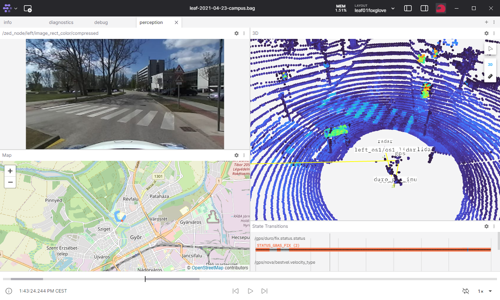

 

<details markdown="block">
  <summary>
    Tartalom
  </summary>
  {: .text-delta }
1. TOC
{:toc}
</details>

---


# Géptermi ismeretek (`C100`)

## Közös meghajtó (`K:\`)

A közös meghajtó a `K:\` meghajtóként található meg Winodws Fájlkezelőben (File Explorer). Ha esetleg nem látszana, akkor szintén a Fájlkezelőben elérhető: `\\fs-kab.eik.sze.hu\C100\kozos`.


A tantárgyhoz kapcsolódó fájlok pontosan a [`\\fs-kab.eik.sze.hu\C100\kozos\GKNB_AUTM078_Autonóm_robotok_és_járművek_programozása`](\\fs-kab.eik.sze.hu\C100\kozos\GKNB_AUTM078_Autonóm_robotok_és_járművek_programozása) címen érhetőek el.

### WSL és közös meghajtó

WSL alól szintén el kellene tudni érni a közös meghajtót mégpedig az `/mnt/kozos` mount ponton. Teszteljük az elérést a `cd /mnt/kozos` paranccsal. Ha a `-bash: cd: /mnt/kozos: No such file or directory` üzenetet kaptuk, akkor hozzuk létre `mkdir` segítségével. Ha az `ls /mnt/kozos` nem listáz fájlokat, akkor pedig nincs felmountolva.

Ha esetleg nem működne a közös meghajtó, akkor ezek a parancsok segíthetnek:

``` r
sudo mkdir /mnt/kozos
echo "\\\\\\\\fs-kab.eik.sze.hu\C100\kozos\GKNB_AUTM078_Autonóm_robotok_és_járművek_programozása    /mnt/kozos    drvfs defaults,uid=1000,gid=1000    0    0" | sudo tee -a /etc/fstab
```
Majd `wsl --shutdown` windows cmd-ből.


## WSL a Fájlkezelőben

Az Ubuntu 22.04 fájljai szintén elérhetőek a Windows Fájlkezelőből. Bal oldlalt lászik egy WSL vagy Linux felirat. A `~` a `/home/<gépnév>` mappán belül érhető el, így a `ros2_ws` is. 


## VS code

## VS code WSL elérés


## VS code hasznos extension-ök


## Windows terminal

A közös meghajtón található egy portable verzió. Ezt a `C:\temp`-be másolva használható a program.


A következő ábra egy **célszerű** (nem kötelező) géptermi elrendezést mutat, bal oldalt a terminal, jobb oldalt a böngésző:


## Foxglove

Telepítve van, az asztalon található ikonnal indítható. Ha mégse lenne telepítve, a közös meghajtón lévő portable verziót kell a `C:\temp`-be másolni. 

