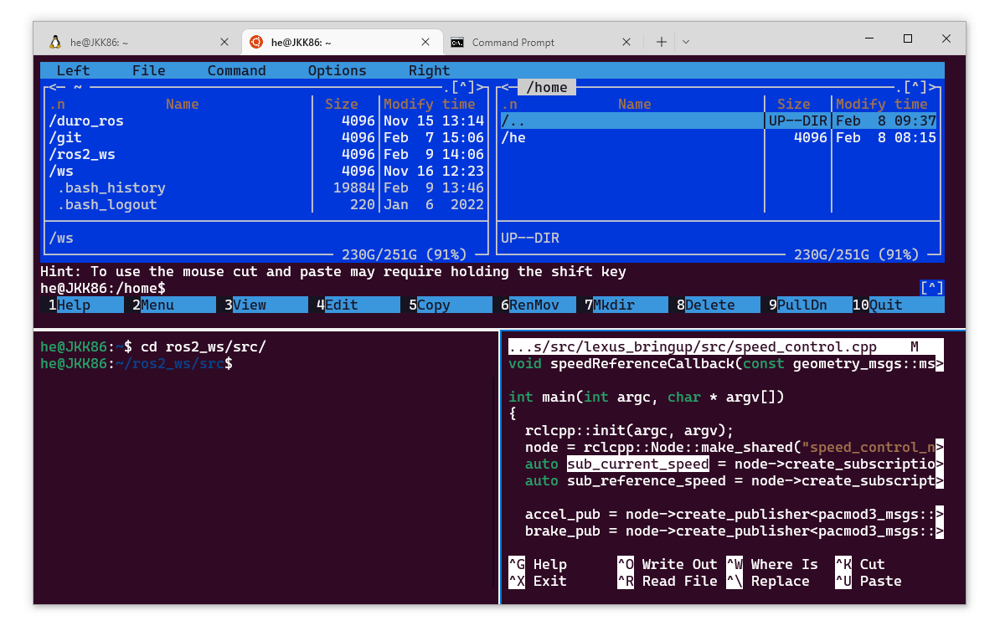
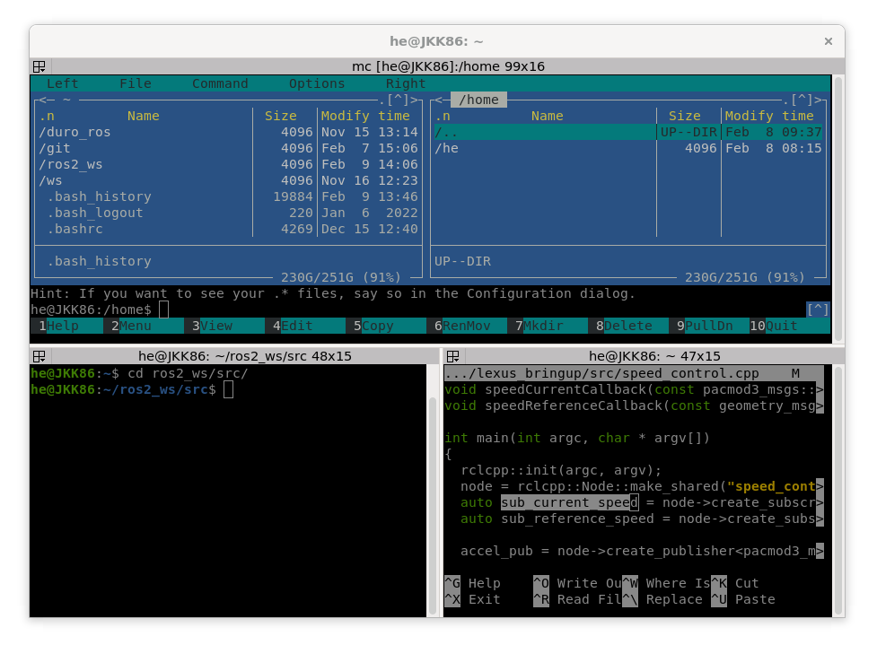
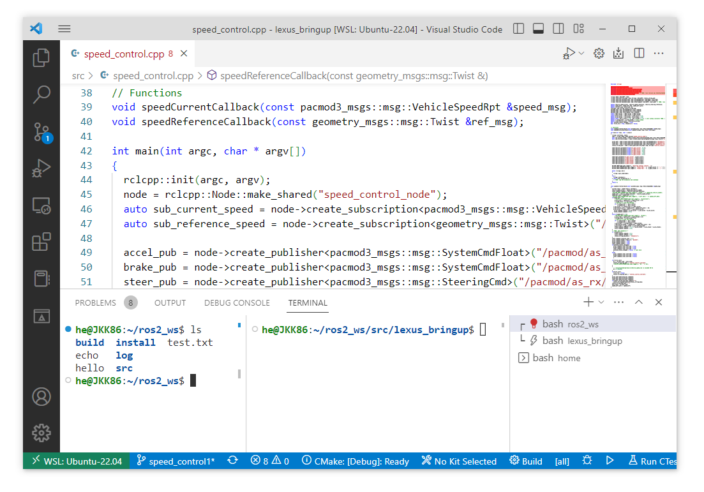
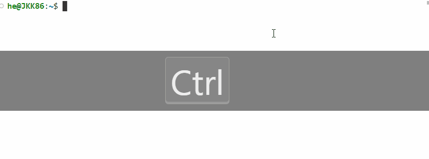
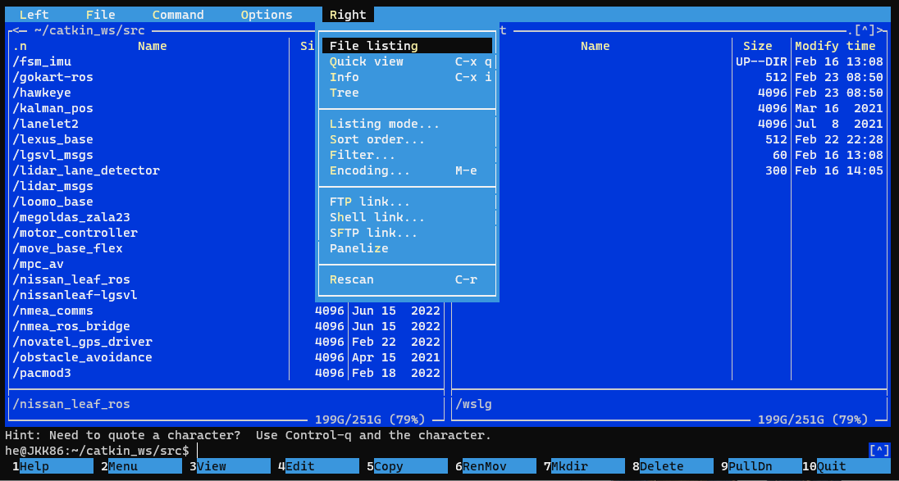
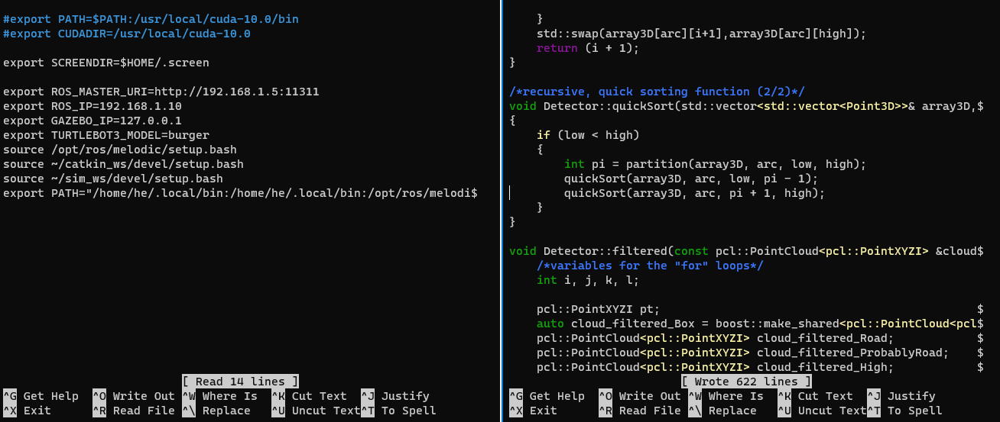
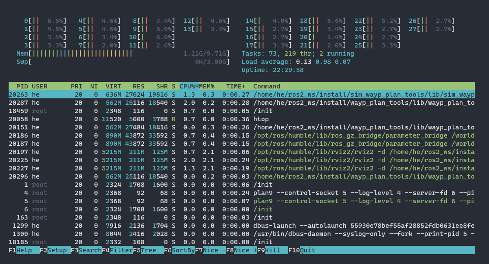
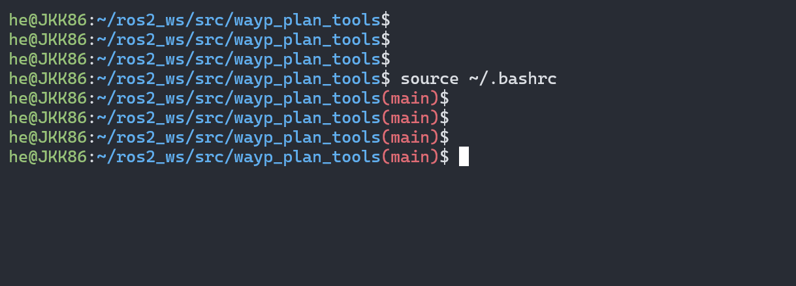

{: .no_toc }

<details open markdown="block">
  <summary>
    Tartalom
  </summary>
  {: .text-delta }
1. TOC
{:toc}
</details>

---


# Linux

A leírásban alapvető Linux ismeretek találhatók. Linuxban (ebben a leírásban értsd  Ubuntu, Raspbian) a legtöbb munkamenetet lehetséges, vagy épp célszerű terminálból végrehajtani.
Ez a tutorial segít a linux terminál alapjainak megismertetésében.

{: .highlight }
Fontos, hogy a megszokott `ctrl`+`v`, `ctrl`+`c` helyett itt a `ctrl`+`shift`+`v`, `ctrl`+`shift`+`c` működik. A `ctr`+`c`(megszakítás billentyűzetről) pl. egy ROS node (program) befejezésére használható itt. 

# Ajánlott terminálprogramok

Számos program választható a szöveges parancssor elérésére. ROS/ROS2 esetén talán a következők a legjobb választások.

## Windows Terminal

Ahogy a neve is mutatja, ez a megoldás WSL esetén, Windows-on releváns. Előnye, hogy egy helyen használhatunk több Linux disztribúciót akár Windows parancssorral is. `Ctrl-Shift-P` billentyű kombinációkkal, majd a Split down, Split left parancsokkal oszhatjuk szét hasonló módon a terminált:



## Terminator

Linuxon értelmezett terminál, de telepíteni kell.

``` bash
sudo apt update
sudo apt install terminator
```

Terminator-ban `Ctrl-Shift-O`, `Ctrl-Shift-E` billentyű kombinációkkal oszthatjuk tovább az adott ablakot. `Ctrl-Shift-W` bezárja az aktív ablakot.




## VS code terminal

A fejlesztőkörnyezet beépített terminálja, mind Windowson, mind Linuxon működik.




# Fontosabb terminal parancsok
## Korábbi parancsok


- `Fel nyíl🔼` vagy `Le nyíl🔽` - A közvetlenül ezelőtti parancsokat érhetjük el így.
- `Ctrl+R` billenytűkombinációval korábbi parancsok hívhatók elő, időrenben egyre korábbiak
- `Ctrl+Shift+R` billenytűkombinációval korábbi parancsok hívhatóak elő, de időrenben előre haladva 

A megszokott `ctrl`+`v`, `ctrl`+`c` helyett itt a `ctrl`+`shift`+`v`, `ctrl`+`shift`+`c` működik. A `ctr`+`c` pl. egy ROS node (program) befejezésére használható itt.



## Automatikus kiegészítés

- `Tab` billenytűvel az elkezdett parancsok egészíthetőek ki
- `Tab Tab` billenytűkombinációval az összes lehetséges parancsot fogja kilistázni


## Képrnyőtörlés

- `Ctrl+L` billenytűvel törölhetőek a korábbi szövegek, így jobban átlátható lesz a terminal

## Könyvtárak közötti navigáció
- `cd`: adott könyvtárba / mappába történő belépés
  - pl `cd ~/catkin_ws/src`, `cd ../..`
- `ls`: listázás: könyvtárak, fájlok
- `mkdir`: könyvtár készítése
- `pwd`: aktuális munkakönyvtár kiíratása (print working directory)
- `cp`: Ezzel a paranccsal tudunk másolni (`cp` `/file/helye` `/ahova/másolni/akarod/`, `cp -r` `/a/könyvtár/helye` `/ahova másolni/akarod`)
- `mv`: Ezzel adott fájlt vagy könyvtárat tudunk mozgatni (áthelyezni) vagy átnevezni (`mv /a/fájl/helye *fájl új neve`, `mv /a/fájl/helye /a/fájl/új/helye`)
- `rm`: Fájlok törlése (`rm /a/fájl/helye, rm -r /a/fájlok/és/mappák/helye`) Az `rm -r` parancsnál minden törlődni fog a meghatározott helyen.
- `rmdir`: Egy üres könyvtár törlése
- `chmod`: (change mode) Arra alkalmas, hogy megváltoztassuk a fájlok / mappák hozzáférési jogait. Tehetjük ezt például karakteres kapcsolókkal (r, w, stb.), vagy oktálisan (számjegyekkel).
  - pl `chmod +x my_python_node.py`: írási jog hozzáadása
  - pl `chmod 777 everything.py`: minden jog hozzáadása

### `chmod`

|N|Sum|`rwx`|Permission|
|-|---|-----|----------|
|`7`	|4(r)+ 2(w) + 1(x)|	`rwx`	|read, write and execute|
|`6`	|4(r)+ 2(w)|	`rw-`	|read and write|
|`5`	|4(r)+ 1(x)|	`r-x`	|read and execute|
|`4`	|4(r)|`r--`	|read only|
|`3`	|2(w)+ 1(x)|`-wx`	|write and execute|
|`2`	|2(w)|`-w-`	|write only|
|`1`	|1(x)|`--x`	|execute only|
|`0`	|0   |`---`	|none|

### Könyvtárak

| Hely  |  Magyarázat |
|-------|---|
|`/`    | A könyvtárfa kiindulópontja, gyökér  |
|`/boot`| Rendszerindítás, bootloader |
|`/bin` | A futtatható parancsok, binaries |
|`/sbin`| A rendszergazda parancsai, superuser/system bin   |
|`/lib` | Az induláshoz szükséges osztott rendszerkönyvtárak -libraries- illetve, modulok, meghajtóprogramok  |
|`/dev` | Eszközök, mint például USB (`ttyUSB0`) - devices  |
|`/etc` | Beállítófájlok, helyi indító parancsok, jelszavak, hálózati beállítók stb. helye.  |
|`/home`| Itt található minden felhasználó saját könyvtárat. Például ha a `sanyi` felhasználóval vagyunk belépve, `/home/sanyi` tartalmazza a fájljainkat. A `/home/sanyi/Desktop`, vagy röviden `~/Desktop` az asztalunk tartalma. |
|`/mnt` | A felcsatolt (mountolt) perifériák, fájlrendszerek helye, mount.  |
|`/proc`| Process information |
|`/root`| A root user könyvtára  |
|`/tmp` |  Temp |
|`/usr` |  Universal system resources, alkalmazások, rendszereszközök |
|`/var` |  Változó adatok, például nyomtatási munkák, email-ek |

## Verziókezelés
- `git clone`: git repo klónozása
- `git config --global user.name "Sanyika"`: felhsználónév beállítása
- `git config --global user.email "sanyika@gggmail.com`: email beállítása
- `git init`: lokális repó inicializálása
- `git add <file>`: fájl hozzáadása
- `git status`: aktuális státusz lekérdezése
- `git commit -m "My beautiful commit"`: commit, üzenettel
- `git push`: push
- `git pull`: pull
- `git branch <new_branch_name>`: branch készítése
- `git checkout <branch_name>`: új branch
- `git merge <branch_name>`: a jelenlegi branch-be mergeli a branch-t

{: .important-title }
> Tipp
>
> A legtöbb művelet VS code-dal elvégezhető terminál nélkül is.

## Szöveges fájlok
- `wget`: webes tartalmak letöltése terminalból
- `cat`: fájl tartalmának kiíratása
- `touch`: szöveges fájl létrehozása
  - pl. `touch hello.txt`
- `echo`: kiíratás, vagy fájlba írás (`>>` operátor). Amennyiben nem létezik a fájl, létrehozza (`touch`)
  - pl. `echo "hello" >> hello.txt`  
  - pl. `echo "n = 5; print('\n'.join(':D ' * i for i in range(1, n + 1)))" >> hello.py` 
  - pl. `rostopic list >> hello.txt` 
  - pl. `rostopic echo -n1 /scan >> hello.txt` 
- `nano`: szövegszerkesztő: egyszerű, terminál-alapú
- `code`: szövegszerkesztő: GUI, VS code
  - pl. `code .` megnyintja az aktuális mappa tartalmát
  - pl. `code ~/.bashrc` megnyintja a  `~/.bashrc` tartalmát szerkesztésre
- `catkin`: catkin tools: wrapper a `cmake` és `make` parancsok egyszerűbb használatához


## Telepítés
- `sudo apt install` vagy `sudo apt-get install`: szoftver csomagkezelővel történő telepítés, Advanced Packaging Tool (APT). 
  - pl. `sudo apt install tree mc` - tree és mc programok telepítése 
- `sudo`: (Superuser do) Lehetővé teszi, hogy rendszergazdaként vagy más felhasználó nevében hajtsunk végre parancsokat.
- `sudo apt update`: csomagindex frissítése, ha új verziók jönnek ki különböző szoftverekből, ezt a paracsot a telepítés (`apt install`) előtt célszerű kiadni.
- `sudo apt update`: már telepített csomagok frissítése
- `apt list`: listázza asz összes telepített csomagot
  - pl. `apt list | grep ros`: leszűri csak az `ROS`-hez kapcsolódó csomagokat

## További hasznos eszközök

### Navigáció
- `Ctrl + a` vagy `home`: A sor elejére dob
- `Ctrl + e` vagy `end`: A sor végére dob
- `Ctrl + ◀` / `Ctrl + ▶`: Az előző / következő szóra ugrik
### `grep`
- `grep`: (Global \ Regular Expression \ Print) fájlokban illetve parancsok kimenetében keres
  - pl. `grep 'ROS' ~/.bashrc`: listázza a `bashrc` fájlban az `ROS` szöveget tartalmazó sorokat
  - pl. `rostopic list | grep pose`: listázza az összes topicot, amiben van `pose` string
### `ssh`
- `ssh`: (Secure Shell Protocol) linux gépektbe távoli terminal bejelentkezést tesz lehetővé
  - pl. `ssh nvidia@192.168.1.5`: belépés az adott user adott IP címen lévő gépébe
  - pl. `ssh user01@computer4 -X`: belépés `-X` X window használatával, így az esetleges ablakok a mi gépünkön jelennek meg, de a távoli gép hostolja őket
  - pl. `ssh laptop@192.168.0.2 touch hello.txt`: létrehoz az adott gépen egy fájlt, nyilván más parancsokkal is működik
### Gyakran használt parancsok
- A fájlrendszer állapotáról a `df -h` (disk filesystem, human readable) parancs ad tájékoztatást
- Futó folyamatokról a `ps` ad tájékoztatást pl: `ps -A | grep ros`

Az `ssh` alapvetően jelszót is kér, de ha megbízunk egy adott gépben, elmenthetjük a privát-publikus kulcspárt, és akkor erre nincs szükség, [például így](https://github.com/szenergy/szenergy-public-resources/wiki/H-SSH-no-password).

### `rsync` hálózati másolás

Hálózatba kötött gépek közötti másolás (remote sync), pl. egy Nvidia Jetson beágyazott számítógépről a saját gépünk `/mnt/c/bag/` mappájába történő másolás progress-barral így néz ki:

``` r
rsync -avzh --progress nvidia@192.168.1.5:/mnt/storage_1tb/2023-07-02/ /mnt/c/bag/2023-07-02/
```

### `screen`

Virtuális terminálokat indít, kezel, például:
``` r
screen -m -d -S roscore bash -c roscore
screen -m -d -S campfly bash -c 'roslaunch drone_bringup campus_fly.launch'
screen -m -d -S rviz1 bash -c 'rosrun rviz rviz'
```

- list screen: `screen -ls`
- restore screen:  `screen -r roscore` / `screen -r campfly` /  `screen -r rviz1`
- detach: `Ctrl-a` + `Ctrl-d`
- kill: `killall -9 screen` and `screen -wipe`


### `mc` fájlkezelő

GNU Midnight Commander (`mc`), a Norton Commander inspirálta fájlkezelő:



### `nmtui`

Az `nmtui` (Network Manager Text User Interface) terminal-alapú Wifi / Ethernet / Hálózat konfigurátor.


### `nano` szövegszerkesztő
Terminal alapú szövegszerkesztő. Szerkesztés után `Ctrl+X` a kilépés, utána `Y`-t ütve menti a fájlt.




### `htop` / `top`

Az htop egy interaktív folyamatfigyelő parancs (nagyjából a windows task manager funkcionalitása), amely megjeleníti és felügyeli a futó folyamatokat a rendszeren. Memória- és CPU-használat folymatonként részletezve is kilvasható, továbbá van lehetőség a `kill` használatára is.



### `~/.bashrc` fájl

A `bashrc` fájl (a `~` jelentése, hogy `user1` felhasználó esetén a `/home/user1/` mappában található, a `.` jelentése pedig, hogy rejtett fájl) minden terminal indtáskor lefutó fájl. Tehát, ha pl egy parancsot írunk bele, ami `echo "hello"` akkor minden terminal indításkor kiír egy hello üzenetet. Szerkesztése `nano`/`VS code` szövegszerkesztőből:

```
nano ~/.bashrc
code ~/.bashrc
```

Számunkra fontos környezeti változók pl:
``` c
export ROS_MASTER_URI=http://192.168.1.5:11311
export ROS_IP=192.168.1.10
export GAZEBO_IP=127.0.0.1
export TURTLEBOT3_MODEL=burger
source /opt/ros/noetic/setup.bash
source ~/catkin_ws/devel/setup.bash
```

A `bashrc` fájl módosítása után nem kell új terminált nyitni, ha kiadjuk a következő parancsot:

```
source ~/.bashrc
```

#### ROS 1 

*Figyelem:* a fejezetben a régi ROS 1-es könyzeteti változókról van szó, az új ROS 2-est a következő fejezet tartalmazza. 
Kiírathatjuk a környezeti változókat (environment variables) `echo`-val / `printenv`-vel pl:

``` php
echo $ROS_MASTER_URI
printenv ROS_MASTER_URI

http://192.168.1.5:11311
```
``` php
echo $ROS_IP
printenv ROS_IP

192.168.1.10
```

#### ROS 2 

Kiírathatjuk a környezeti változókat (environment variables) `echo`-val / `printenv`-vel pl:

``` php
echo $ROS_DISTRO
printenv ROS_DISTRO

humble
```
``` php
echo $AMENT_PREFIX_PATH
printenv AMENT_PREFIX_PATH

/opt/ros/humble
```

```php
printenv | grep -i ROS

ROS_VERSION=2
ROS_PYTHON_VERSION=3
ROS_DISTRO=humble
```

#### Gazebo és WSL 

Gazebo szimulátort és WSL-t használva előfordulhat egy [issue](https://github.com/gazebosim/gz-sim/issues/1841), ami egy egyszerű környezeti változó beállításával javítható. A `~/.bashrc` fájlban a következőt kell beállítani.

``` php
export LIBGL_ALWAYS_SOFTWARE=1 ### GAZEBO IGNITION 
```

Új terminál vagy `source` után a `echo $LIBGL_ALWAYS_SOFTWARE` parancsra `1`-et fog kiíni.

### Branch megjelenítése Linux bash-ben
*Opcionális, de hasznos lehet*: Keressük meg és módosítsuk a `~/.bashrc` fájlban a következő részt. 

*(VS code használatával a következő parancs: `code ~/.bashrc`)*

``` bash
if [ "$color_prompt" = yes ]; then
    PS1='${debian_chroot:+($debian_chroot)}\[\033[01;32m\]\u@\h\[\033[00m\]:\[\033[01;34m\]\w\[\033[00m\]\$ '
else
    PS1='${debian_chroot:+($debian_chroot)}\u@\h:\w\$ '
fi
unset color_prompt force_color_prompt
```

Miután megvan, cseréljük a következő részre:

``` bash
parse_git_branch() {
 git branch 2> /dev/null | sed -e '/^[^*]/d' -e 's/* \(.*\)/(\1)/'
}
if [ "$color_prompt" = yes ]; then
 PS1='${debian_chroot:+($debian_chroot)}\[\033[01;32m\]\u@\h\[\033[00m\]:\[\033[01;34m\]\w\[\033[01;31m\]$(parse_git_branch)\[\033[00m\]\n\$ '
else
 PS1='${debian_chroot:+($debian_chroot)}\u@\h:\w$(parse_git_branch)\\n$ '
fi
``` 
Mentsünk, majd a `source ~/.bashrc`, illetve minden új terminálnyitás hatására git repository-t tartalmazó könyvtárban a következőhöz hasonló bash fogad majd minket:



Forrás: 
[Ubuntu magyar dokumentációs projekt `CC by-sa 2.5`](http://sugo.ubuntu.hu/community-doc/hardy/universe/basic/terminal_hasznalata.html), [Óbuda University `CC BY-NC-SA 4.0`](https://github.com/ABC-iRobotics/ros_course_materials_hu/blob/main/LICENSE.md)