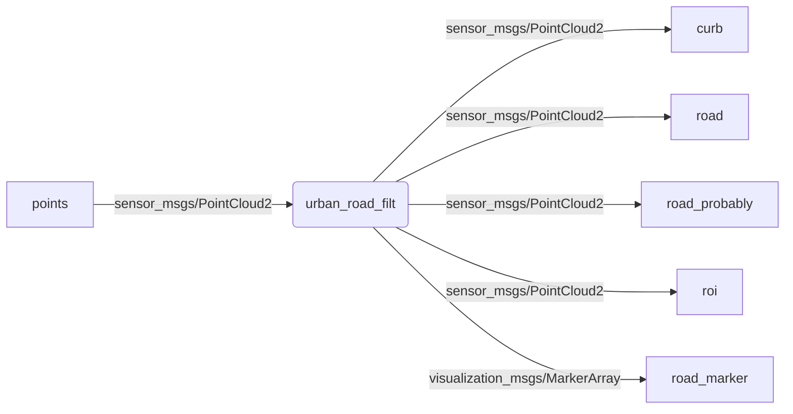

{: .no_toc }

<details open markdown="block">
  <summary>
    Tartalom
  </summary>
  {: .text-delta }
1. TOC
{:toc}
</details>

---


# `ROS 1` (`ROS`) alapfoglamak

Az `ROS` olyan szoftverkönyvtárak és eszközök készlete (middleware), amelyek segítenek robotalkalmazások fejlesztésében. Definíció szerint a middleware egy szoftver komponenseket összekötő szoftver. Olyan réteg, amely az operációs rendszer és az alkalmazások között helyezkedik el az elosztott számítógépes hálózat mindkét oldalán.

A legtöbb robotikai fejlesztő már a robtika hajnalán úgy gondolta, hogy nem célszerű minden robotnak teljesen egyedi szoftvert létrehozni, célszerűbb lenne valamilyen keretrendszerben gondolkozni. Erre az igényre volt az egyik válasz az `ROS`. Az egységes mértékegységek, standardizált kommunkáció, beépített vizualizációs és debug lehetőségek miatt ma az [egyik](https://metrics.ros.org) [legnépszerűbb](https://en.wikipedia.org/wiki/Robot_Operating_System) ilyen rendszer.


## Verziók

[ROS verziók és telepítés](https://sze-info.github.io/arj/telepites/README.html)

Melodic
{: .label .label-green }

Noetic
{: .label .label-purple }

# Koncepciók

## Nodes 

A node legegyszerűbben fogalmazva ROS programot (magyarosítva csomópont) jelent. Jellemzőik:

- "Végrehajthatóak" (c++ / py).
- Minden node egy folyamat
- ROS kezeli a szálakat (threading).
- Egy node belsejében több szál is lehet.
- publish/subscribe to topics. 
- Több node is "közzétehet" egy topicra, és egy node több topicot is "meghallgathat".

## Topics

- A node-ok közötti információ áramlásért felel.
- Minden topic típusát az "üzenet" határozza meg
- A node-ok között megengedett a "many-to-many" kommunikáció 

## Messages

- Egy topic tartalmát és szerkezetét az üzenet határozza meg
- Alkalmazásprogramozási interfész (API) a Node-ok számára .msg  kiterjesztésű fájlokban vannak definiálva

### Üzenetek típusai 
- Primitive built-in types (std_msgs)
  - `bool`, `string`, `float32`, `int32`, `…`
- Higher-level built in types:
  - `geometry_msgs`: `Point`, `Polygon`, `Vector`, `Pose`, `PoseWithCovariance`, `…`
  - `nav_msgs`: `OccupancyGrid`, `Odometry`, `Path`, `…`
  - `sensors_msgs`: `Joy`, `Imu`, `NavSatFix`, `PointCloud`, `LaserScan`, …
- Támogatottak továbbá:
  - Konstansok
  - Felsorolások
  - Beágyazott definíciók

Példa:

``` c
$ rosmsg show geometry_msgs/Point
float64 x
float64 y
float64 z
```

``` c
$ rosmsg show std_msgs/Header
uint32 seq
time stamp
string frame_id
```

A `Header` és a`Point` a típusból épül fel a `PoseStamped` típus struktúrája:

``` c
$ rosmsg show geometry_msgs/PoseStamped
std_msgs/Header header
  uint32 seq
  time stamp
  string frame_id
geometry_msgs/Pose pose
  geometry_msgs/Point position
    float64 x
    float64 y
    float64 z
  geometry_msgs/Quaternion orientation
    float64 x
    float64 y
    float64 z
    float64 w
```

## Publishing / Subscribing

A következőkben az `urban_road_filt` nevű node a `points` adatokra iratkozik fel, ami `PointCloud2` típusú, és hirdet `PointCloud2`, `MarkerArray` típusú üzeneteket:



## Parameters
- Publish/Subscribe segítségével nem írható le minden
- A Node-oknak néha szükségük lehet paraméterezésre
- Paraméterek lehetnek:
  - Vezérlő típusa
  - Szín küszöbértékek; 
  - Kamera felbontás, stb

## Launch fájlok

Több node (ROS program) kötegelt végehajtása. XML formátumú fájl, amely az ROS szinte minden aspektusát / műveletét meghatározhatja. Node indítás, paraméterek beállítása / betöltése, topic leképezése, parancssori argumentumok átadása.


## ROS Master

- Egy speciális node
- Összekapcsolja a publisher és subscriber node-okat a  topic-okon keresztül
- Segíti a node-ok közti  kommunikációt
- Tényleges forgalom nem megy rajta keresztül
- TCP/IP protokoll


[ROS bevezetés](https://docs.google.com/presentation/d/e/2PACX-1vTl-60emc4HDBYLlGXbSuV7m7T3cbYpqxPU1MnaKxG9J-2XBD9-8eQyKNB0JffPFcOzRMbtXGASlm2x/pub?start=false&loop=false&delayms=3000) _(online google prezentáció magyarul)_

