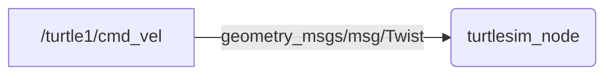
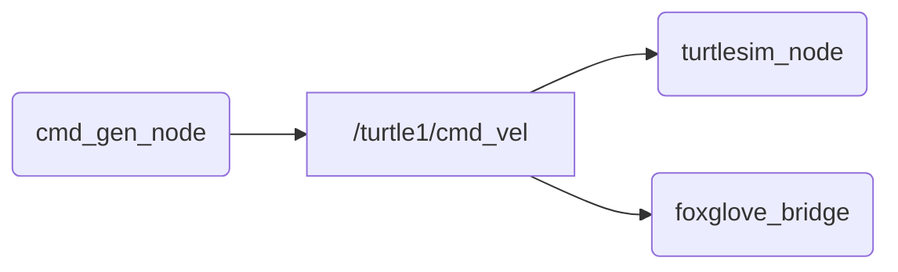

{: .no_toc }

<details open markdown="block">
  <summary>
    Tartalom
  </summary>
  {: .text-delta }
1. TOC
{:toc}
</details>

---


# `ROS 2` bevezetés és gyakorlat

## Emlékeztető

Pár alapfogalom az [előző](https://sze-info.github.io/arj/bevezetes/ros2.html) alkalomról: 

- **Node**: Gyakorlatilag ROS *program*ot jelent. (pl. `turtlesim_node`, `cmd_gen_node`, `foxglove_bridge`)
- **Topic** (topik): Nevekkel ellátott kommunikációs csatorna. (pl. `/turtle1/cmd_vel`, `/turtle1/pose`, `/raw_cmd`)
- **Message** (üzenet): (pl. `std_msgs/msg/Bool`, `geometry_msgs/msg/Twist`, `turtlesim/msg/Pose`)
- **Package** (csomag): ROS programok (node-ok) gyűjteménye (pl. `turtlesim`, `arj_intro_cpp`, `arj_transforms_cpp`)
- **Launch fájlok**: Több node paraméterezett elindítására alkalmas (pl. `multisim.launch.py`, `foxglove_bridge.launch.xml`, `foxglove_bridge.launch.py`)
- **Publish / subscribe**: Üzenetekre történő publikálás és feliratkozás. 
- **Build**: A package forráskódjából futtatható állományok készítésének folyamata. ROS2-ben a `colcon` az alapértelmezett build eszköz. 

# `1.` feladat - Node és publish

Nyissunk két terminált. Az első terminálból indítsuk a beépített `turtlesim_node` szimulátort, ami a `turtlesim` package-ben található.

``` r
ros2 launch turtlesim turtlesim_node
```

*Megjegyzés*: ha esetleg valamiért hiányozna, telepíthető a `sudo apt install ros-humble-turtlesim` paranccsal.

A második ablakból publikáljunk egy parancsot, melynek hatására körbe fordul:

``` r
ros2 topic pub /turtle1/cmd_vel geometry_msgs/msg/Twist '{linear: {x: 0.5, y: 0.0, z: 0.0}, angular: {x: 0.0, y: 0.0, z: 1.2}}'
```

<center></center>

A háttérben a `turtlesim_node` node (kerek jelölés) feliratkozik a `/turtle1/cmd_vel` topicra (szögletes jelölés), ennek hatására indul a mozgás. 




Ahogy a flowcharton is látszik, a `/turtle1/cmd_vel` típusa `geometry_msgs/msg/Twist`. Ezt a következő parancsból tudhatjuk meg:

``` r
ros2 topic type /turtle1/cmd_vel
```

A `geometry_msgs/msg/Twist` a üzenet strutúráját pedig ez a parancs adja:

``` r
ros2 interface show geometry_msgs/msg/Twist
```

``` r
Vector3  linear
        float64 x
        float64 y
        float64 z
Vector3  angular
        float64 x
        float64 y
        float64 z
```
Az összes topic-ot így lehet listázni:

``` r
ros2 topic list
```

Az adott topic tartalmát a következőképp lehet kiíratni:

``` r
ros2 topic echo /turtle1/pose
ros2 topic echo /turtle1/pose --csv
ros2 topic echo /turtle1/pose --csv > turtle_data_01.csv
```

# Workspace és build tudnivalók
Első lépésként az `ls | grep ros2` parancs segítségével ellenőrizzük, hoyg létezik-e a workspace a home directoryban. A tantárgyban a workspace-t `ros2_ws`-nek nevezzük. A név igazából nem számít, de a legtöbb tutorial is ezt a nevet használja, így mi is követjük ezt a hagyományt. Ha nem létezne a `mkdir -p gyak_ws/src` parancs segítségével készíthetjük el a workspace és a source mappákat.

## Colcon
A legfontosabb parancs talaán a `colcon build`. Említésre méltó még a `colcon list` és a `colcon graph`. Előbbi listázza az elérhető packageket, utóbbi pedig a függőségekről ad gyors nézetet.
A `colcon build` számos hasznos kapcsolóval érkezik:
- `--symlink-install`
- `--continue-on-error`
- `--parallel-workers 2`
TODO

# `2.` feladat - Package build és használat

[docs.ros.org/en/humble/Tutorials/Beginner-Client-Libraries/Creating-A-Workspace/Creating-A-Workspace.html](https://docs.ros.org/en/humble/Tutorials/Beginner-Client-Libraries/Creating-A-Workspace/Creating-A-Workspace.html)

Nyissunk négy terminált. Az első terminálból most is indítsuk a beépített `turtlesim_node` szimulátort, ami a `turtlesim` package-ben található.

``` r
ros2 launch turtlesim turtlesim_node
```

A második terminálban klónozzuk, majd buildeljük a példa package-t.

``` r
cd ~/ros2_ws/src
git clone https://github.com/sze-info/arj_packages
colcon build --packages-select arj_intro_cpp
```

A harmadik terminálban futtassuk a `cmd_gen_node` ROS node-ot.

Először `source`-olnunk kell, ha saját package-ket használunk:

``` r
source ~/ros2_ws/install/local_setup.bash
```

Ezután már futtatható a node:

``` r
ros2 run arj_intro_cpp cmd_gen_node
```

A következőképp mozog most a teknős:

<center></center>


Nézzük meg az utolsó terminálban a Foxglove segítségével az élő adatokat (itt se felejtsük a `source`-t):

``` r
ros2 launch arj_intro_cpp foxglove_bridge.launch.py
```


Mindehárom node-ot egyben a következőképp indíthatjuk:

``` r
ros2 launch arj_intro_cpp turtle.launch.py
```

# `3.` feladat - Saját package készítése

[docs.ros.org/en/humble/Tutorials/Beginner-Client-Libraries/Using-Parameters-In-A-Class-Python.html](https://docs.ros.org/en/humble/Tutorials/Beginner-Client-Libraries/Using-Parameters-In-A-Class-Python.html)

# Források
- [docs.ros.org/en/humble/Tutorials/Beginner-CLI-Tools/Introducing-Turtlesim/Introducing-Turtlesim.html](https://docs.ros.org/en/humble/Tutorials/Beginner-CLI-Tools/Introducing-Turtlesim/Introducing-Turtlesim.html)