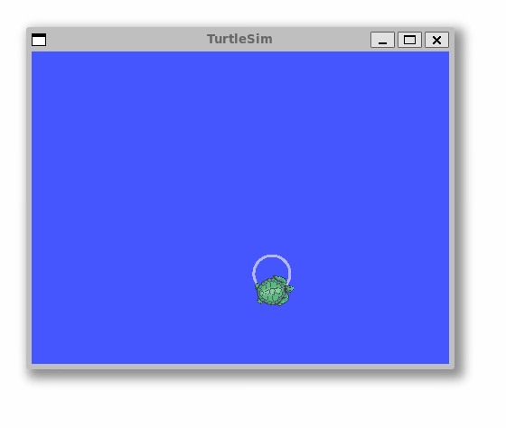
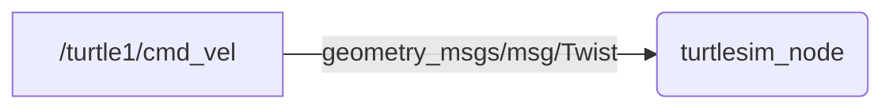
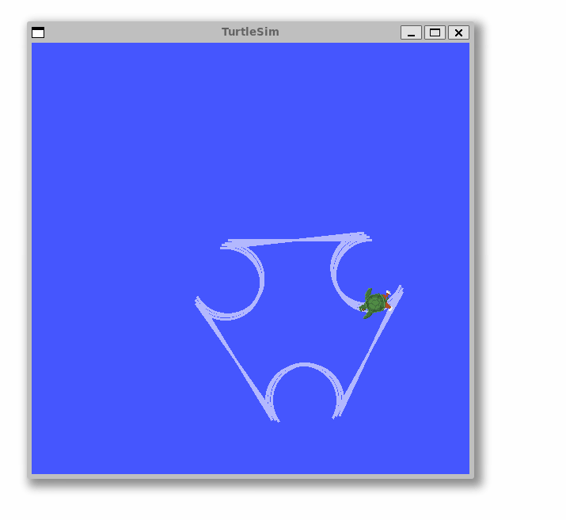
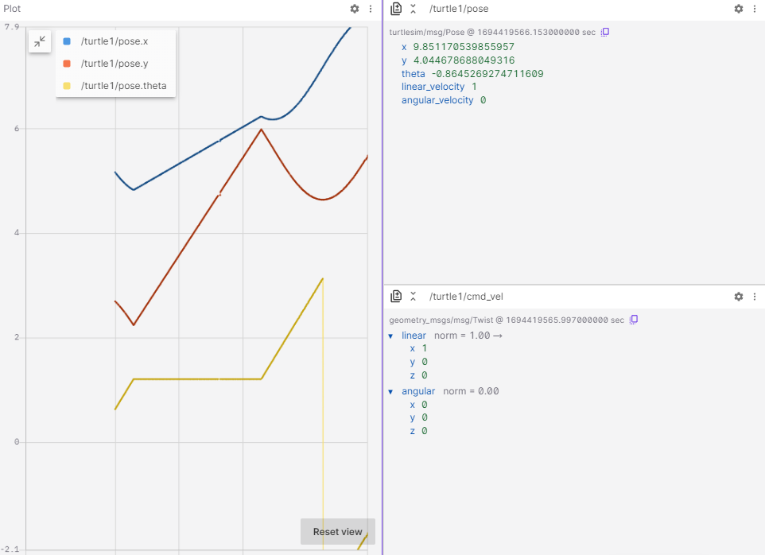
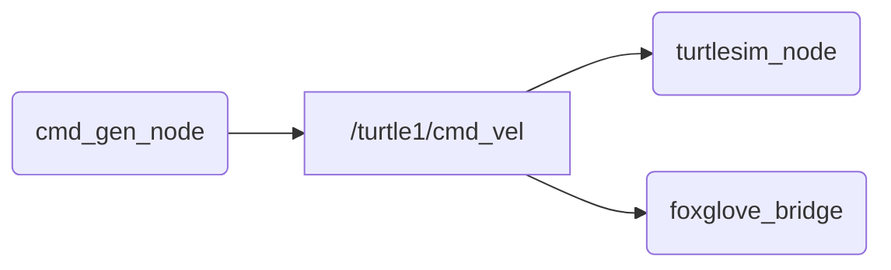

 

<details markdown="block">
  <summary>
    Tartalom
  </summary>
  {: .text-delta }
1. TOC
{:toc}
</details>

---


# `ROS 2` bevezetés és gyakorlat

## Emlékeztető

Pár alapfogalom az [előző](https://sze-info.github.io/arj/bevezetes/ros2.html) alkalomról: 

- **Node**: Gyakorlatilag ROS *program*ot jelent. (pl. `turtlesim_node`, `cmd_gen_node`, `foxglove_bridge`)
- **Topic** (topik): Nevekkel ellátott kommunikációs csatorna. (pl. `/turtle1/cmd_vel`, `/turtle1/pose`, `/raw_cmd`)
- **Message** (üzenet): (pl. `std_msgs/msg/Bool`, `geometry_msgs/msg/Twist`, `turtlesim/msg/Pose`)
- **Package** (csomag): ROS programok (node-ok) gyűjteménye (pl. `turtlesim`, `arj_intro_cpp`, `arj_transforms_cpp`)
- **Launch fájlok**: Több node paraméterezett elindítására alkalmas (pl. `multisim.launch.py`, `foxglove_bridge.launch.xml`, `foxglove_bridge.launch.py`)
- **Publish / subscribe**: Üzenetekre történő publikálás és feliratkozás. 
- **Build**: A package forráskódjából futtatható állományok készítésének folyamata. ROS2-ben a `colcon` az alapértelmezett build eszköz. 

# `1.` feladat - Node és publish

Nyissunk két terminált. Az első terminálból indítsuk a beépített `turtlesim_node` szimulátort, ami a `turtlesim` package-ben található.

``` r
ros2 run turtlesim turtlesim_node
```

*Megjegyzés*: ha esetleg valamiért hiányozna, telepíthető a `sudo apt install ros-humble-turtlesim` paranccsal.

A második ablakból publikáljunk egy parancsot, melynek hatására körbe fordul:

``` r
ros2 topic pub /turtle1/cmd_vel geometry_msgs/msg/Twist '{linear: {x: 0.5, y: 0.0, z: 0.0}, angular: {x: 0.0, y: 0.0, z: 1.2}}'
```

<center></center>

A háttérben a `turtlesim_node` node (kerek jelölés) feliratkozik a `/turtle1/cmd_vel` topicra (szögletes jelölés), ennek hatására indul a mozgás. 




Ahogy a flowcharton is látszik, a `/turtle1/cmd_vel` típusa `geometry_msgs/msg/Twist`. Ezt a következő parancsból tudhatjuk meg:

``` r
ros2 topic type /turtle1/cmd_vel
```

A `geometry_msgs/msg/Twist` a üzenet strutúráját pedig ez a parancs adja:

``` r
ros2 interface show geometry_msgs/msg/Twist
```

``` r
Vector3  linear
        float64 x
        float64 y
        float64 z
Vector3  angular
        float64 x
        float64 y
        float64 z
```
Az összes topic-ot így lehet listázni:

``` r
ros2 topic list
```

Az adott topic tartalmát, különböző formátumban, szűrésekkel a következőképp lehet kiíratni vagy fájlba iratni:

``` r
ros2 topic echo /turtle1/pose
ros2 topic echo /turtle1/pose --csv
ros2 topic echo /turtle1/pose --csv > turtle_data_01.csv
ros2 topic echo /turtle1/pose --once
ros2 topic echo /turtle1/pose --once | grep velocity
ros2 topic echo /turtle1/pose | grep x
```

# Workspace és build tudnivalók
Első lépésként az `ls ~ | grep ros2` parancs segítségével ellenőrizzük, hogy létezik-e a workspace a home directoryban(`~`). A tantárgyban a workspace-t `ros2_ws`-nek nevezzük. A név igazából nem számít, de a legtöbb tutorial is ezt a nevet használja, így mi is követjük ezt a hagyományt. Több workspace is használható egyidejüleg, külön source-olható, nagyobb rendszereknél ez kényelmes megoldás lehet. Mi egyelőre maradunk az egytelen `ros2_ws`-nél. Ha nem létezne a `mkdir -p ros2_ws/src` parancs segítségével készíthetjük el a workspace és a source mappákat.

## Colcon
A legfontosabb parancs talán a `colcon build`. Említésre méltó még a `colcon list` és a `colcon graph`. Előbbi listázza az elérhető packageket, utóbbi pedig a függőségekről ad gyors nézetet.

A `colcon build` számos hasznos kapcsolóval érkezik:
- `--packages-select`: Talán az egyik leggyakrabban használt kapcsoló, utána meggadhatunk több package-t, amit buildelni szeretnénk. Ha nincs megadva, akkor az alapértelmezett, hogy a teljes workspace-t buildeli. A gyakorlatban lesz is egy `colcon build --packages-select arj_intro_cpp arj_transforms_cpp` parancs, ez a két arj package-t buildeli.
- `--symlink-install`: A fájlok forrásból való másolása helyett használjon szimbolikus hivatkozásokat. Így elkerülhető, hogy pl. minden egyes launch fájl módosítás esetén újra kelljen buildelni a package-t.
- `--parallel-workers 2`: A párhuzamosan feldolgozható feladatok maximális száma, ebben az esetben `2`. Ha nincs megadva, akkor az alapértelmezett érték a logikai CPU magok száma. Akkor érdemes korlátozni, ha a build nem fut végig erőforrás hiány miatt. 
- `--continue-on-error`: Nagyobb build esetén, ne álljon meg az első hibás package után. Így ha 100 packageből 1 nem működne, akkor is 99 buildelődik. Ha ez nincs megadva, akkor 0 és 99 közötti package buildelődik, a függőségek és egyéb sorrendiségek alapján. 

## Source
Ahhoz hogy az ROS2 futtatható fájlainkat valóban el tudjuk indítani, be kell állíani a be a környezetet (úgynevezett source-olás), tehát meg kell adni a bash számára, hogy hol keresse az adott futtatható fájlokat, azoknak milyen függőségei vannak stb. Ez egyszerűbb, mint hangzik, csak egy `source <útvonal>/<név>.bash` parancsot kell kiadni. Korábban írtuk, hogy a worksapce neve nem számít, és valóban, a source megadása után mindegy, hogy fizikailag hol található a futtatható állomány, kényelmesen elindítható egy paranccsal bármelyik mappából. 
Mivel a packagek különböző workspace-eken belül egymásra is épülhetnek, az ROS2 bevezette az overlay / underlay elvet. Ez azt jelenti, hogy egyik workspace buildelésekor egy másik workspace már be volt source-olva, annak valamely package-e függ a az előzőleg lebuildelt package-től. Tehát annak funkcionalitása, kódja szükséges a ráépülő package-nek. Ennek megfeleően a source-olás is kétféle lehet:
- A `local_setup.bash` script csak a jelenlegi workspace-ben állítja be a környezetet (source-ol). Tehát nem source-ol szülő (függő) workspace-t.
- A `setup.bash` szkript viszont a `local_setup.bash` parancsfájlt adja az összes olyan workspace-hez, amely a munkaterület létrehozásakor függőség volt. 

{: .highlight }
A tantárgyban nem kell ilyen összetett rendszereket használni, legtöbbször egy `ros2_ws` is elég.

# `2.` feladat - Package build és használat

[docs.ros.org/en/humble/Tutorials/Beginner-Client-Libraries/Creating-A-Workspace/Creating-A-Workspace.html](https://docs.ros.org/en/humble/Tutorials/Beginner-Client-Libraries/Creating-A-Workspace/Creating-A-Workspace.html)

Nyissunk négy terminált. Az első terminálból most is indítsuk a beépített `turtlesim_node` szimulátort, ami a `turtlesim` package-ben található.

``` r
ros2 launch turtlesim turtlesim_node
```

A második terminálban ellenőrizzük a `ros2_ws/src` tartalmát, és **ha szükséges** klónozzuk, majd buildeljük a példa package-t.

``` r
ls ~/ros2_ws/src | grep arj_
```

Ha nincs package (az előző `ls` nem ad vissza találatot):
``` r
cd ~/ros2_ws/src
git clone https://github.com/sze-info/arj_packages
cd ~/ros2_ws
colcon build --packages-select arj_intro_cpp
```

A harmadik terminálban futtassuk a `cmd_gen_node` ROS node-ot.

Először `source`-olnunk kell, ha saját package-ket használunk:

``` r
source ~/ros2_ws/install/setup.bash
```

Ezután már futtatható a node:

``` r
ros2 run arj_intro_cpp cmd_gen_node
```

A következőképp mozog most a teknős:

<center></center>

Forráskódja elérhető a [github.com/sze-info/arj_packages](https://github.com/sze-info/arj_packages/blob/main/arj_intro_cpp/src/cmd_gen_node.cpp) repon.A lényeg, hogy a `loop` függvény 5 Hz (200 ms) frekvencián fut le, és 

``` cpp
void loop()
{
  // Publish transforms
  auto cmd_msg = geometry_msgs::msg::Twist();
  if (loop_count_ < 20)
  {
    cmd_msg.linear.x = 1.0;
    cmd_msg.angular.z = 0.0;
  }
  else
  {
    cmd_msg.linear.x = -1.0;
    cmd_msg.angular.z = 1.0;
  }
  cmd_pub_->publish(cmd_msg);
  loop_count_++;
  if (loop_count_ > 40)
  {
    loop_count_ = 0;
  }
}
```

{: .important-title }
> Python megfelelője
>
> A C++ kód python verziója szintén elérhető a [github.com/sze-info/arj_packages](https://github.com/sze-info/arj_packages/blob/main/arj_intro_py/arj_intro_py/cmd_gen_node.py) címen. Érdemes összehasonlítani a C++ és a python kódokat.

Nézzük meg az utolsó terminálban a Foxglove segítségével az élő adatokat (itt se felejtsük a `source`-t):

``` r
ros2 launch arj_intro_cpp foxglove_bridge.launch.py
```

Vizsgáljuk meg Foxglove Studio-val is WebSocketen keresztül (Open connection `ws://localhost:8765`):



*Megjegyzés*: gépteremben fel van téve a `foxglove_bridge`, otthon `sudo apt install ros-humble-foxglove-bridge` paranccsal (előtte update) telepíthető.


Mindehárom node-ot egyben a következőképp indíthatjuk:

``` r
ros2 launch arj_intro_cpp turtle.launch.py
```

Vizsgáljuk meg a package tartalmát röviden a `code ~/ros2_ws/src/arj_packages/arj_intro_cpp` parancs után.


# `3.` feladat - Saját package készítése

A feladat a hivatalos ROS2 dokumentáción alapul: [docs.ros.org/en/humble/Tutorials/Beginner-Client-Libraries/Creating-Your-First-ROS2-Package.html](https://docs.ros.org/en/humble/Tutorials/Beginner-Client-Libraries/Creating-Your-First-ROS2-Package.html). Készítsük el a `my_package` nevű ROS 2 package-t.


{: .important-title }
> Python megfelelője
>
> Jelenleg C++ package-t készítünk, de az [eredeti](https://docs.ros.org/en/humble/Tutorials/Beginner-Client-Libraries/Creating-Your-First-ROS2-Package.html) tutorial is taralmazza a CMake(c++) package Python megfelelőit.

Első lépés, hogy a a workspace `src` mappájába lépjünk:

``` r
cd ~/ros2_ws/src
```

Készítsünk egy `my_package` nevű package-t és egy `my_node` nevű node-ot.

``` r
ros2 pkg create --build-type ament_cmake --node-name my_node my_package
```

Buildeljük a szokásos módon:

``` r
cd ~/ros2_ws
colcon build --packages-select my_package
```


Majd source:

``` r
source ~/ros2_ws/install/setup.bash
```

És már futtatható is:

``` r
ros2 run my_package my_node


hello world my_package package
```

Vizsgáljuk meg a `my_package` tartalmát!

``` r
ls -R ~/ros2_ws/src/my_package

/home/he/ros2_ws/src/my_package:
  CMakeLists.txt  include  package.xml  src
/home/he/ros2_ws/src/my_package/include:
  my_package
/home/he/ros2_ws/src/my_package/include/my_package:
  [empty]
/home/he/ros2_ws/src/my_package/src:
  my_node.cpp
```

```
tree ~/ros2_ws/src/my_package

my_package
├── CMakeLists.txt
├── include
│   └── my_package
├── package.xml
└── src
    └── my_node.cpp
```

``` cpp
cat ~/ros2_ws/src/my_package/src/my_node.cpp


#include <cstdio>

int main(int argc, char ** argv)
{
  (void) argc;
  (void) argv;

  printf("hello world my_package package\n");
  return 0;
}

```
Érdemes megfigyelni, hogy a cpp fájl még semmilyen `ros2` headert nem használ.

Futtatása: 

```
source ~/ros2_ws/install/setup.bash
ros2 run my_package my_node
```


Alternatívaként VS code-ból is megnyinthatjuk a teljes mappát.
```r
code ~/ros2_ws/src/my_package
```


{: .note }
A `code` parancs után fájlt megadva a fájl niytódik meg, míg mappát (könyvtárat) megadva az adott mappa tartalma nyílik meg. Gyakran forul elő, hogy például egy adott package-ben vagyunk és szeretnénk az aktuális mappát megnyitni. Ezt megtehetjük a `code .` paranccsal, amikoris az aktuális mappa nyitódik meg, hiszen a `.` karakter az aktuális mappát jelenti linuxban. 

# `4.` feladat - C++ publisher / subscriber

A gyakorlat a hivatalos ROS 2 tutorialokon alapszik: [docs.ros.org/en/humble/Tutorials/Beginner-Client-Libraries/Writing-A-Simple-Cpp-Publisher-And-Subscriber.html](https://docs.ros.org/en/humble/Tutorials/Beginner-Client-Libraries/Writing-A-Simple-Cpp-Publisher-And-Subscriber.html)

- [C++ publisher](https://github.com/ros2/examples/blob/humble/rclcpp/topics/minimal_publisher/member_function.cpp)
- [C++ subscriber](https://github.com/ros2/examples/blob/humble/rclcpp/topics/minimal_subscriber/member_function.cpp)

## Hozzuk létre a `cpp_pubsub` package-t

Nyissunk egy új terminált, és source-oljunk a telepítést, hogy a `ros2` parancsok működjenek.

Navigáljunk az már létrehozott `ros2_ws` könyvtárba.

Fontos, hogy a csomagokat az `src' könyvtárban kell létrehozni, nem a munkaterület gyökerében. Tehát navigáljunk a `ros2_ws/src` fájlba, és futtassuk a package létrehozó parancsot:

```
ros2 pkg create --build-type ament_cmake cpp_pubsub
```

A terminál egy üzenetet küld vissza, amely megerősíti a ``cpp_pubsub`` csomag és az összes szükséges fájl és mappa létrehozását.

Lépj a ``ros2_ws/src/cpp_pubsub/src`` mappába.
Ez az a könyvtár minden CMake package-ben, ahová a forrásfájlok tartoznak (pl `.cpp` kiterjesztéssel).


## Írjuk meg a publisher node-ot

Töltsük le a példa talker kódját:

```
wget -O publisher_member_function.cpp https://raw.githubusercontent.com/ros2/examples/{REPOS_FILE_BRANCH}/rclcpp/topics/minimal_publisher/member_function.cpp
```


Ez a parancs létrehozza a  ``publisher_member_function.cpp`` fájlt. Nyissuk meg pl VS code segítségével a mappát (`code .`)

``` cpp

#include <chrono>
#include <functional>
#include <memory>
#include <string>

#include "rclcpp/rclcpp.hpp"
#include "std_msgs/msg/string.hpp"

using namespace std::chrono_literals;

/* This example creates a subclass of Node and uses std::bind() to register a
* member function as a callback from the timer. */

class MinimalPublisher : public rclcpp::Node
{
    public:
    MinimalPublisher()
    : Node("minimal_publisher"), count_(0)
    {
        publisher_ = this->create_publisher<std_msgs::msg::String>("topic", 10);
        timer_ = this->create_wall_timer(
        500ms, std::bind(&MinimalPublisher::timer_callback, this));
    }

    private:
    void timer_callback()
    {
        auto message = std_msgs::msg::String();
        message.data = "Hello, world! " + std::to_string(count_++);
        RCLCPP_INFO(this->get_logger(), "Publishing: '%s'", message.data.c_str());
        publisher_->publish(message);
    }
    rclcpp::TimerBase::SharedPtr timer_;
    rclcpp::Publisher<std_msgs::msg::String>::SharedPtr publisher_;
    size_t count_;
};

int main(int argc, char * argv[])
{
    rclcpp::init(argc, argv);
    rclcpp::spin(std::make_shared<MinimalPublisher>());
    rclcpp::shutdown();
    return 0;
}
```


## Függőségek hozzáadása

Lépjünk vissza egy szinttel a ``ros2_ws/src/cpp_pubsub`` könyvtárba, ahol a ``CMakeLists.txt`` és a ``package.xml`` fájlok már létrejöttek.

Nyissuk meg a ``package.xml`` fájlt a szövegszerkesztővel.

Mindig érdemes kitölteni a ``<description>``, ``<maintainer>`` és ``<license>`` tag-eket:

``` xml
<description>Examples of minimal publisher/subscriber using rclcpp</description>
<maintainer email="you@email.com">Your Name</maintainer>
<license>Apache License 2.0</license>
```

Adjunk hozzá egy új sort az ``ament_cmake`` buildtool függősége után, és illessze be a következő függőségeket a node include utasításainak megfelelően:

``` xml
<depend>rclcpp</depend>
<depend>std_msgs</depend>
``` 

Ez deklarálja, hogy a pacakge-nek szükséges az ``rclcpp`` és a ``std_msgs`` fordításkor és futtatáskor.


## CMakeLists.txt

Most nyissuk meg a ``CMakeLists.txt`` fájlt.
A meglévő ``find_package(ament_cmake REQUIRED)`` függőség alá adjuk hozzá a következő sorokat:

``` cmake
find_package(rclcpp REQUIRED)
find_package(std_msgs REQUIRED)
```

Ezután adjukhozzá a végrehajtható fájlt, és nevezze el ``talker``-nak, hogy a ``ros2 run`` használatával futtassa a node-ot:

``` cmake
add_executable(talker src/publisher_member_function.cpp)
ament_target_dependencies(talker rclcpp std_msgs)
```

Ezután adjuk hozzá a végrehajtható fájlt, és nevezze el ``talker``-nak, hogy a ``ros2 run`` használatával futtassa a node-ot:


``` cmake
install(TARGETS
talker
DESTINATION lib/${PROJECT_NAME})
``` 

A ``CMakeLists.txt`` megtisztítható néhány felesleges szakasz és megjegyzés eltávolításával, így a következőképpen néz ki:

``` cmake


cmake_minimum_required(VERSION 3.5)
project(cpp_pubsub)

# Default to C++14
if(NOT CMAKE_CXX_STANDARD)
set(CMAKE_CXX_STANDARD 14)
endif()

if(CMAKE_COMPILER_IS_GNUCXX OR CMAKE_CXX_COMPILER_ID MATCHES "Clang")
add_compile_options(-Wall -Wextra -Wpedantic)
endif()

find_package(ament_cmake REQUIRED)
find_package(rclcpp REQUIRED)
find_package(std_msgs REQUIRED)

add_executable(talker src/publisher_member_function.cpp)
ament_target_dependencies(talker rclcpp std_msgs)

install(TARGETS
talker
DESTINATION lib/${PROJECT_NAME})

ament_package()
```

Már buildelhető a package, adjuk hozzá a feliratkozó (subscriber) node-ot is, hogy láthassuk a teljes rendszert működés közben.
## Írjuk meg a subscriber node-ot

A subscriber node elkészítését a következő tutorial 3-a pontja is leírja: [docs.ros.org/en/humble/Tutorials/Beginner-Client-Libraries/Writing-A-Simple-Cpp-Publisher-And-Subscriber.html](https://docs.ros.org/en/humble/Tutorials/Beginner-Client-Libraries/Writing-A-Simple-Cpp-Publisher-And-Subscriber.html#id8)

Lépjünk vissza a `ros2_ws/src/cpp_pubsub/src` mappába és töltsük le a sunbscriber node-ot is:

```
wget -O subscriber_member_function.cpp https://raw.githubusercontent.com/ros2/examples/humble/rclcpp/topics/minimal_subscriber/member_function.cpp
```

Ha most `ls`-el listázunk, a következőt kell lássuk:

```
publisher_member_function.cpp  subscriber_member_function.cpp
```

A `CMakeList.txt`-hez adjuk hozzá a subscribe node-ot is:

``` cmake
add_executable(listener src/subscriber_member_function.cpp)
ament_target_dependencies(listener rclcpp std_msgs)

install(TARGETS
  talker
  listener
  DESTINATION lib/${PROJECT_NAME})
```

## Fordítsuk a package-t

```
cd ~/ros2_ws/
colcon build --packages-select cpp_pubsub

```


``` r
source ~/ros2_ws/install/setup.bash
ros2 run cpp_pubsub talker

[INFO] [minimal_publisher]: Publishing: "Hello World: 0"
[INFO] [minimal_publisher]: Publishing: "Hello World: 1"
[INFO] [minimal_publisher]: Publishing: "Hello World: 2"
[INFO] [minimal_publisher]: Publishing: "Hello World: 3"
[INFO] [minimal_publisher]: Publishing: "Hello World: 4"
```

Egy újabb terminalba:
``` r
source ~/ros2_ws/install/setup.bash
ros2 run cpp_pubsub listener

[INFO] [minimal_subscriber]: I heard: "Hello World: 10"
[INFO] [minimal_subscriber]: I heard: "Hello World: 11"
[INFO] [minimal_subscriber]: I heard: "Hello World: 12"
[INFO] [minimal_subscriber]: I heard: "Hello World: 13"
[INFO] [minimal_subscriber]: I heard: "Hello World: 14"
```

# `5.` feladat - Python publisher / subscriber

A gyakorlat a hivatalos ROS 2 tutorialokon alapszik: [docs.ros.org/en/humble/Tutorials/Beginner-Client-Libraries/Writing-A-Simple-Py-Publisher-And-Subscriber.html](https://docs.ros.org/en/humble/Tutorials/Beginner-Client-Libraries/Writing-A-Simple-Py-Publisher-And-Subscriber.html)


- [Python publisher](https://github.com/ros2/examples/blob/humble/rclpy/topics/minimal_publisher/examples_rclpy_minimal_publisher/publisher_member_function.py)
- [Python subscriber](https://github.com/ros2/examples/blob/humble/rclpy/topics/minimal_subscriber/examples_rclpy_minimal_subscriber/subscriber_member_function.py)

# Források
- [docs.ros.org/en/humble/Tutorials/Beginner-CLI-Tools/Introducing-Turtlesim/Introducing-Turtlesim.html](https://docs.ros.org/en/humble/Tutorials/Beginner-CLI-Tools/Introducing-Turtlesim/Introducing-Turtlesim.html)
- [docs.ros.org/en/humble/Tutorials/Beginner-Client-Libraries/Creating-Your-First-ROS2-Package.html](https://docs.ros.org/en/humble/Tutorials/Beginner-Client-Libraries/Creating-Your-First-ROS2-Package.html)
- [docs.ros.org/en/humble/Tutorials/Beginner-Client-Libraries/Writing-A-Simple-Cpp-Publisher-And-Subscriber.html](https://docs.ros.org/en/humble/Tutorials/Beginner-Client-Libraries/Writing-A-Simple-Cpp-Publisher-And-Subscriber.html)
- [docs.ros.org/en/humble/Tutorials/Beginner-Client-Libraries/Writing-A-Simple-Py-Publisher-And-Subscriber.html](https://docs.ros.org/en/humble/Tutorials/Beginner-Client-Libraries/Writing-A-Simple-Py-Publisher-And-Subscriber.html)