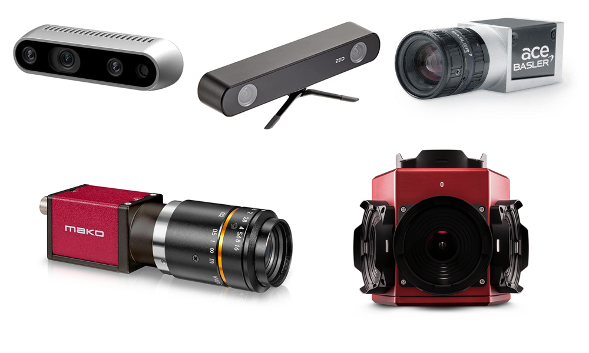
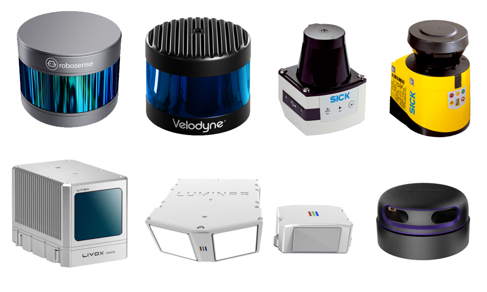
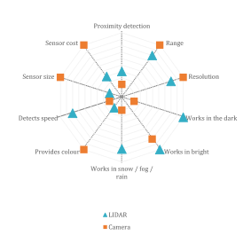
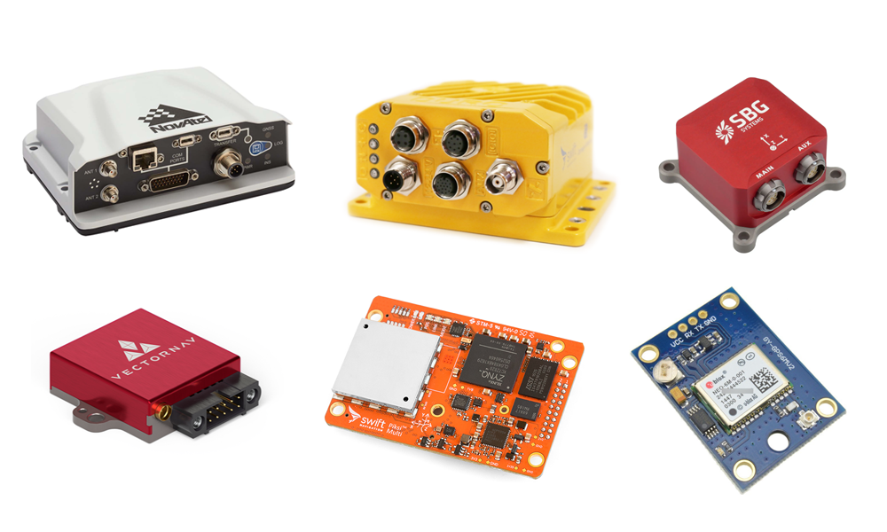
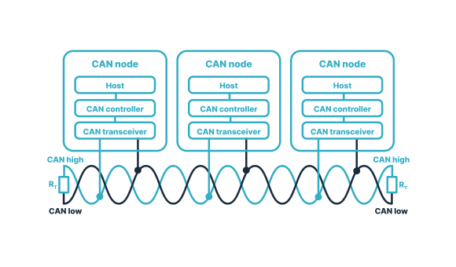
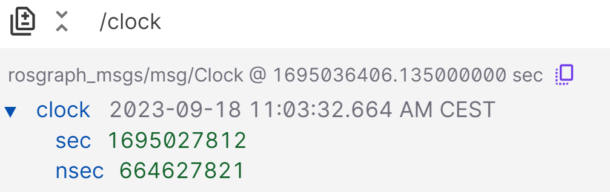

 

<details markdown="block">
  <summary>
    Tartalom
  </summary>
  {: .text-delta }
1. TOC
{:toc}
</details>

---


# Érzékelés

Az érzékelés nyers adatok beolvasását jelenti.


Érzékelés esetében fontos felhívi a figyelmet, hogy ez még nem jelent magas szintű adatfeldolgozást. Szenzorai lehetnek kamerák, mikrofonok, LIDAR-ok stb. Ahogy az ábra is mutatja a tananyagban az érzékeléssel együtt tárgyaljuk az aktuálást is.

{: .note }
Magyar nyelven könnyű összekeverni az érzékelés (sensing) és az észlelés (perception) foglamakat. Az érzékelés egyszerű driver szintű nyers adatok előállításával foglakozik.


## Kamera

A kamera az érzékelőjére (pl CCD CMOS szenzor) érkező fényt elektronikus jellé alakítja, diitálisan. Megkülönböztethetünk mono, sztereo vagy mélységérzékelésre képes kamerákat is.

- *Jellemző gyártók:* Allied Vision, Basler, Stereolabs, Orbbec, Intel
- *Jellemző interfész:* GigE, USB3
- *Jellemző `ROS 2` topic típusok:* [`sensor_msgs/msg/Image`](https://github.com/ros2/common_interfaces/blob/humble/sensor_msgs/msg/Image.msg), [`sensor_msgs/msg/CameraInfo`](https://github.com/ros2/common_interfaces/blob/humble/sensor_msgs/msg/CameraInfo.msg)



## LIDAR

A LIDAR (Light Detection and Ranging) szenzor egy olyan eszköz, amely lézerpulzusokkal és azok visszaverődési idejéből távolságokat képes megállapítani. Az elve hasnoló a lézeres távolságmérőhöz, ám a mérés gyakorisága és frekvenciája is sokkal naygobb annál. Példaképp vegyünk egy forgó 64 csatornás LIDAR-t. Ez jellemzően `10` vagy `20` Hz-en mér, tehát másodpercenként `10` vagy `20` teljes `360°`-os körbefordulást tesz meg. A `64` csatorna azt jelenti, hogy minden pillanatban `64` egymás alatti érzékelő érzékel. Egy körbefordulást jellemzően `512` / `1024` / `2048` mérést jelent csatornánként. Innen ki is számolható a másodpercenkénti mérésadat: pl `20*64*1024 = 1 310 720`. Tehát jellemzően másodpercenként, több mint egymillió 3D pontot mér az eszköz, amihez intenzitás, ambient, reflektív tulajdonságok is társulnak.

- *Jellemző gyártók:* Velodyne, Ouster, Livox, SICK, Hokuy, Pioneer, Luminar, Hesai, Robosense, Ibeo, Innoviz, Quanenergy, Cepton, Blickfeld, Aeva
- *Jellemző interfész:* GigE
- *Jellemző `ROS 2` topic típusok:* [`sensor_msgs/msg/PointCloud2`](https://github.com/ros2/common_interfaces/blob/humble/sensor_msgs/msg/PointCloud2.msg), [`sensor_msgs/msg/LaserScan`](https://github.com/ros2/common_interfaces/blob/humble/sensor_msgs/msg/LaserScan.msg)

LIDAR gyártókat, dataseteket, algoritmusokat tartlamazó gyűjtemény: [github.com/szenergy/awesome-lidar](https://github.com/szenergy/awesome-lidar).



<iframe width="560" height="315" src="https://www.youtube.com/embed/1IWXO0vvmO8?rel=0" title="YouTube video player" frameborder="0" allow="accelerometer; autoplay; clipboard-write; encrypted-media; gyroscope; picture-in-picture; web-share" allowfullscreen></iframe>

## Radar
- *Jellemző gyártók:* Aptiv, Bosch, Continental,  Denso
- *Jellemző interfész:* CAN bus
- *Jellemző `ROS 2` topic típusok:* [`radar_msgs/msg/RadarTrack`](https://github.com/ros-perception/radar_msgs/blob/ros2/msg/RadarTrack.msg)




A LIDAR és a kamera jellemzőinek összehasonlítása


## IMU

Az IMU kis méretű elektromechanikus giroszkópokat és gyorsulásmérőket, valamint jelfeldolgozó processzorokat tartalmazó szenzor. Gyakran kombinálják további szenzorokkal, pl. barometrikus magasságmérővel, magnetométerrel, iránytűvel. Némely GPS (GNSS) rendszerben is megtalálhatók.

- *Jellemző gyártók:* Lord MicroStrain, Bosch, XSens
- *Jellemző interfész:* Serial, Ethernet, USB, CAN bus
- *Jellemző `ROS 2` topic típusok:* [`sensor_msgs/msg/Imu`](https://github.com/ros2/common_interfaces/blob/humble/sensor_msgs/msg/Imu.msg), [`sensor_msgs/msg/MagneticField`](https://github.com/ros2/common_interfaces/blob/humble/sensor_msgs/msg/MagneticField.msg)


## GNSS (GPS)

A [GNSS](https://en.wikipedia.org/wiki/Satellite_navigation) (global navigation satellite system) globális szatelit-alapú navigációs rendszert jelent, köznapi szóhasználatban ezt szokás GPS-nek nevezni. Ha pontosak szeretnénk lenni, akkor a GPS csupán az első ilyen technológia ezen kívül létezik még GLONASS, BeiDou, Galileo és QZSS rendszer is, ezek üzemeltetése különböző államokhoz / szövetségekhez kötődik.

- *Jellemző gyártók:* SwiftNavigation, VectorNav, Ublox, NovaTel
- *Jellemző interfész:* GigE, CAN bus
- *Jellemző `ROS 2` topic típusok:* [`sensor_msgs/msg/NavSatFix`](https://github.com/ros2/common_interfaces/blob/humble/sensor_msgs/msg/NavSatFix.msg), [`geometry_msgs/msg/PoseStamped`](https://github.com/ros2/common_interfaces/blob/humble/geometry_msgs/msg/PoseStamped.msg)



Rövid, de jó leírás a GNSS pontosságról: [www.sbg-systems.com/news/mastering-accurac-gnss-and-its-errors-sources/](https://www.sbg-systems.com/news/mastering-accurac-gnss-and-its-errors-sources/)

## CAN bus

A CAN bus (Controller Area Network) egy jellemően autóipari szabvány, mely lehetővé teszi a mikrokontrollerek és az eszközök számára, hogy központi egység (host) nélkül kommunikáljanak egymással. Az ethernet kommunkációval összevetve egyszerűbb megvalósítás, alacsonyabb sávszélességű, robosztus.

- Sebesség adat lekérdezése, refencia jel
- Kormányszög adat lekérdezése, refencia jel
- *Jellemző `ROS 2` topic típusok:* [`can_msgs/msg/Frame`](http://docs.ros.org/en/noetic/api/can_msgs/html/msg/Frame.html), [`geometry_msgs/msg/Twist`](https://github.com/ros2/common_interfaces/blob/humble/geometry_msgs/msg/Twist.msg)



# `ROS 2` időkezelés

Az `ROS` idő kezelésre a Unix-időt, vagy a POSIX-időt használja. Ez a UTC (greenwichi idő) szerinti 1970. január 1. 00:00:00 óta eltelt másodpercek és nanoszekundumok számát jelenti (`int32 sec`, `int32 nsec`). Ez egyrészt relatív kis helyet foglal a memóriában, másrészt könnyen számolható két időpont között eltelt idő, mégpedig egy egyszerű kivonással. 

[ros2time.ipynb](https://github.com/sze-info/arj/blob/main/docs/erzekeles/ros2time.ipynb){: .btn .btn-purple .mr-4 } 

Hátránya, hogy nem túl intuitív, nem olvasható az ember számára. Pl. a Foxglove Studio ezért is gyakran átalakítja olvashatóbb formátumra. 



A másodpercek és nanoszekundumok a következőképp képzelhetők el:

``` py
import rclpy
current_time = node.get_clock().now()
print(current_time.to_msg())

Output: 
sec=1694595162, nanosec=945886859
```

Az időbélyeg több helyen is szerepet kap:

``` r
ros2 topic echo /clock --once
clock:
  sec: 1689687476
  nanosec: 770421827
``` 

``` r
ros2 topic echo --once /lexus3/gps/duro/current_pose

header:
  stamp:
    sec: 1694595162
    nanosec: 945886859
  frame_id: map
pose:
  position:
    x: 640142.9676535318
    y: 5193606.439717201
    z: 1.7999999523162842
  orientation:
    x: 0.008532664424537166
    y: 0.0018914791588597107
    z: 0.44068499630505714
    w: 0.8976192678279703
```

Ha szeretnénk átválatni a másodperceket és nanoszekundumokat, azt a következő módon tehetjük meg:

``` py
from datetime import datetime
current_time_float = current_time.to_msg().sec + current_time.to_msg().nanosec / 1e9 # 1e9 is 1,000,000,000: nanosec to sec
print("As a float:\t%.5f" % (current_time_float))
print("ISO format:", end="\t")
print(datetime.utcfromtimestamp(current_time_float).isoformat())


Output:
As a float:	1694595162.94589
ISO format:	2023-09-13T08:52:42.945887
```

# Források


- [Szenzorok ROS-ben](https://docs.google.com/presentation/d/e/2PACX-1vQbXSe4cb-aYgWNNiUF1PHJBZrwl0keWantbFjTe94zm1A9cVGqmWKC4lHCSUr4y7vfq1PrJ2mP8XqP/pub?start=false&loop=false&delayms=3000) _(online google prezentáció magyarul)_
- [docs.ros.org/en/humble/Tutorials/Beginner-CLI-Tools/Understanding-ROS2-Topics/Understanding-ROS2-Topics.html](https://docs.ros.org/en/humble/Tutorials/Beginner-CLI-Tools/Understanding-ROS2-Topics/Understanding-ROS2-Topics.html)

