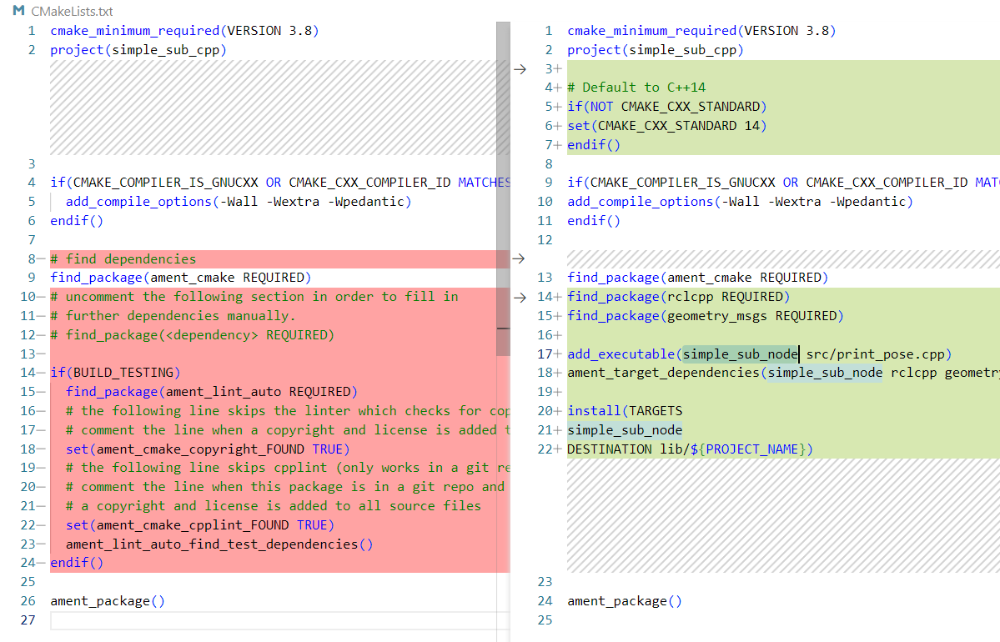

 

<details markdown="block">
  <summary>
    Tartalom
  </summary>
  {: .text-delta }
1. TOC
{:toc}
</details>

---


# Gyakorlat

A gyakorlat Ubuntu 22.04 `ROS humble`, Windows 10/11 WSL `humble` mellett működik. A különböző verziók telepítésének leírása [itt található](https://sze-info.github.io/arj/telepites/README.html).

Otthoni gépen a gyakorlat előtt érdemes ellenőrizni, hogy a megfelelő `ROS 2` szoftvercsomagok telepítve vannak-e.

``` r
sudo apt install ros-humble-rosbag2 ros-humble-rosbag2-storage-mcap
```

Gépteremben is ellenőrizzük a `check_all.sh` segítségével:
``` r
cd /mnt/kozos/script
./bag_mcap.sh
./check_all.sh
```

# Előkészületek

Az előző gyakorlaton megismerkedtünk a következő rosbag-gel (ROS 2-ben a formátum már `.mcap`):


Előkészületként nézzük meg, hogy létezik-e a `C:\temp` könyvtár

``` c
test -d "/mnt/c/temp" && echo Letezik || echo Nem letezik
```
Vagy egyszerűbben:
``` c
ls /mnt/c/temp
```

- Ha nem létezik (`No such file or directory`) akkor hozzuk létre: `mkdir /mnt/c/temp`
- Ha létezik, akkor nincs teendőnk, lépjünk a következő lépésre, másoljuk át ide az `.mcap` fájlokat


Tanteremben a másolás a következő parancsok **egyike** legyen:

``` r 
rsync -avzh --progress /mnt/kozos/measurement_files/lexus3sample01.mcap  /mnt/c/temp/
rsync -avzh --progress /mnt/kozos/measurement_files/lexus3sample02.mcap  /mnt/c/temp/
rsync -avzh --progress /mnt/kozos/measurement_files/lexus3sample03.mcap  /mnt/c/temp/
rsync -avzh --progress /mnt/kozos/measurement_files/lexus3sample04.mcap  /mnt/c/temp/
rsync -avzh --progress /mnt/kozos/measurement_files/lexus3sample05.mcap  /mnt/c/temp/
```

Otthon a következő linkről (zöld gomb) vagy lehet parancsként `wget`-el lehet letölteni:

```r 
wget https://laesze-my.sharepoint.com/:u:/g/personal/herno_o365_sze_hu/EakTOhcjblNInqjRMfaGVmsB0diDv0SWpXw9rwo0MD7f3w?download=1
```

[Rosbag letöltése 300 MB](https://laesze-my.sharepoint.com/:u:/g/personal/herno_o365_sze_hu/EakTOhcjblNInqjRMfaGVmsB0diDv0SWpXw9rwo0MD7f3w?download=1){: .btn .btn-green .mr-4 } 

Listázzuk a **megfelelő** átásolt `.mcap` fájl alap információit, hasonlóan:  

``` r
ros2 bag info /mnt/c/temp/lexus3sample06.mcap

closing.

Files:             /mnt/c/temp/lexus3sample06.mcap
Bag size:          286.7 MiB
Storage id:        mcap
Duration:          3.367s
Start:             Jul 18 2023 15:37:09.211 (1689687429.211)
End:               Jul 18 2023 15:38:03.314 (1689687483.314)
Messages:          29598
Topic information: 
  Topic: /lexus3/zed2i/zed_node/right_raw/image_raw_color/compressed | Type: sensor_msgs/msg/CompressedImage
  Topic: /lexus3/os_left/points | Type: sensor_msgs/msg/PointCloud2
  Topic: /lexus3/os_right/points | Type: sensor_msgs/msg/PointCloud2
  Topic: /lexus3/os_center/imu | Type: sensor_msgs/msg/Imu
  Topic: /tf_static | Type: tf2_msgs/msg/TFMessage
  Topic: /lexus3/os_center/points | Type: sensor_msgs/msg/PointCloud2
  Topic: /tf | Type: tf2_msgs/msg/TFMessage
  Topic: /lexus3/gps/duro/mag | Type: sensor_msgs/msg/MagneticField
  Topic: /lexus3/gps/duro/imu | Type: sensor_msgs/msg/Imu
  Topic: /lexus3/gps/duro/status_string | Type: std_msgs/msg/String
  Topic: /lexus3/gps/duro/current_pose | Type: geometry_msgs/msg/PoseStamped
```

# Játsszuk vissza az `.mcap` fájlt

A következőken a mérésadafájlt visszajátsszuk és ellenőrizzük milyen adatok jelennek meg, milyen típusban és sebességben. A `--loop` kapcsoló a végtelen ismétlést a `--clock` kapcsoló pedig egy `/clock` topic hirdetéséért felel, ehhez igazítja a lejátszást.

``` r
ros2 bag play /mnt/c/temp/lexus3sample06.mcap --clock --loop
```
Ugyanez, csak lassabban visszajátszva pl:

``` r
ros2 bag play /mnt/c/temp/lexus3sample06.mcap --clock --loop --rate 0.2
```


A következő topic-ok jelennek meg:

``` r
ros2 topic list

/clock
/events/read_split
/lexus3/gps/duro/current_pose
/lexus3/gps/duro/imu
/lexus3/gps/duro/mag
/lexus3/gps/duro/status_string
/lexus3/os_center/imu
/lexus3/os_center/points
/lexus3/os_left/points
/lexus3/os_right/points
/lexus3/zed2i/zed_node/right_raw/image_raw_color
/parameter_events
/rosout
/tf
/tf_static
```

A `ros2 topic hz` az adott topic frekvenciáját mutatja. A pozíció pl. itt ~20Hz.

``` r
ros2 topic hz /lexus3/gps/duro/current_pose
average rate: 20.133
        min: 0.002s max: 0.101s std dev: 0.03451s window: 22
```

# `ROS 2` időkezelés

Az `ROS` idő kezelésre a Unix-idő vagy POSIX-időt használja. Ez a UTC (greenwichi idő) szerinti 1970. január 1. 00:00:00 óta eltelt másodpercek és nanoszekundumok számát jelenti (`int32 sec`, `int32 nsec`). Ez egyrészt relatív kis helyet fogla a memóriában, másrészt könnyen számolható két időpont között eltelt idő, mégpedig egy egyszerű kivonással. 

[ros2time.ipynb](https://github.com/sze-info/arj/blob/main/docs/erzekeles/ros2time.ipynb){: .btn .btn-purple .mr-4 } 

Hátránya, hogy nem túl intuitív, nem olvasható az ember számára. Pl. a Foxglove Studio ezért is gyakran átalakítja olvashatóbb formátumra. 


A másodpercek és nanoszekundumok a következőképp képzelhetők el:

``` py
import rclpy
current_time = node.get_clock().now()
print(current_time.to_msg())

Output: 
sec=1694595162, nanosec=945886859
```

Az időbélyeg több helyen is szerepet kap:

``` r
ros2 topic echo /clock --once
clock:
  sec: 1689687476
  nanosec: 770421827
``` 

``` r
ros2 topic echo --once /lexus3/gps/duro/current_pose

header:
  stamp:
    sec: 1694595162
    nanosec: 945886859
  frame_id: map
pose:
  position:
    x: 640142.9676535318
    y: 5193606.439717201
    z: 1.7999999523162842
  orientation:
    x: 0.008532664424537166
    y: 0.0018914791588597107
    z: 0.44068499630505714
    w: 0.8976192678279703
```

Ha szeretnénk átválatni a másodperceket és nanoszekundumokat, azt pl a következő módon thetjük meg:

``` py
from datetime import datetime
current_time_float = current_time.to_msg().sec + current_time.to_msg().nanosec / 1e9 # 1e9 is 1,000,000,000: nanosec to sec
print("As a float:\t%.5f" % (current_time_float))
print("ISO format:", end="\t")
print(datetime.utcfromtimestamp(current_time_float).isoformat())


Output:
As a float:	1694595162.94589
ISO format:	2023-09-13T08:52:42.945887
```

**Emlékeztető**: a nanoszekundum a másodperc egy milliárdodrésze (10^-9 s).

# GNSS (GPS)

A köveztkezőkben átnézünk pár jellemző szenzort (GPS, kamer, LIDAR) és azok topic-jait, node-jait (driver package-ekbe szervezve). Vessünk egy pillantást a saját fejelsztésű Duro GPS (GNSS) driverre: [github.com/szenergy/duro_gps_driver](https://github.com/szenergy/duro_gps_driver/tree/ros2-humble). A GPS-t etherneten a számítógéphez csatlakoztatva, a ROS drivert indítva a következő topicokat fogja hirdetni:


|Topic|Type
|-|-|
`/gps/duro/current_pose` |[`[geometry_msgs/PoseStamped]`](http://docs.ros.org/en/melodic/api/geometry_msgs/html/msg/PoseStamped.html)
`/gps/duro/fix` |[`[sensor_msgs/NavSatFix]`](http://docs.ros.org/en/melodic/api/sensor_msgs/html/msg/NavSatFix.html)
`/gps/duro/imu` |[`[sensor_msgs/Imu]`](http://docs.ros.org/en/melodic/api/sensor_msgs/html/msg/Imu.html)
`/gps/duro/mag` |[`[sensor_msgs/MagneticField]`](http://docs.ros.org/en/melodic/api/sensor_msgs/html/msg/MagneticField.html)
`/gps/duro/odom ` |[`[nav_msgs/Odometry]`](http://docs.ros.org/en/melodic/api/nav_msgs/html/msg/Odometry.html)
`/gps/duro/rollpitchyaw` |[`[geometry_msgs/Vector3]`](http://docs.ros.org/en/melodic/api/geometry_msgs/html/msg/Vector3.html)
`/gps/duro/status_flag` |[`[std_msgs/UInt8]`](http://docs.ros.org/en/melodic/api/std_msgs/html/msg/UInt8.html)
`/gps/duro/status_string` |[`[std_msgs/String]`](http://docs.ros.org/en/melodic/api/std_msgs/html/msg/String.html)
`/gps/duro/time_ref` |[`[sensor_msgs/TimeReference]`](http://docs.ros.org/en/api/sensor_msgs/html/msg/TimeReference.html)


# IMU

*Jellemző `ROS 2` topic típusok:* [`sensor_msgs/msg/Imu`](https://github.com/ros2/common_interfaces/blob/humble/sensor_msgs/msg/Imu.msg), [`sensor_msgs/msg/MagneticField`](https://github.com/ros2/common_interfaces/blob/humble/sensor_msgs/msg/MagneticField.msg)


``` r
ros2 topic echo --once /lexus3/gps/duro/imu

header:
  stamp:
    sec: 1695039048
    nanosec: 44466475
  frame_id: duro
orientation:
  x: 0.0
  y: 0.0
  z: 0.7071067811865475
  w: 0.7071067811865476
orientation_covariance:
  - [0.0, 0.0, 0.0, 0.0, 0.0, 0.0, 0.0, 0.0, 0.0]
angular_velocity:
  x: 0.01330030487804878
  y: 0.015893864329268294
  z: 0.037307355182926834
angular_velocity_covariance:
  - [0.0, 0.0, 0.0, 0.0, 0.0, 0.0, 0.0, 0.0, 0.0]
linear_acceleration:
  x: -0.5291185668945312
  y: 0.031124621582031248
  z: -9.610325463867188
linear_acceleration_covariance:
  - [0.0, 0.0, 0.0, 0.0, 0.0, 0.0, 0.0, 0.0, 0.0]
```

# Kamera


*Jellemző `ROS 2` topic típusok:* [`sensor_msgs/msg/Image`](https://github.com/ros2/common_interfaces/blob/humble/sensor_msgs/msg/Image.msg), [`sensor_msgs/msg/CameraInfo`](https://github.com/ros2/common_interfaces/blob/humble/sensor_msgs/msg/CameraInfo.msg)

``` r
ros2 topic echo --once /lexus3/zed2i/zed_node/right_raw/image_raw_color

header:
  stamp:
    sec: 1695039047
    nanosec: 340698516
  frame_id: zed2i_right_camera_optical_frame
height: 720
width: 1280
encoding: bgra8
is_bigendian: 0
step: 5120
data: 21,66,93,255,21,66,94,255,25,69,94,255,14,63,90,255,31,55,80,255,19,49,75,255,26,55,76,255,24,57,80,255,35,51,72,255,30,52,74,255,57,73,88,255,55,74,90,255,64,74,93,255,52,66,86,255,56,61,76,255,25,34,48,255,25,31,52,255,16,24,43,255,14,22,41,255,19,27,46,255,13,20,38,255,23,28,45,255,31,41,65,255,36,37,59,255,23,59,82,255,45,71,91,255,51,84,116,255,70,94,122,255,57,105,141,255,42,84,117,255,42,90,126,255,36,81,116,255,..
```


# LIDAR


*Jellemző `ROS 2` topic típusok:* [`sensor_msgs/msg/PointCloud2`](https://github.com/ros2/common_interfaces/blob/humble/sensor_msgs/msg/PointCloud2.msg), [`sensor_msgs/msg/LaserScan`](https://github.com/ros2/common_interfaces/blob/humble/sensor_msgs/msg/LaserScan.msg)


``` r
ros2 topic echo --once /lexus3/os_center/points

header:
  stamp:
    sec: 1695039048
    nanosec: 390894137
  frame_id: lexus3/os_center_a_laser_data_frame
height: 64
width: 1024
fields:
- name: x, y, z, intensity, t, reflectivity, ring, ambient, range
data: 0,0,0,0,0,0,0,0,0,0,0,0,0,0,128,63,0,0,16,65,96,211,241,2,0,0,0,0,12,3,0,0,0,0,0,0,0,0,0,0,0,0,0,0,0,0,0,0,0,0,0,0,0,0,0,0,0,0,0,0,0,0,128,63,0,0,16,65,116,145,242,2,0,0,0,0,0,3,0,0,0,0,0,0,0,0,0,0,0,0,0,0,0,0,0,0,0,0,0,0,0,0,0,0,0,0,0,0,0,0,128,63,0,0,32,65,18,92,243,2,0,0,0,0,253,2,0,0,...,
```


# Vizualizáció

## RVIZ2

``` r
ros2 run rviz2 rviz2
```

Alakítsunk ki hasonló elrendezést:


## Foxglove studio

``` r
ros2 launch foxglove_bridge foxglove_bridge_launch.xml port:=8765
```


Alakítsunk ki hasonló elrendezést:


Forrás: [foxglove.dev/blog/introducing-foxglove-studios-new-navigation](https://foxglove.dev/blog/introducing-foxglove-studios-new-navigation)

# Hozzuk létre a `simple_sub_cpp` package-t

A következőkben egy egyszerű subscriber node fog feliratkozni `geometry_msgs/PoseStamped` üzenetekre, majd kiírni az X és az Y koordinátákat. A gyakorlat a hivatalos ROS 2 tutorialokon alapszik: [docs.ros.org/en/humble/Tutorials/Beginner-Client-Libraries/Writing-A-Simple-Cpp-Publisher-And-Subscriber.html](https://docs.ros.org/en/humble/Tutorials/Beginner-Client-Libraries/Writing-A-Simple-Cpp-Publisher-And-Subscriber.html)

- [C++ publisher](https://github.com/ros2/examples/blob/humble/rclcpp/topics/minimal_publisher/member_function.cpp)
- [C++ subscriber](https://github.com/ros2/examples/blob/humble/rclcpp/topics/minimal_subscriber/member_function.cpp)

Nyissunk egy új terminált, és source-oljunk a telepítést, hogy a `ros2` parancsok működjenek.

Navigáljunk az már létrehozott `ros2_ws` könyvtárba.

Fontos, hogy a csomagokat az `src' könyvtárban kell létrehozni, nem a munkaterület gyökerében. Tehát navigáljunk a `ros2_ws/src` mappába, és futtassuk a package létrehozó parancsot:

```
cd ~/ros2_ws/src
ros2 pkg create --build-type ament_cmake simple_sub_cpp
```

A terminál egy üzenetet küld vissza, amely megerősíti a `simple_sub_cpp` csomag és az összes szükséges fájl és mappa létrehozását.


## Írjuk meg a subscriber node-ot (`print_pose.cpp` >> `simple_sub_node`)

Lépjünk a ``ros2_ws/src/simple_sub_cpp/src`` mappába.

``` r
cd ~/ros2_ws/src/simple_sub_cpp/src
```

Ez az a könyvtár minden CMake package-ben, ahová a forrásfájlok tartoznak (pl `.cpp` kiterjesztéssel).

Töltsük le a példa feliratkozó kódját:

```
wget -O print_pose.cpp https://raw.githubusercontent.com/sze-info/arj_packages/main/etc/print_pose.cpp
```


Ez a parancs létrehozza a  ``print_pose.cpp`` fájlt. Nyissuk meg pl VS code segítségével a mappát (`code .`)

``` cpp
// ros2 topic type /lexus3/gps/duro/current_pose
// geometry_msgs/msg/PoseStamped
// ros2 interface show geometry_msgs/msg/PoseStamped

#include <memory>
#include "rclcpp/rclcpp.hpp"
#include "geometry_msgs/msg/pose_stamped.hpp"

using std::placeholders::_1;

class SimplePoseSub : public rclcpp::Node
{
public:
  SimplePoseSub() : Node("simple_pose_sub")
  {
    sub1_ = this->create_subscription<geometry_msgs::msg::PoseStamped>("/lexus3/gps/duro/current_pose", 10, std::bind(&SimplePoseSub::topic_callback, this, _1));
  }

private:
  void topic_callback(const geometry_msgs::msg::PoseStamped &msg) const
  {
    RCLCPP_INFO(this->get_logger(), "x: %.3f, y: %.3f", msg.pose.position.x, msg.pose.position.y);
  }
  rclcpp::Subscription<geometry_msgs::msg::PoseStamped>::SharedPtr sub1_;
};

int main(int argc, char *argv[])
{
  rclcpp::init(argc, argv);
  rclcpp::spin(std::make_shared<SimplePoseSub>());
  rclcpp::shutdown();
  return 0;
}
```

{: .important-title }
> Python megfelelője
>
> A [C++ kód](https://github.com/sze-info/arj_packages/blob/main/etc/print_pose.cpp) python verziója szintén elérhető a [github.com/sze-info/arj_packages](https://github.com/sze-info/arj_packages/blob/main/etc/print_pose.py) címen. Érdemes összehasonlítani a C++ és a python kódokat.


## Függőségek hozzáadása

Lépjünk vissza egy szinttel a ``ros2_ws/src/simple_sub_cpp`` könyvtárba, ahol a ``CMakeLists.txt`` és a ``package.xml`` fájlok már létrejöttek.

Nyissuk meg a ``package.xml`` fájlt a szövegszerkesztővel (pl. `vs code`). **Tipp**: a teljes könyvtárat is meg lehet, nyitni, ami később pár dolgot egyszerűsít:

``` r
code ~/ros2_ws/src/simple_sub_cpp/
```


Mindig érdemes kitölteni a ``<description>``, ``<maintainer>`` és ``<license>`` tag-eket:

``` xml
<description>Examples of minimal publisher/subscriber using rclcpp</description>
<maintainer email="you@email.com">Your Name</maintainer>
<license>Apache License 2.0</license>
```

Adjunk hozzá egy új sort az ``ament_cmake`` buildtool függősége után, és illessze be a következő függőségeket a node include utasításainak megfelelően:

``` xml
<depend>rclcpp</depend>
<depend>geometry_msgs</depend>
``` 

Ez deklarálja, hogy a pacakge-nek szükséges az ``rclcpp`` és a ``geometry_msgs`` fordításkor és futtatáskor.


## CMakeLists.txt

Most nyissuk meg a ``CMakeLists.txt`` fájlt.
A meglévő ``find_package(ament_cmake REQUIRED)`` függőség alá adjuk hozzá a következő sorokat:

``` cmake
find_package(rclcpp REQUIRED)
find_package(geometry_msgs REQUIRED)
```

Ezután adjuk hozzá a végrehajtható fájlt (ez most a `print_pose.cpp`-ből fog csak állni), és nevezzük el `simple_sub_node`-nak, hogy a `ros2 run` használatával futtassa a node-ot:

``` cmake
add_executable(simple_sub_node src/print_pose.cpp)
ament_target_dependencies(simple_sub_node rclcpp geometry_msgs)
```

Végül az `install(TARGETS...)` részt adjuk hozzá, hogy az `ros 2` megtalálja a futtatható állományt, amit lefordítottunk:

``` cmake
install(TARGETS
simple_sub_node
DESTINATION lib/${PROJECT_NAME})
``` 

A ``CMakeLists.txt`` megtisztítható néhány felesleges szakasz és megjegyzés eltávolításával, így a következőképpen néz ki:

``` cmake

cmake_minimum_required(VERSION 3.8)
project(simple_sub_cpp)

# Default to C++14
if(NOT CMAKE_CXX_STANDARD)
set(CMAKE_CXX_STANDARD 14)
endif()

if(CMAKE_COMPILER_IS_GNUCXX OR CMAKE_CXX_COMPILER_ID MATCHES "Clang")
add_compile_options(-Wall -Wextra -Wpedantic)
endif()

find_package(ament_cmake REQUIRED)
find_package(rclcpp REQUIRED)
find_package(geometry_msgs REQUIRED)

add_executable(simple_sub_node src/print_pose.cpp)
ament_target_dependencies(simple_sub_node rclcpp geometry_msgs)

install(TARGETS
simple_sub_node
DESTINATION lib/${PROJECT_NAME})

ament_package()
```

Összefoglalásképp a következő módosításokat hajtottuk végre:




## Build és futtatás

Már buildelhető a package:

``` r 
cd ~/ros2_ws/
colcon build --packages-select simple_sub_cpp
```

Futtassuk a szokásos módon:

``` r
source ~/ros2_ws/install/setup.bash
ros2 run simple_sub_cpp simple_sub_node
```

Kimenet:

``` r
[simple_pose_sub]: x: 697201.725, y: 5285679.845
[simple_pose_sub]: x: 697201.796, y: 5285679.548
[simple_pose_sub]: x: 697201.838, y: 5285679.251
[simple_pose_sub]: x: 697201.886, y: 5285678.949
```


# Források
- [docs.ros.org/en/humble/Tutorials/Beginner-Client-Libraries/Creating-Your-First-ROS2-Package.html](https://docs.ros.org/en/humble/Tutorials/Beginner-Client-Libraries/Creating-Your-First-ROS2-Package.html)
- [docs.ros.org/en/humble/Tutorials/Beginner-Client-Libraries/Writing-A-Simple-Cpp-Publisher-And-Subscriber.html](https://docs.ros.org/en/humble/Tutorials/Beginner-Client-Libraries/Writing-A-Simple-Cpp-Publisher-And-Subscriber.html)
- [docs.ros.org/en/humble/Tutorials/Beginner-Client-Libraries/Writing-A-Simple-Py-Publisher-And-Subscriber.html](https://docs.ros.org/en/humble/Tutorials/Beginner-Client-Libraries/Writing-A-Simple-Py-Publisher-And-Subscriber.html)