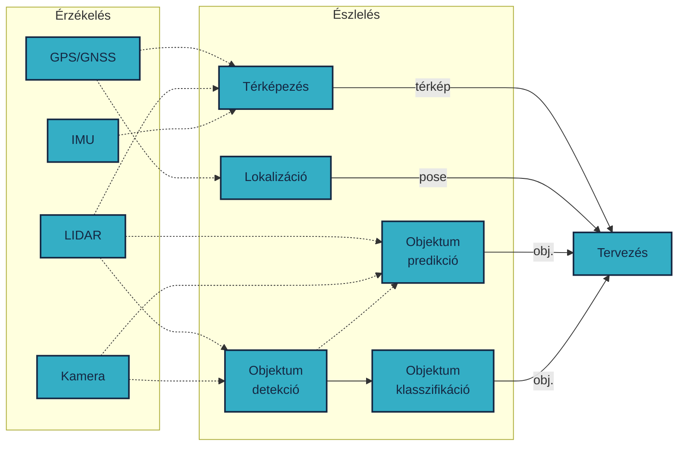

 

  

    Tartalom
  

  {: .text-delta }
1. TOC
{:toc}

---

# Észlelés

Az észlelés (perception) az érzékelt nyers adatokból történő információ kinyerése. 

Az észlelés célja lehet:
- Objektumfelismerés (detekció), pl: 
    - Gyalogos, biciklis jármű felimerés 
    - Tábla felismerés, jelzőlámpa felismerés
    - Vezethető felület és fogalmi sáv felismerés (lokalizációhoz és tervezéshez is)
- Objektumklasszifikáció:
    - A már felismert objektumok osztályzása. Pl a jelzőlámpa milyen színű éppen, melyik jármű kisteherautó és melyik lovaskocsi.
- Objektum követés és predikció: 
    - Merre haladtak eddig a járművek, gyalogosok illetve becslés, hogy merre haladnak majd a jövőben. Ez összefügghet a klasszifikációval, hiszen bár egy lovaskocsi méretre hasonló egy utánfutós autóhoz, mégis egész más gyorsulásra képes. Az így gyűjtött infromációnak megfeleően lehet útvonalat, tarjektóriát tevezni.   
- Lokalizáció és térképépítés
    - [SLAM](https://en.wikipedia.org/wiki/Simultaneous_localization_and_mapping): nem illetve nem csak GNSS alapú helymeghatározás kiegészítése lokális térképp készítéssel. LOAM: LIDAR alapú odometria.

A felhasznált szenzorok alapján lehet:
- LIDAR
- Kamera
- Radar
- IMU
- GNSS/GPS
- Mikrofon
- A fenti szenzorok tetszőleges kombinációja

{: .note }
Magyar nyelven könnyű összekeverni az érzékelés (sensing) és az észlelés (perception) foglamakat. Az észlelés összetett funkció a nyers adatokból feldolgozott, értelmezett kimenet előállításával foglakozik.

Ez a tananyagrész a TU München Autonomous Driving Software Engineering tantárgy tananyagán alapszik, amit az Institute of Automotive Technology intézet munkatársai állítottak össze. Az órai videó elérhető német nyelven:

<iframe width="560" height="315" src="https://www.youtube.com/embed/mffK5EbNLos?si=g1BJhjlVpJe3mrG8?rel=0" title="YouTube video player" frameborder="0" allow="accelerometer; autoplay; clipboard-write; encrypted-media; gyroscope; picture-in-picture; web-share" allowfullscreen></iframe>

## Kihívások, nehézségek

Számos kihívás nehezítheti a felismerést illetve annak pontosságát:
- Időjárás (eső, hó, köd, ...)
- Napszak (éjszaka, naplemente, napfelkelte ...)
- Takarás (objektumok csak részlegesen látszanak)
- Számítási idő (nagyobb sebességeknél hatványozottan)
- Különböző könyezetek (városi, autópálya, erdős szakasz ...)

# Use case (esettanulmányok)

Mivel az észlelés minden egyes aspektusát nehéz lenne bemutani, inkább pár use-case segítségével mutatnánk be.

## Kamera-alapú jelzőlámpa klasszifikáció

Mesterséges intelligencia (neurális háló: YOLOv7) segítségével kamerakép feldolgozás. 

<iframe width="560" height="315" src="https://www.youtube.com/embed/2AQy0-QckMk?si=FHxRsQ5S4m-T5rK-?rel=0" title="YouTube video player" frameborder="0" allow="accelerometer; autoplay; clipboard-write; encrypted-media; gyroscope; picture-in-picture; web-share" allowfullscreen></iframe>

## LIDAR-alapú egyszerű magasság szűrés

A gyakorlaton is előkerülő feladat egyszerű LIDAR szűrés, X, Y és Z koordináták szerint. Mivel a LIDAR a 3D környezet egyszerű reprezentációját adja bizonyos szempontból könnyebb dolgunk van vele, mint a kamerával. Gyakori technológia, hogy az út szintjét szűrik ki a LIDAR adatból(ground-segmentation), majd a maradék pontok (non-ground) jelentik az összes objektumot. Itt egy sokkal egyszerűbb technológiát demonstrálunk:

## Klaszterezés 

Miután az út szintjét kiszűrtük a LIDAR adatból (ground-segmentation), út pontok (ground) és maradék pontok (non-ground) keletkeztek. A non-ground pontokat természetesen klaszterezni (cluster) kell, hogy kialakuljanak az objektumokat leíró pontok. A klaszterezés lényege, hogy egy adott objektum (pl egy autó) pontjai egymáshoz közel állnak.

Forrás: [codeahoy.com](https://codeahoy.com/img/kmeans/kmeans-animated.gif)

<iframe width="560" height="315" src="https://www.youtube.com/embed/Y0bmX5s6ojk?si=waCecpMidjLI19_N?rel=0" title="YouTube video player" frameborder="0" allow="accelerometer; autoplay; clipboard-write; encrypted-media; gyroscope; picture-in-picture; web-share" allowfullscreen></iframe>

## Szenzorfúzió

A következő videó egy való életből vett példán keresztül mutatja be az észlelést.

<iframe width="560" height="315" src="https://www.youtube.com/embed/5E2NYmgvo3E?si=n7lpvnjh2LGBzEC_?rel=0" title="YouTube video player" frameborder="0" allow="accelerometer; autoplay; clipboard-write; encrypted-media; gyroscope; picture-in-picture; web-share" allowfullscreen></iframe>

## LIDAR-alapú útfelület / padka detekció

Egyetemünk egyik saját fejlesztésű algoritmusa.

<iframe width="560" height="315" src="https://www.youtube.com/embed/T2qi4pldR-E?si=9p4mxITiHcwxk4HL?rel=0" title="YouTube video player" frameborder="0" allow="accelerometer; autoplay; clipboard-write; encrypted-media; gyroscope; picture-in-picture; web-share" allowfullscreen></iframe>

## LIDAR-alapú objektum követés és predikció

<iframe width="560" height="315" src="https://www.youtube.com/embed/si9gamz07LA?si=uG4gJHcaTnfOMpfv?rel=0" title="YouTube video player" frameborder="0" allow="accelerometer; autoplay; clipboard-write; encrypted-media; gyroscope; picture-in-picture; web-share" allowfullscreen></iframe>

## SLAM LIDAR és kamera fúzió

A Simultaneous Localization and Mapping (SLAM) lényege, hogy egy mozgó rendszer (robot vagy jármű) pozícióját és a környezetét térképezze egyszerre, miközben navigál.

<iframe width="560" height="315" src="https://www.youtube.com/embed/oRzH-grBsKY?si=UPFX2vd85StR6MLY?rel=0" title="YouTube video player" frameborder="0" allow="accelerometer; autoplay; clipboard-write; encrypted-media; gyroscope; picture-in-picture; web-share" allowfullscreen></iframe>

# Források
- [github.com/TUMFTM/Lecture_ADSE](https://github.com/TUMFTM/Lecture_ADSE)
- [Kim and Kum (2019) – Deep Learning based Vehicle Position and Orientation Estimation via Inverse Perspective Mapping Image](https://ieeexplore.ieee.org/document/8814050)
- [Object Perception: LIDAR youtube APEX AI](https://www.youtube.com/watch?v=xSGCpb24dhI&amp;list=PLL57Sz4fhxLpCXgN0lvCF7aHAlRA5FoFr&amp;index=7&amp;ab_channel=ApexAI)
- [Object Perception: CAMERA youtube APEX AI](https://www.youtube.com/watch?v=OtjTa-meJ-E&amp;list=PLL57Sz4fhxLpCXgN0lvCF7aHAlRA5FoFr&amp;index=8&amp;ab_channel=ApexAI)
- [Object Perception: Radar youtube APEX AI](https://www.youtube.com/watch?v=PcVIO-xoNv8&amp;list=PLL57Sz4fhxLpCXgN0lvCF7aHAlRA5FoFr&amp;index=9&amp;ab_channel=ApexAI)