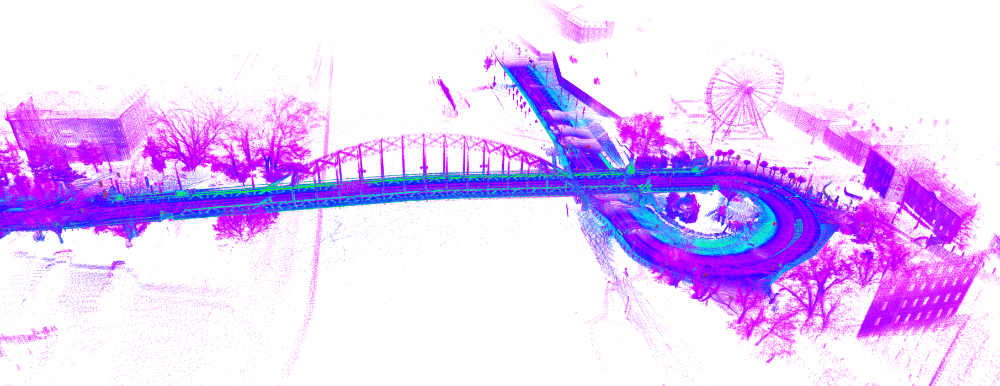

 

<details markdown="block">
  <summary>
    Tartalom
  </summary>
  {: .text-delta }
1. TOC
{:toc}
</details>

---


# SLAM és LOAM

Simultaneous localization and mapping (SLAM) és LIDAR-based odometry and or mapping (LOAM).

Egy győri mérésből összeállított gobális pontfelhő:



## Direct LIDAR-Inertial Odometry

A DLIO egy könnyűsúlyú LIDAR-inerciális odometra algoritmus, amely újszerű coarse-to-fine (durva-finom) megközelítéssel folytonos idejű trajektóriát generál.


<iframe width="560" height="315" src="https://www.youtube.com/embed/APot6QP_wvg?rel=0?rel=0" title="YouTube video player" frameborder="0" allow="accelerometer; autoplay; clipboard-write; encrypted-media; gyroscope; picture-in-picture; web-share" allowfullscreen></iframe>

### Telepítés

Elérhető:

- [github.com/vectr-ucla/direct_lidar_inertial_odometry/tree/feature/ros2](https://github.com/vectr-ucla/direct_lidar_inertial_odometry/tree/feature/ros2) ROS 2 branch
- [github.com/jkk-research/direct_lidar_inertial_odometry](https://github.com/jkk-research/direct_lidar_inertial_odometry) csak az ROS 2 branch-et tartalmazó fork

Nézzük meg, hogy telepítve van-e a `pcl-ros`:

``` bash
sudo apt install ros-humble-pcl-ros
```

``` bash
cd ~/ros2_ws/src/
```

``` bash
git clone https://github.com/jkk-research/direct_lidar_inertial_odometry
```

``` bash
cd ~/ros2_ws/
```

``` bash
colcon build --packages-select direct_lidar_inertial_odometry 
```

## Futtatás

``` bash
code ~/ros2_ws/src/direct_lidar_inertial_odometry/launch/dlio.launch.py
```

``` py
rviz = LaunchConfiguration('rviz', default='true')
pointcloud_topic = LaunchConfiguration('pointcloud_topic', default='/lexus3/os_center/points')
imu_topic = LaunchConfiguration('imu_topic', default='/lexus3/os_center/imu')
```

**Első opció**: Colon-nál vagy `--symlink-install`-t használunk: ekkor a fájlok forrásból való másolása helyett szimbolikus hivatkozásokat használ. Így elkerülhető, hogy pl. minden egyes launch fájl módosítás esetén újra kelljen buildelni a package-t.

``` bash
cd ~/ros2_ws/ && colcon build --symlink-install --packages-select direct_lidar_inertial_odometry  
```

**Második opció**: újra buildelünk minden egyes launch fájl módosítás esetén:

``` bash
cd ~/ros2_ws/ && colcon build --packages-select direct_lidar_inertial_odometry 
```

## KISS-ICP

[KISS-ICP](https://www.ipb.uni-bonn.de/wp-content/papercite-data/pdf/vizzo2023ral.pdf) egy LIDAR odometria pipeline megoldás, amely tegtöbb esetben komolyabb paraméter állítás nélül is jól működik.

<a href="https://user-images.githubusercontent.com/21349875/219626075-d67e9165-31a2-4a1b-8c26-9f04e7d195ec.mp4"></a>

### Telepítés

``` bash
cd ~/ros2_ws/src/
```

``` bash
git clone https://github.com/PRBonn/kiss-icp
```

``` bash
cd ~/ros2_ws/
```

``` bash
colcon build --packages-select kiss_icp
```

### Futtatás

``` bash
ros2 launch kiss_icp odometry.launch.py topic:=/lexus3/os_left/points
```

## fastcampus_slam_codes oktatóanyag
[github.com/changh95/fastcampus_slam_codes](https://github.com/changh95/fastcampus_slam_codes/)