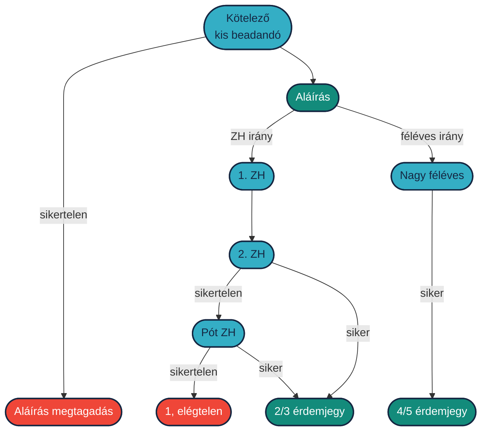
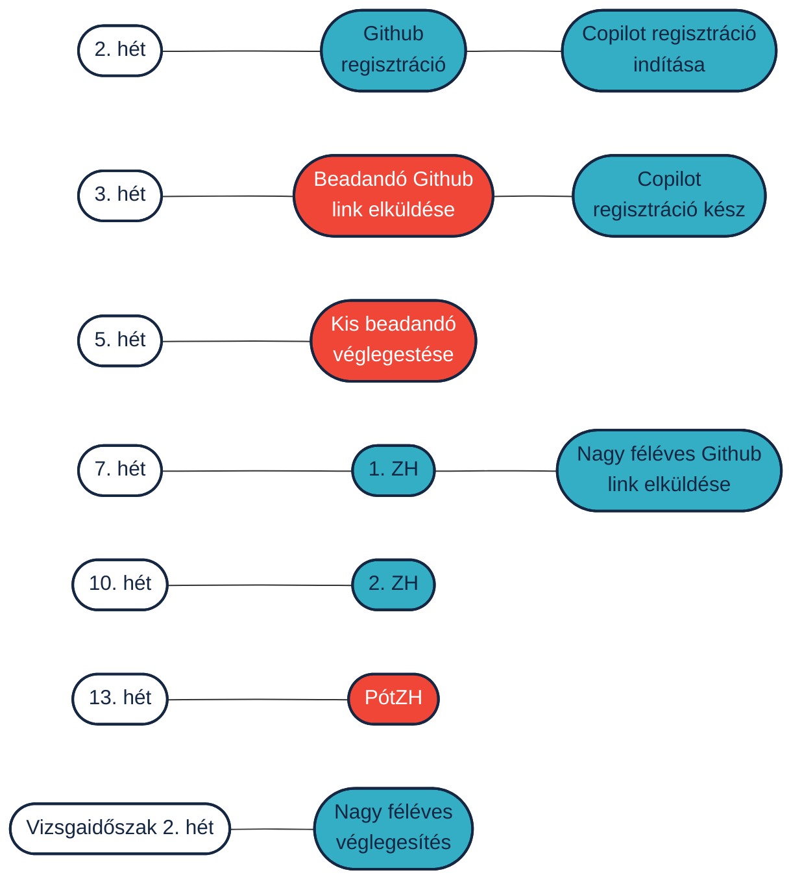

 

  

    Tartalom
  

  {: .text-delta }
1. TOC
{:toc}

---

# Kis beadandó és nagy féléves

A kis beadandó célja, hogy a hallgatók az órán megszerzett kezdő szintű elméleti tudás mellé gyakorlati tapasztalatot szerezzenek ROS 2-ről és GitHub-ról. A kis beadandó viszonylag **kevés idő** alatt elvégezhető: egy oktató pár óra alatt, egy átlag hallgató pár délután alatt elkészülhet vele. Terjedelem 30-100 kódsor node-onként.

Ezzel szemben a nagy féléves egy kicsit több időt vesz igénybe, de sokkal érdekesebb feladatra is van lehetőség és idő. Ráadásul a jó és jeles érdemjegyet is csak így lehet megszerezni.

A jegyszerzés másik lehetősége a ZH-k, erre azonban csak szerény érdemjegy kapható.

## Határidők, félév beosztása

Fontos, tudni, hogy a kis beadandó **aláírás feltétel**. A GitHub regisztráció, a beadandó link beküldés elmulasztása, már a szemeszter viszonlag korai szakszában sikeretelen félévet eredményezhet. Ezek kis feladatok, meglétüket mégis szigorúan ellenőrizzük.

