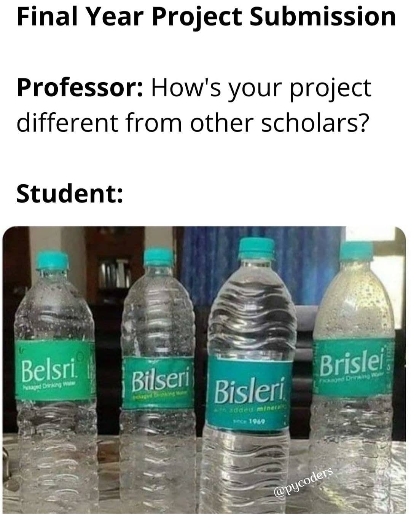

# Féléves beadandó

## Példák

Az alábbi példák nem feltétlenül féléves munkának készültek, de annak elfogadhatóak lennének:
-  [github.com/jkk-research/pointcloud_to_grid](https://github.com/jkk-research/pointcloud_to_grid)
-  [github.com/jkk-research/urban_road_filter](https://github.com/jkk-research/urban_road_filter)
-  [github.com/dobaybalazs/curb_detection](https://github.com/dobaybalazs/curb_detection)
-  [github.com/szenergy/rviz_markers](https://github.com/szenergy/rviz_markers)
-  [github.com/linklab-uva/f1tenth_gtc_tutorial](https://github.com/linklab-uva/f1tenth_gtc_tutorial)

## A *féléves* feladatnál pozitív hatást kelt:
- 👍 Jól követhető magyar és/vagy angol nyelvű dokumentáció is, képekkel illusztrálva. [Markdown](https://docs.github.com/en/get-started/writing-on-github/getting-started-with-writing-and-formatting-on-github/basic-writing-and-formatting-syntax) használata.
- 👍 Alap információk a `README.md`-ben, dokumentáció a `/wiki`-ben.
- 👍 Issue-k.
- 👍 Branch-ek.
- 👍 Gitignore.
- 👍 Licensz.
- 👍 Repository topic-ok, köztük a tárgykód és a SZE. A topic-ok alapján aztán pl itt is listázódik a repository: [github.com/topics/sze](https://github.com/topics/sze).
- 👍 Plusz jegy adható, amennyiben a jelen tananyag kiegészítésre / hibajavításra kerül (temészetesen pull request által).

## *Komoly hibák*, ami miatt a *féléves* akár több érdemjeggyel is rosszabb  lehet:
- 😡 Tömörített állomány a GitHub repositoryban (pl. `zip` és még rosszabb, ha `rar`). Kivétel lehet, ha direkt tömörített állománykezelés a cél, de forráskód, kép, stb. soha ne kerüljön így fel. 
- 😡 [Nem eredeti munka](#meme), vagy az átvett kód nincs hivatkozva. 
- 😡 Csapatban csak egy hallgató commitol. (Ez nyilván nem vonatkozis egyfős feladatokra).
- 😡 Kevés commit. Azért lenne fontos a megfelelő számú commit, mert ebből tudjuk, megítélni, hogyan haladt előre a munkafolyamat, ki, mit és mikor dolgozott.
- 😡 Nincs `README.md`, hiányzik a rövid dokumentáció vagy a képek.
- 😡 A dokumentáció pdf / docx-ként feltöltve a `/wiki` helyett.
- 😡 File upload commit helyett.
- 😡 Forráskód kiképmetszőzve markdown szintaxis kiemelés helyett. (Mivel képként nem másolható, kereshető, stb a kód.)

## Ötletek témaválasztáshoz

- Inspriráció lehet a korábbi vagy jelenlegi szakdolgozatok / diplomamunkák témái: [horverno.github.io/temaajanlatok](https://horverno.github.io/temaajanlatok/)
- Olyan témát célszerű választani, amin szívesen dolgoznál heteken/hónapokon keresztül is. Ha pl. a vizualizáció, az algoritmusok gyakorlata, a 3D vagy épp a mesterséges intelligencia vonzó, akkor ennek megfelelő témát célszerű választani.
- Korábbi szakdolgozatok, félévesek elérhetőek, ezeket igényelni [itt lehet](https://docs.google.com/forms/d/e/1FAIpQLSdtMK--IQl4v5pHiATDP4MJwuU-M0Ycd2keMndQfuuhvlr1rA/viewform?usp=sf_link). Fontos, hogy ezeket **tilos** továbbosztani, csak oktatási céllal állnak rendelkezésre.

{: .new }
Erősen ajánlott a [GitHub Student Developer Pack](https://education.github.com/pack) beszerzése, többek között [Copilot](https://github.com/features/copilot) is jár hozzá.

### Meme

Credit: [pycoders](https://www.instagram.com/pycoders/)