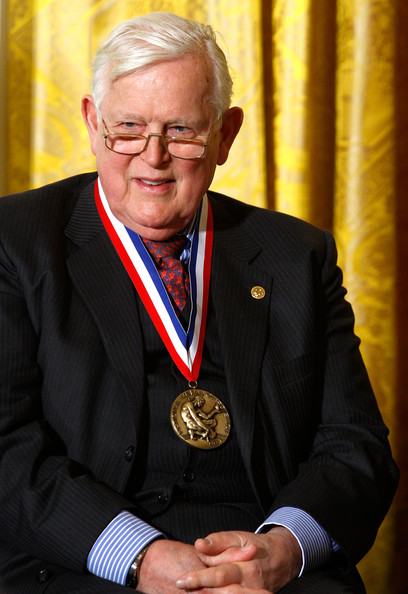

# Kálmán filter

Kálmán Rudolf Emil (Budapest, 1930. május 19. – Gainesville, 2016. július 2.) amerikai magyar villamosmérnök, matematikus, a műszaki tudományok doktora, a Magyar Tudományos Akadémia tiszteleti tagja. Munkássága a matematikai eljárások folyamatirányítási és szabályozáselméleti alkalmazásában, az operációkutatásban jelentős, többek között a nevéhez fűződik a Kálmán-szűrő elvének kidolgozása.

Newton's Equations of Motion

$$ x = x_0 + v_{x0} * t + \frac{1}{2}a_x * t^2 $$

$$ y = y_0 + v_{y0} * t + \frac{1}{2}a_y * t^2 $$

State Transition (no control input)

$$x_{k+1} = \begin{bmatrix}1 & 0 & \Delta t & 0 & \frac{1}{2}\Delta t^2 & 0 \\ 0 & 1 & 0 & \Delta t & 0 & \frac{1}{2}\Delta t^2 \\ 0 & 0 & 1 & 0 & \Delta t & 0 \\ 0 & 0 & 0 & 1 & 0 & \Delta t \\ 0 & 0 & 0 & 0 & 1 & 0  \\ 0 & 0 & 0 & 0 & 0 & 1\end{bmatrix} \cdot \begin{bmatrix} x \\ y \\ \dot x \\ \dot y \\ \ddot x \\ \ddot y\end{bmatrix}_{k}$$

$$y = H \cdot x$$

Acceleration (IMU) and position (GNSS) (x˙˙, y˙˙, x, y) sensors are used.

$$y = \begin{bmatrix}0 & 0 & 0 & 0 & 1 & 0 \\ 0 & 0 & 0 & 0 & 0 & 1 \\ 1 & 0 & 0 & 0 & 0 & 0 \\ 0 & 1 & 0 & 0 & 0 & 0 \end{bmatrix} \cdot x$$
