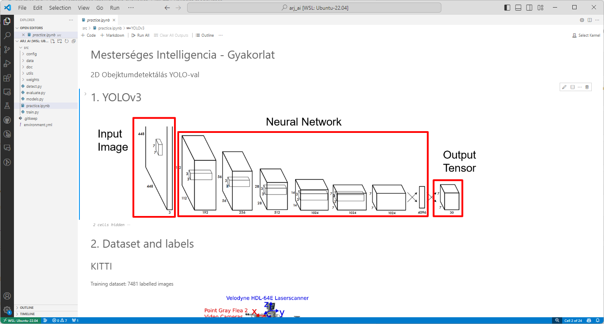
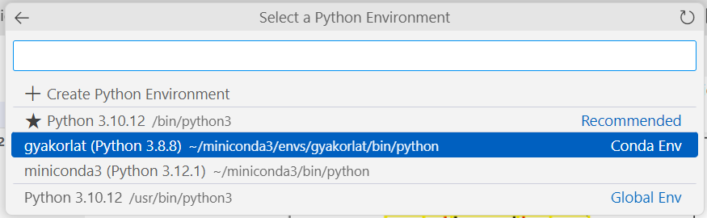

 

<details markdown="block">
  <summary>
    Tartalom
  </summary>
  {: .text-delta }
1. TOC
{:toc}
</details>

---


# Mesterséges intelligencia gyakorlat

## Gyakrolati anyag letöltése
A gyakorlati anyag frissítéséhez adjuk ki a következő parancsokat:

```bash
cd ~/ros2_ws/src/arj_packages
``` 
``` r
git checkout -- .
``` 
``` r
git pull
```

## Conda környezet telepítése
Az anaconda (miniconda) egy izolált virtuális környezetet biztosít, ahol az éppen aktuális munkához szükséges verziószámú Python csomagokat tudjuk telepíteni.

```bash
mkdir -p ~/miniconda3
``` 
``` r
wget https://repo.anaconda.com/miniconda/Miniconda3-latest-Linux-x86_64.sh -O ~/miniconda3/miniconda.sh
``` 
``` r
bash ~/miniconda3/miniconda.sh -b -u -p ~/miniconda3
``` 
``` r
rm -rf ~/miniconda3/miniconda.sh
``` 
``` r
~/miniconda3/bin/conda init bash
```

A solver hangolja össze a verziókat az előre definiált környezethez (`environment.yml`) szükséges csomagok között. A `libmamba-solver` az alapértelmezetthez solverhez képest egy gyorsabb hangolást tesz lehetővé.
```bash
source ~/.bashrc
```
```bash
conda config --set auto_activate_base false
``` 
``` r
conda update -n base conda
``` 
``` r
conda install -n base conda-libmamba-solver
``` 
``` r
conda config --set solver libmamba
```

Miután a Conda települt, létrehozzuk a saját virtuális környezetünket:
```bash
cd ~/ros2_ws/src/arj_packages/arj_ai
``` 
``` r
conda env create -f environment.yml
```
## Gyakorlat megnyitása

Az anyag a következőképpen nyitható meg:
```bash
conda activate gyakorlat
``` 
``` r
cd ~/ros2_ws/src/arj_packages/arj_ai 
``` 
``` r
code .
```



Válassszuk ki a környezetet:



# Hibaelhárítás

TODO

``` python
ImportError                               Traceback (most recent call last)
Cell In[1], line 10
      8 import matplotlib.patches as patches
      9 import matplotlib.pyplot as plt
---> 10 import torch
     11 import torchvision.transforms as transforms
     12 from PIL import Image

File ~/miniconda3/envs/gyakorlat/lib/python3.8/site-packages/torch/__init__.py:189
    187     if USE_GLOBAL_DEPS:
    188         _load_global_deps()
--> 189     from torch._C import *
    191 # Appease the type checker; ordinarily this binding is inserted by the
    192 # torch._C module initialization code in C
    193 if False:

ImportError: /home/he/miniconda3/envs/gyakorlat/lib/python3.8/site-packages/torch/lib/libtorch_cpu.so: undefined symbol: iJIT_IsProfilingActive
```

# Conda deaktiválás

``` bash
conda deactivate
```