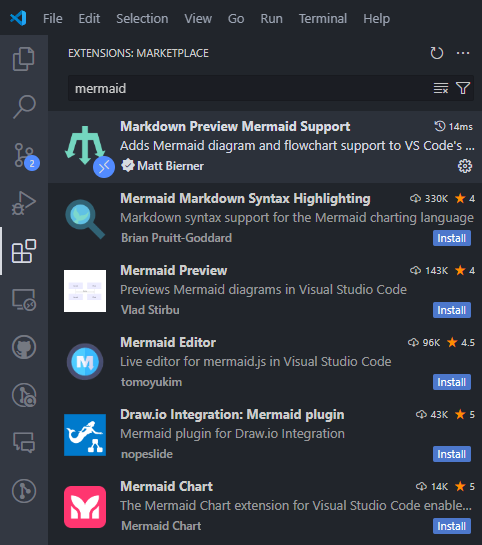
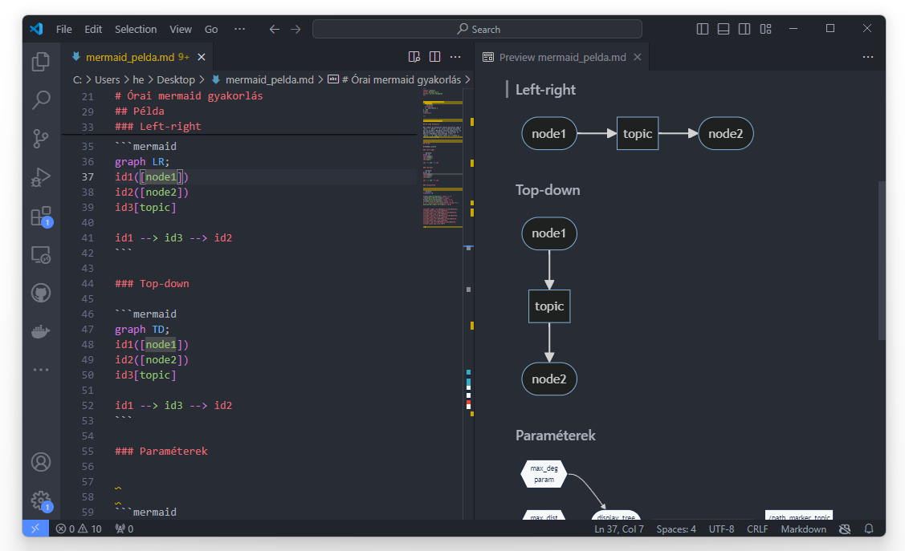
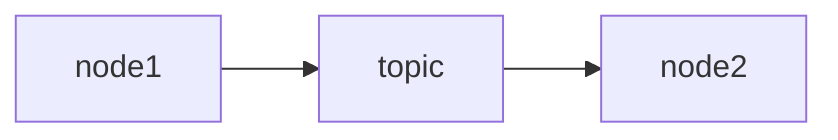
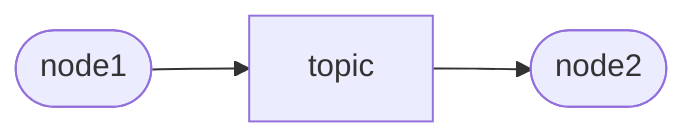
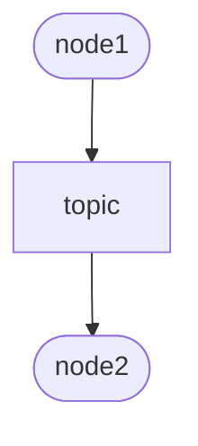
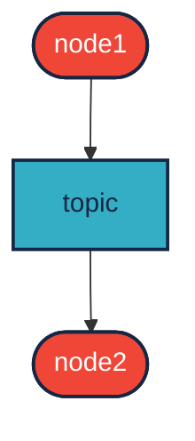
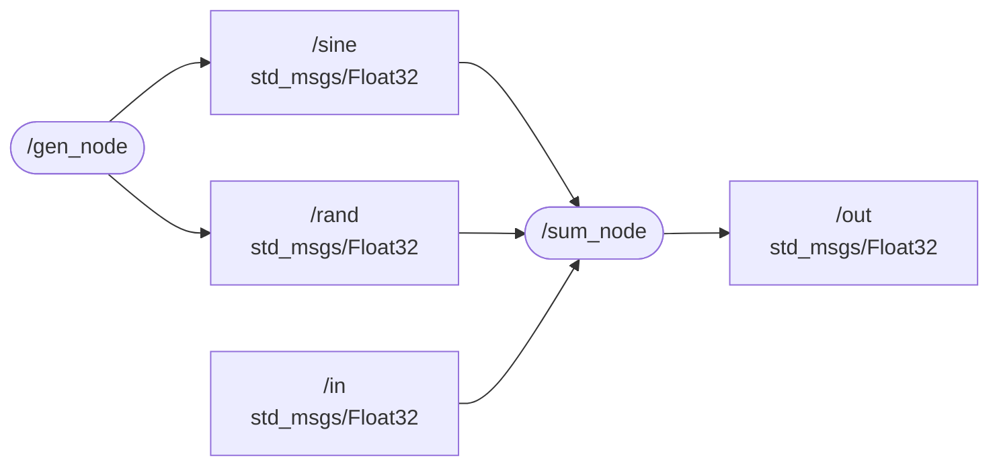
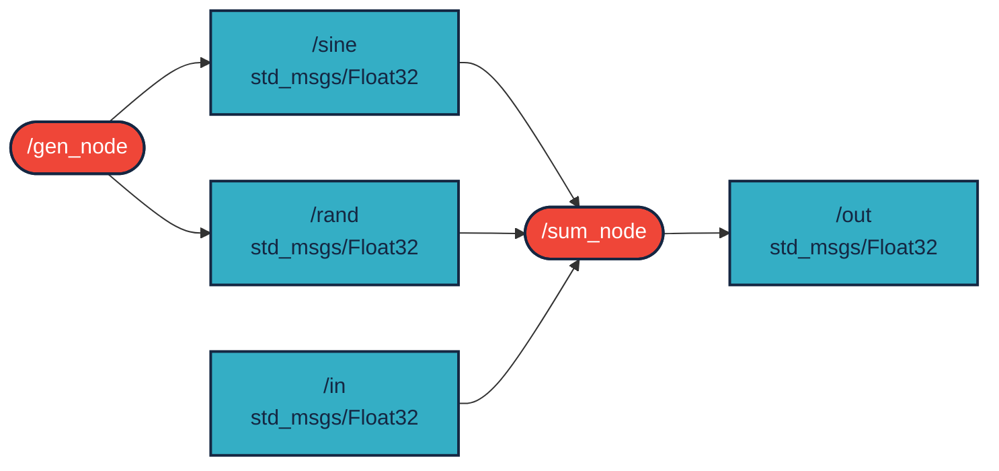
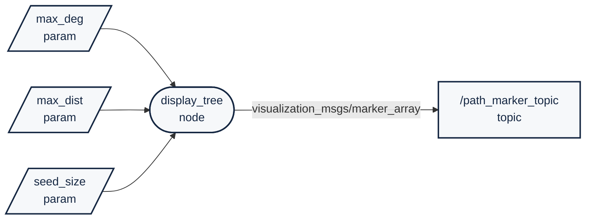
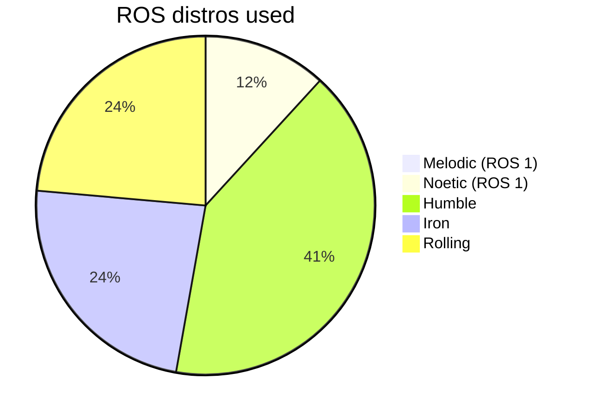

 

<details markdown="block">
  <summary>
    Tartalom
  </summary>
  {: .text-delta }
1. TOC
{:toc}
</details>

---


# Mermaid gyakorlás

A mermaid hasznos kiegészője lehet a markdown fájlainknak (pl `README.md`). Különböző grafikononokat, flowchartokat tudunk vele viszonylag könnyen létrehozni.

## VS code extension

Bal oldalt az Extension ikonra kattintva vagy a `Ctrl` + `Shift` + `X` után a meraid kulcsszót beírva előjön a Markdown Preview kiegészítő, ez egy katintással telepíthető és használhat is. Ezután a Markdown előnézetében (`Ctrl` + `Shift` + `V` vagy felső ikon) már látható is lesz az előlnézet. 
<center>


</center>

Célszerű a *Mermaid Markdown Syntax Highlighting* és a *Color Highlight* extension-t is használni, ekkor a következőképp jelenik meg a gráf kódja:

<center>

</center>
# Példák


## Egyszerű példa

Ay egyik legegyszerűbb flowchart kódja következő 2 sorból áll:

```ruby
graph LR;
node1 --> topic --> node2
```

Az első sor a gráf típusa, a második (vagy további) sorokban a kapcsolatokat `-->` a nyilak definiálják.



## Téglalap helyett formákkal

Az `LR` a left-right rövidítése. A formák lehetnek lekerekítettek `([ ])`, szögletesek `[ ]`,  hexagonok {`{ }`} paralellogrammák `[/ /]` és [továbbiak is](https://mermaid.js.org/syntax/flowchart.html#node-shapes). ROS-ben megtanultuk, hogy a **node** lekerekített, míg a **topic** szögletes. Az azonosítókat itt pl: `id1`, `id2`, `id3` a zárójel elé lehet írni. A kapcsolatkoat vagy külön sorban (mint itt) vagy egy sorban (későbbi példa) is definiálhatjuk.

``` ruby
graph LR;
id1([node1])
id2([node2])
id3[topic]

id1 --> id3 --> id2
```




## Balról jobbra helyett fentről lefele

Az `TD` a top-down rövidítése:

```ruby
graph TD;
id1([node1])
id2([node2])
id3[topic]

id1 --> id3 --> id2
```



## Színek használata

`classDef` segítségével színeket, vonalakat, definálhatunk, majd 3 db kettőspont után `:::` azonosíthatjuk a megfelelő osztályhoz:

```ruby
graph TD;
id1([node1]):::red
id2([node2]):::red
id3[topic]:::light

id1 --> id3 --> id2

classDef light fill:#34aec5,stroke:#152742,stroke-width:2px,color:#152742  
classDef dark fill:#152742,stroke:#34aec5,stroke-width:2px,color:#34aec5
classDef white fill:#ffffff,stroke:#152742,stroke-width:2px,color:#152742
classDef red fill:#ef4638,stroke:#152742,stroke-width:2px,color:#fff
```



## Több node és topic 

További, több node-ot és topicot tartalmazó példa:

```ruby
graph LR;

gen([ /gen_node]) --> sine
gen --> rand[ /rand<br/>std_msgs/Float32]
sine[ /sine<br/>std_msgs/Float32] --> sum([ /sum_node])
sum --> out[ /out<br/>std_msgs/Float32]
rand --> sum
in[ /in<br/>std_msgs/Float32] --> sum
```




## Az előbbi példa, csak színekkel

```ruby
graph LR

gen([ /gen_node]):::red --> sine
gen --> rand[ /rand<br/>std_msgs/Float32]:::light 
sine[ /sine<br/>std_msgs/Float32]:::light --> sum([ /sum_node]):::red
sum --> out[ /out<br/>std_msgs/Float32]:::light 
rand --> sum
in[ /in<br/>std_msgs/Float32]:::light --> sum

classDef light fill:#34aec5,stroke:#152742,stroke-width:2px,color:#152742  
classDef dark fill:#152742,stroke:#34aec5,stroke-width:2px,color:#34aec5
classDef white fill:#ffffff,stroke:#152742,stroke-width:2px,color:#152742
classDef red fill:#ef4638,stroke:#152742,stroke-width:2px,color:#fff

```


## Alternatív verzió `class` használatára

A három `:::` pont helyett egyszerűen a `class` kulcsszó után felsorolhatjuk az osztályokat:

```python
graph LR

gen([ /gen_node]) --> sine
gen --> rand[ /rand<br/>std_msgs/Float32] 
sine[ /sine<br/>std_msgs/Float32] --> sum([ /sum_node])
sum --> out[ /out<br/>std_msgs/Float32]
rand --> sum
in[ /in<br/>std_msgs/Float32] --> sum

classDef light fill:#34aec5,stroke:#152742,stroke-width:2px,color:#152742  
classDef dark fill:#152742,stroke:#34aec5,stroke-width:2px,color:#34aec5
classDef white fill:#ffffff,stroke:#152742,stroke-width:2px,color:#152742
classDef red fill:#ef4638,stroke:#152742,stroke-width:2px,color:#fff

class gen,sum red
class rand,sine,in,out light

```




```ruby
flowchart LR

A[/ max_deg</br>param /]:::gray --> D([display_tree</br>node]):::gray
B[/ max_dist</br>param /]:::gray --> D
C[/ seed_size</br>param /]:::gray --> D
D --> |visualization_msgs/marker_array| P[ /path_marker_topic</br>topic]:::gray


classDef light fill:#34aec5,stroke:#152742,stroke-width:2px,color:#152742  
classDef dark fill:#152742,stroke:#34aec5,stroke-width:2px,color:#34aec5
classDef white fill:#ffffff,stroke:#152742,stroke-width:2px,color:#152742
classDef gray fill:#f6f8fa,stroke:#152742,stroke-width:2px,color:#152742
classDef red fill:#ef4638,stroke:#152742,stroke-width:2px,color:#fff
```

## Paraméterek

Gyakran jól jön a definiált paraméterek vizualizálása. Erre jelen tudásunk szerint nincs szabványos jelölés hexagonok {`{ }`} vagy paralellogrammák `[/ /]` lehetnek az opciók.



## Rendszerterv

``` python
flowchart TD
    S[State Machine <br>/plan_state_machine] -.->|/plan_state*| LS[LIDAR segementation<br>/prcp_ground_obstacle_segm_lidar]
    S -.-> CS[Cone detection camera<br> and de-projection]
    S -.-> O[Object fusion]
    CS -->|/prcp_obj_list_camera| O
    LS -->|/prcp_obj_list_lidar| O
    O -->|/prcp_obj_list_fused| T[Trajectory planner<br>/plan_trajectory_planner]
    T --> C[Control<br>/ctrl_vehicle_control]
    S -.-> T
    S -.-> C
    O --> M[Map Creation<br>/prc_slam]
    M -->|/prcp_map| T
    L[Localization<br>/prcp_odometry_kf_prediction] --> T
    C --> CAN[To CAN]

    classDef light fill:#34aec5,stroke:#152742,stroke-width:2px,color:#152742  
    classDef dark fill:#152742,stroke:#34aec5,stroke-width:2px,color:#34aec5
    classDef white fill:#ffffff,stroke:#152742,stroke-width:2px,color:#15274
    classDef dash fill:#ffffff,stroke:#152742,stroke-width:2px,color:#15274, stroke-dasharray: 5 5
    classDef red fill:#ef4638,stroke:#152742,stroke-width:2px,color:#fff
    classDef green fill:#138b7b,stroke:#152742,stroke-width:2px,color:#fff
    class CS,LS,L,T,M,C white
    class O light
    class S dash
    class CAN red
 ``` 

```mermaid
flowchart TD
    S[State Machine <br>/plan_state_machine] -.->|/plan_state*| LS[LIDAR segementation<br>/prcp_ground_obstacle_segm_lidar]
    S -.-> CS[Cone detection camera<br> and de-projection]
    S -.-> O[Object fusion]
    CS -->|/prcp_obj_list_camera| O
    LS -->|/prcp_obj_list_lidar| O
    O -->|/prcp_obj_list_fused| T[Trajectory planner<br>/plan_trajectory_planner]
    T --> C[Control<br>/ctrl_vehicle_control]
    S -.-> T
    S -.-> C
    O --> M[Map Creation<br>/prc_slam]
    M -->|/prcp_map| T
    L[Localization<br>/prcp_odometry_kf_prediction] --> T
    C --> CAN[To CAN]
    classDef light fill:#34aec5,stroke:#152742,stroke-width:2px,color:#152742  
    classDef dark fill:#152742,stroke:#34aec5,stroke-width:2px,color:#34aec5
    classDef white fill:#ffffff,stroke:#152742,stroke-width:2px,color:#15274
    classDef dash fill:#ffffff,stroke:#152742,stroke-width:2px,color:#15274, stroke-dasharray: 5 5
    classDef red fill:#ef4638,stroke:#152742,stroke-width:2px,color:#fff
    classDef green fill:#138b7b,stroke:#152742,stroke-width:2px,color:#fff
    class CS,LS,L,T,M,C white
    class O light
    class S dash
    class CAN red
 ``` 

## Körcikk

Az [metrics.ros.org/rosdistro_rosdistro.html](https://metrics.ros.org/rosdistro_rosdistro.html) alapján egy körcikk diagram:

``` python
pie title ROS distros used
    "Melodic (ROS 1)" : 0.0010
    "Noetic (ROS 1)" : 0.0951
    "Humble" : 0.3333
    "Iron" : 0.1905
    "Rolling" : 0.1904
```



# Linkek
- [Mermaid flowchart](https://mermaid.js.org/syntax/flowchart.html)
- [Mermaid pie chart](https://mermaid.js.org/syntax/pie.html)
- [Mermaid intro](https://mermaid.js.org/intro/)
