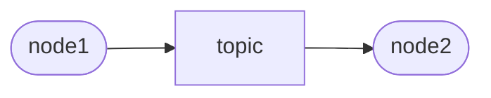
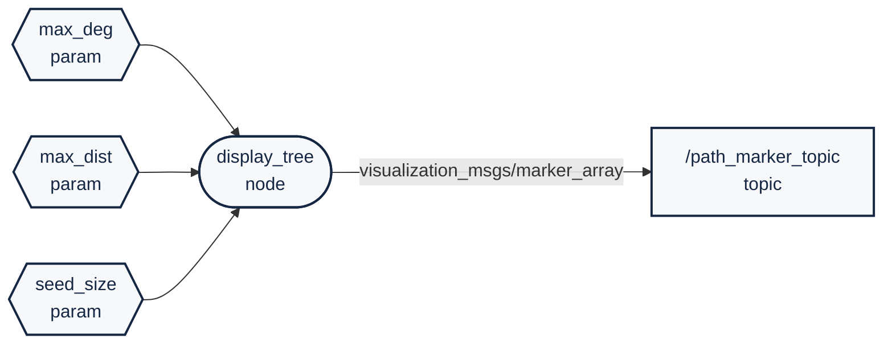

 

<details markdown="block">
  <summary>
    Tartalom
  </summary>
  {: .text-delta }
1. TOC
{:toc}
</details>

---


# Mermaid gyakorlás

A mermaid hasznos kiegészője lehet a markdown fájlainknak (pl `README.md`). Különböző grafikononokat, flowchartokat tudunk vele viszonylag könnyen létrehozni.

## VS code extension

Bal oldalt az Extension ikonra kattintva vagy a `Ctrl` + `Shift` + `X` után a meraid kulcsszót beírva előjön a Markdown Preview kiegészítő, ez egy katintással telepíthető és használhat is. Ezután a Markdown előnézetében (`Ctrl` + `Shift` + `V` vagy felső ikon) már látható is lesz az előlnézet. 
<center>


</center>

# Példák

Az `LR` a left-right rövidítése:

``` ruby
graph LR;
id1([node1])
id2([node2])
id3[topic]

id1 --> id3 --> id2
```




Az `TD` a top-down rövidítése:

```ruby
graph TD;
id1([node1])
id2([node2])
id3[topic]

id1 --> id3 --> id2
```


```ruby
graph TD;
id1([node1]):::red
id2([node2]):::red
id3[topic]:::light

id1 --> id3 --> id2

classDef light fill:#34aec5,stroke:#152742,stroke-width:2px,color:#152742  
classDef dark fill:#152742,stroke:#34aec5,stroke-width:2px,color:#34aec5
classDef white fill:#ffffff,stroke:#152742,stroke-width:2px,color:#152742
classDef red fill:#ef4638,stroke:#152742,stroke-width:2px,color:#fff
```


```ruby
graph LR;

gen([ /gen_node]) --> sine
gen --> rand[ /rand<br/>std_msgs/Float32]
sine[ /sine<br/>std_msgs/Float32] --> sum([ /sum_node])
sum --> out[ /out<br/>std_msgs/Float32]
rand --> sum
in[ /in<br/>std_msgs/Float32] --> sum
```


```ruby
graph LR

gen([ /gen_node]):::red --> sine
gen --> rand[ /rand<br/>std_msgs/Float32]:::light 
sine[ /sine<br/>std_msgs/Float32]:::light --> sum([ /sum_node]):::red
sum --> out[ /out<br/>std_msgs/Float32]:::light 
rand --> sum
in[ /in<br/>std_msgs/Float32]:::light --> sum

classDef light fill:#34aec5,stroke:#152742,stroke-width:2px,color:#152742  
classDef dark fill:#152742,stroke:#34aec5,stroke-width:2px,color:#34aec5
classDef white fill:#ffffff,stroke:#152742,stroke-width:2px,color:#152742
classDef red fill:#ef4638,stroke:#152742,stroke-width:2px,color:#fff

```


```ruby
graph LR

gen([ /gen_node]) --> sine
gen --> rand[ /rand<br/>std_msgs/Float32] 
sine[ /sine<br/>std_msgs/Float32] --> sum([ /sum_node])
sum --> out[ /out<br/>std_msgs/Float32]
rand --> sum
in[ /in<br/>std_msgs/Float32] --> sum

classDef light fill:#34aec5,stroke:#152742,stroke-width:2px,color:#152742  
classDef dark fill:#152742,stroke:#34aec5,stroke-width:2px,color:#34aec5
classDef white fill:#ffffff,stroke:#152742,stroke-width:2px,color:#152742
classDef red fill:#ef4638,stroke:#152742,stroke-width:2px,color:#fff

class gen,sum red
class rand,sine,in,out light

```


```ruby
flowchart LR

A{{max_deg</br>param}}:::gray --> D([display_tree</br>node]):::gray
B{{max_dist</br>param}}:::gray --> D
C{{seed_size</br>param}}:::gray --> D
D --> |visualization_msgs/marker_array| P[ /path_marker_topic</br>topic]:::gray


classDef light fill:#34aec5,stroke:#152742,stroke-width:2px,color:#152742  
classDef dark fill:#152742,stroke:#34aec5,stroke-width:2px,color:#34aec5
classDef white fill:#ffffff,stroke:#152742,stroke-width:2px,color:#152742
classDef gray fill:#f6f8fa,stroke:#152742,stroke-width:2px,color:#152742
classDef red fill:#ef4638,stroke:#152742,stroke-width:2px,color:#fff

```




``` ruby
flowchart TD
    S[State Machine <br>/plan_state_machine] -.->|/plan_state*| LS[LIDAR segementation<br>/prcp_ground_obstacle_segm_lidar]
    S -.-> CS[Cone detection camera<br> and de-projection]
    S -.-> O[Object fusion]
    CS -->|/prcp_obj_list_camera| O
    LS -->|/prcp_obj_list_lidar| O
    O -->|/prcp_obj_list_fused| T[Trajectory planner<br>/plan_trajectory_planner]
    T --> C[Control<br>/ctrl_vehicle_control]
    S -.-> T
    S -.-> C
    O --> M[Map Creation<br>/prc_slam]
    M -->|/prcp_map| T
    L[Localization<br>/prcp_odometry_kf_prediction] --> T
    C --> CAN[To CAN]

    classDef light fill:#34aec5,stroke:#152742,stroke-width:2px,color:#152742  
    classDef dark fill:#152742,stroke:#34aec5,stroke-width:2px,color:#34aec5
    classDef white fill:#ffffff,stroke:#152742,stroke-width:2px,color:#15274
    classDef dash fill:#ffffff,stroke:#152742,stroke-width:2px,color:#15274, stroke-dasharray: 5 5
    classDef red fill:#ef4638,stroke:#152742,stroke-width:2px,color:#fff

    class CS,LS,L,T,M,C white
    class O light
    class S dash
    class CAN red
 ``` 

```mermaid
flowchart TD
    S[State Machine <br>/plan_state_machine] -.->|/plan_state*| LS[LIDAR segementation<br>/prcp_ground_obstacle_segm_lidar]
    S -.-> CS[Cone detection camera<br> and de-projection]
    S -.-> O[Object fusion]
    CS -->|/prcp_obj_list_camera| O
    LS -->|/prcp_obj_list_lidar| O
    O -->|/prcp_obj_list_fused| T[Trajectory planner<br>/plan_trajectory_planner]
    T --> C[Control<br>/ctrl_vehicle_control]
    S -.-> T
    S -.-> C
    O --> M[Map Creation<br>/prc_slam]
    M -->|/prcp_map| T
    L[Localization<br>/prcp_odometry_kf_prediction] --> T
    C --> CAN[To CAN]
    classDef light fill:#34aec5,stroke:#152742,stroke-width:2px,color:#152742  
    classDef dark fill:#152742,stroke:#34aec5,stroke-width:2px,color:#34aec5
    classDef white fill:#ffffff,stroke:#152742,stroke-width:2px,color:#15274
    classDef dash fill:#ffffff,stroke:#152742,stroke-width:2px,color:#15274, stroke-dasharray: 5 5
    classDef red fill:#ef4638,stroke:#152742,stroke-width:2px,color:#fff
    class CS,LS,L,T,M,C white
    class O light
    class S dash
    class CAN red
 ``` 

# Linkek
- [Mermaid flowchart](https://mermaid.js.org/syntax/flowchart.html)
- [Mermaid pie chart](https://mermaid.js.org/syntax/pie.html)
- [Mermaid intro](https://mermaid.js.org/intro/)
