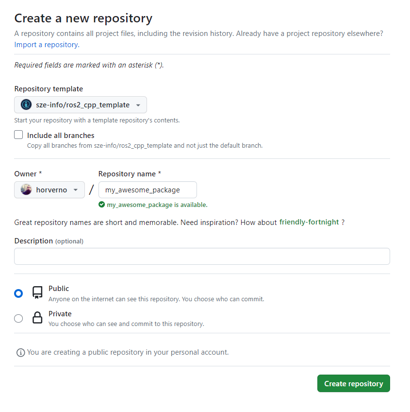
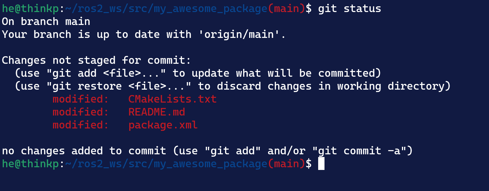
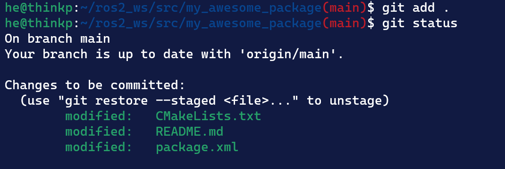
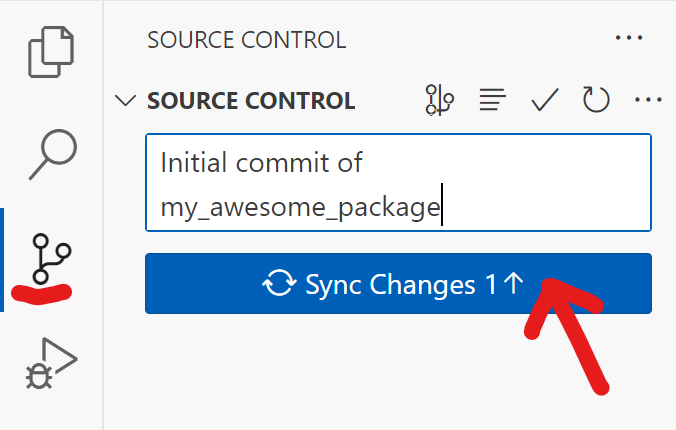
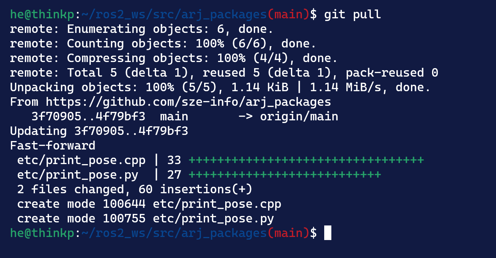

 

<details markdown="block">
  <summary>
    Tartalom
  </summary>
  {: .text-delta }
1. TOC
{:toc}
</details>

---


# Git alapismeretek

## Pár parancs

- `git clone`: git repo klónozása
- `git config --global user.name "Sanyika"`: felhsználónév beállítása
- `git config --global user.email "sanyika@gggmail.com`: email beállítása
- `git init`: lokális repó inicializálása
- `git add <file>`: fájl hozzáadása
- `git status`: aktuális státusz lekérdezése
- `git commit -m "My beautiful commit"`: commit, üzenettel
- `git push`: push
- `git pull`: pull, változások lokális lefrissítése
- `git branch <new_branch_name>`: branch készítése
- `git checkout <branch_name>`: új branch
- `git checkout -- .`: Minden nem staged (unstaged) változás elvetése lokálisan. VS code-ban kb ez a "discard all changes" parancs. (Újabb git verziókban a `git restore .` is hasonló módon működik.)
- `git merge <branch_name>`: a jelenlegi branch-be mergeli a branch-t

<center></center>

*Forrás*: [link](https://www.linkedin.com/posts/chaima-haj-taher-1093881ba_git-softwaredevelopment-workflow-activity-7177685446787751936-atW_)

## Terminológia

- **Local repository**: a helyi munka repo, pl lokálisan a `~/ros2_ws/src/my_repo` 
- **Remote repository**: általában online távoli backup repo pl: `github.com/my_name/my_repo`

# Előkészületek

Ha még nem tetted volna meg, regisztrálj [GitHub](https://github.com/signup)-ra.

# A template használata

Navigálj a [https://github.com/sze-info/ros2_cpp_template](https://github.com/sze-info/ros2_cpp_template) URL-re.

Itt használd a zöld gombot, hozd létre a saját felhasználóddal a `my_awesome_package` nevű package-t:


Utána ez az oldal fogad, itt ki kell tölteni a repo nevét, utána pedig a zöld gombra kattintva létrejön a repo:


# Klónozd `git clone` segítségével a saját package-d

Ha a Github userneved `mycoolusername` a repo (és egyben a package) neve pedig `my_awesome_package`, akkor pl így tudod megtenni:

``` r
cd ~/ros2_ws/src
```
``` r
git clone https://github.com/mycoolusername/my_awesome_package
```
``` r
git clone https://github.com/horverno/my_awesome_package
```

# VS code-ban cserélj ki mindent

``` r
cd ~/ros2_ws/src/my_awesome_package
```
``` r
code .
```

1. `ros2_cpp_template` >> `my_awesome_package` 
2. `sze-info` >> `mycoolusername`
3. `todo` >> értelemszerűen


# Build

Már buildelhető a package:

``` r 
cd ~/ros2_ws/
```
``` r
colcon build --packages-select my_awesome_package
```
A terminál egy üzenetet küld vissza, amely megerősíti, hogy a `my_awesome_package` csomag  lebuildelt.

# Futtatás

Futtatás a szokásos módon:

``` r 
source ~/ros2_ws/install/local_setup.bash
``` 
``` r 
ros2 launch my_awesome_package launch_example1.launch.py
``` 

# Változások követése `git status` segítségével

Amikor lecseréltük a package nevet, több fájl is módosult:

``` r 
cd ~/ros2_ws/src/my_awesome_package
``` 
``` r 
git status
``` 




Ugyanez VS code-ban így néz ki:


# Távoli repo frissítése `git push` segítségével

Minden módosítást szeretnnk a commithoz adni:

``` r
git add .
```

Töltsük ki az üzenetet:

``` r
git commit -m "Initial commit of my_awesome_package"
```

Ténylegesen push-oljuk a módosítást a GitHub szervereire: 

``` r
git push
```




VS code-ban ez is egyszerűbb, __Commit__, majd __Sync Changes__:




# Lokális repo frissítése `git pull` segítségével

Abban az esetben, ha nem a legfrissebb verzió lenne lokálisan, a github-on online tárolt remote lefrissítehető:




# Források
- [docs.ros.org/en/humble/Tutorials/Beginner-Client-Libraries/Creating-Your-First-ROS2-Package.html](https://docs.ros.org/en/humble/Tutorials/Beginner-Client-Libraries/Creating-Your-First-ROS2-Package.html)
- [docs.ros.org/en/humble/Tutorials/Beginner-Client-Libraries/Writing-A-Simple-Cpp-Publisher-And-Subscriber.html](https://docs.ros.org/en/humble/Tutorials/Beginner-Client-Libraries/Writing-A-Simple-Cpp-Publisher-And-Subscriber.html)
- [docs.ros.org/en/humble/Tutorials/Beginner-Client-Libraries/Writing-A-Simple-Py-Publisher-And-Subscriber.html](https://docs.ros.org/en/humble/Tutorials/Beginner-Client-Libraries/Writing-A-Simple-Py-Publisher-And-Subscriber.html)