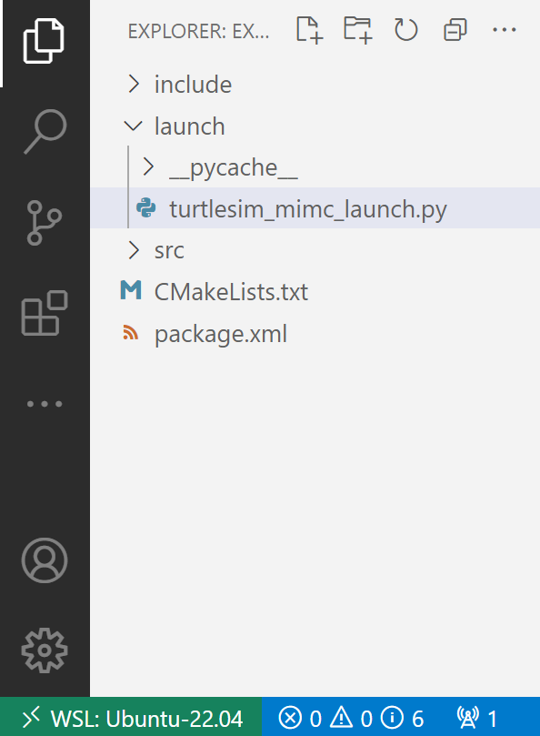

 

<details markdown="block">
  <summary>
    Tartalom
  </summary>
  {: .text-delta }
1. TOC
{:toc}
</details>

---


# `ROS 2` launch és `ROS 2` egyéb haladó koncepciók


## Bevezető

Az ROS 2 launch rendszere segíti a felhasználó által definiált rendszer konfigurációjának megadását, majd a konfiguráció szerinti végrehajtását. A konfigurációs lépés a következőket tartalmazza:
  - mely programok kerüljenek futtatásra,
  - milyen argumentumokat kapjanak a futtatott programok,
  - ROS-specifikus konvencióknak megfelelő összetevők, amelyek a komponensek könnyű újrahasznosíthatóságát teszik lehetővé.

  Fontos megemlíteni továbbá, hogy a megoldás felügyeli az elindított folyamatokat, és képes reagálni a folyamatok futási állapotában bekövetkező változásokra.

  Launch fájlok készítése történhet Python, XML, vagy YAML segítségével.


## Előkészületek
### Hozzuk létre a `example_launch` package-t

Ha esetleg már létezne a `example_launch` package akkor töröljük. (Gépteremben elképzelehető, hogy előző félévben valaki létrehozta.)

``` bash
cd ~ && test -d "ros2_ws/src/example_launch" && echo Letezik || echo Nem letezik
```

``` bash
rm -r  ~/ros2_ws/src/example_launch
```

Nyissunk egy új terminált, és source-oljuk a telepítést (ha nincs `bashrc`-ben), hogy a `ros2` parancsok működjenek.

Navigáljunk az már létrehozott `ros2_ws` könyvtárba.

Fontos, hogy a csomagokat az `src` könyvtárban kell létrehozni, nem a munkaterület gyökerében. Tehát navigáljunk a `ros2_ws/src` mappába, és futtassuk a package létrehozó parancsot:

``` bash
cd ~/ros2_ws/src
```

``` bash
ros2 pkg create --build-type ament_cmake example_launch
```

A terminál egy üzenetet küld vissza, amely megerősíti a `example_launch` csomag és az összes szükséges fájl és mappa létrehozását.

### Launch mappa

Hozzunk létre egy mappát a launch fájlok részére:

``` bash
cd ~/ros2_ws/src/example_launch
```

``` bash
mkdir launch
```

## Launch fájl létrehozása

``` bash
cd launch
```

``` bash
code turtlesim_mimc_launch.py
```

Állítsunk össze egy launch fájlt a ```turtlesim``` csomag elemeivel, Python nyelv alkalmazásával.

``` py
from launch import LaunchDescription
from launch_ros.actions import Node

def generate_launch_description():
    return LaunchDescription([
        Node(
            package='turtlesim',
            namespace='turtlesim1',
            executable='turtlesim_node',
            name='sim'
        ),
        Node(
            package='turtlesim',
            namespace='turtlesim2',
            executable='turtlesim_node',
            name='sim'
        ),
        Node(
            package='turtlesim',
            executable='mimic',
            name='mimic',
            remappings=[
                ('/input/pose', '/turtlesim1/turtle1/pose'),
                ('/output/cmd_vel', '/turtlesim2/turtle1/cmd_vel'),
            ]
        )
    ])

```

A fent leírt módon létrehozott launch fájl a korábbiakban megismert ```turtlesim``` csomag három node-ját indítja el. A cél két turtlesim ablak megnyitása, majd az egyik teknős mozgásának megismétlése a másik teknőssel. A két turtlesim node indításában mindössze a névtér (namespace) tér el. Az egyedi névterek alkalmazása lehetővé teszi két azonos node egyidejű elindítását névkonfliktus nélkül. Így mindkét teknős ugyanazon a topicon fogad utasításokat, és ugyanazon a topicon közli a helyzetét. Az egyéni névterek lehetővé teszik a két teknős üzeneteinek megkülönböztetését.

Az utolsó node szintén a ```turtlesim``` csomagból van, viszont a futtatható fájl eltér: ```mimic```. Ez a csomópont ki van egészítve névmegfeleltetésekkel. Például az egyszerű ```/input/pose``` megfelelője ezesetben ```/turtlesim1/turtle1/pose``` és a korábban megismert ```/output/cmd_vel``` most ```/turtlesim2/turtle1/cmd_vel```. Ez azt jelenti, hogy ```mimic``` feliratkozik a ```/turtlesim1/sim``` pose topic-ra, és újra publisholja úgy, hogy ```/turtlesim2/sim``` sebesség utasítása feliratkozzon rá. Tehát, ```turtlesim2``` utánozni fogja ```turtlesim1``` mozgását. 

### Kód részleteinek áttekintése

Ezek a kifejezések Python ```launch``` modulokat importálnak.

``` py
from launch import LaunchDescription
from launch_ros.actions import Node
```

Ezt követően kezdődik a launch leírása:

``` py
def generate_launch_description():
  return LaunchDescription([

  ])
```

A launch leírásban szereplő első két utasítás indítja a két turtlesim ablakot:

``` py
Node(
    package='turtlesim',
    namespace='turtlesim1',
    executable='turtlesim_node',
    name='sim'
),
Node(
    package='turtlesim',
    namespace='turtlesim2',
    executable='turtlesim_node',
    name='sim'
),
```

Végül megtörténik a mozgás utánzását megvalósító node indítása is:

``` py
Node(
    package='turtlesim',
    executable='mimic',
    name='mimic',
    remappings=[
      ('/input/pose', '/turtlesim1/turtle1/pose'),
      ('/output/cmd_vel', '/turtlesim2/turtle1/cmd_vel'),
    ]
)
```

## `ROS2` launch használata

A létrehozott launch fájl elindítása az alábbi módon történik:

``` bash
cd ~/ros2_ws/src/example_launch/launch # belépünk a launch fájlt tartalmazó mappába
```
``` bash
ros2 launch turtlesim_mimc_launch.py
```

Két turtlesim ablak fog megnyílni, és a következő ```[INFO]``` kimenet lesz látható, felsorolva az indított node-okat:
```bash
[INFO] [launch]: Default logging verbosity is set to INFO
[INFO] [turtlesim_node-1]: process started with pid [11714]
[INFO] [turtlesim_node-2]: process started with pid [11715]
[INFO] [mimic-3]: process started with pid [11716]
```

Hogy kipróbáljuk az elindított rendszer működését, egy új terminálban hirdessünk olyan üzenetet, amellyel a ```turtle1``` mozgatható:

```bash
ros2 topic pub -r 1 /turtlesim1/turtle1/cmd_vel geometry_msgs/msg/Twist "{linear: {x: 2.0, y: 0.0, z: 0.0}, angular: {x: 0.0, y: 0.0, z: -1.8}}"
```

A fent bemutatott direkt módon kívül egy launch fájl futtatható csomag által is:

``` bash
ros2 launch <csomag_megnevezése> <launch_fájl_neve>
```

Olyan csomagok esetében, amelyek launch fájlt tartalmaznak, érdemes létrehozni egy ```exec_depend``` függőséget a ```ros2launch``` csomagra vonatkozóan a csomag ```package.xml``` fájljában:

``` xml
<exec_depend>ros2launch</exec_depend>
```

Ezzel biztosítható, hogy az ```ros2 launch``` parancs elérhető a csomag buildelése után.

## Tanulmányozzuk az elindított rendszert

Úgy, hogy minden eddig elindított node fut, egy újabb terminálban futtassuk az ```rqt_graph``` eszközt, amely grafikusan szemlélteti a launch fájl segítségével kialakított rendszert:

```bash
rqt_graph
```

## Adjuk hozzá a package-hez, hogy bárhonnan indíthassuk

``` bash
cd ~/ros2_ws/src/example_launch
```

``` bash
code .
```




A package.xml-hez a `<test_depend>` elé szúrjuk be következő sort:

``` xml
<exec_depend>ros2launch</exec_depend>
```

A CMakeLists.txt-hez a `ament_package()` elé szúrjuk be következő 2 sort:

``` cmake
install(DIRECTORY launch
  DESTINATION share/${PROJECT_NAME})
```

Buildeljük a szokáso módon:

``` bash
cd ~/ros2_ws
```

``` bash
colcon build --packages-select example_launch
```

``` bash
source ~/ros2_ws/install/setup.bash
```

Ez a parancs most már __bárhonnan__ kiadható:

``` bash
ros2 launch example_launch turtlesim_mimc_launch.py
```

# Források
- [foxglove.dev/blog/how-to-use-ros2-launch-files](https://foxglove.dev/blog/how-to-use-ros2-launch-files)
- [youtube.com/watch?v=PqNGvmE2Pv4&t](https://www.youtube.com/watch?v=PqNGvmE2Pv4&t) 
- [docs.ros.org/en/humble/Tutorials/Intermediate/Launch/Creating-Launch-Files.html](https://docs.ros.org/en/humble/Tutorials/Intermediate/Launch/Creating-Launch-Files.html)
- [docs.ros.org/en/humble/Tutorials/Beginner-Client-Libraries/Creating-Your-First-ROS2-Package.html](https://docs.ros.org/en/humble/Tutorials/Beginner-Client-Libraries/Creating-Your-First-ROS2-Package.html)
- [docs.ros.org/en/humble/Tutorials/Beginner-Client-Libraries/Writing-A-Simple-Cpp-Publisher-And-Subscriber.html](https://docs.ros.org/en/humble/Tutorials/Beginner-Client-Libraries/Writing-A-Simple-Cpp-Publisher-And-Subscriber.html)
- [docs.ros.org/en/humble/Tutorials/Beginner-Client-Libraries/Writing-A-Simple-Py-Publisher-And-Subscriber.html](https://docs.ros.org/en/humble/Tutorials/Beginner-Client-Libraries/Writing-A-Simple-Py-Publisher-And-Subscriber.html)
