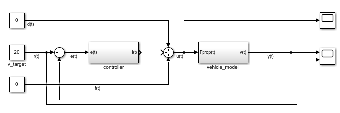

 

  

    Tartalom
  

  {: .text-delta }
1. TOC
{:toc}

---

# Szabályozás

A szabályozás célja a megtervezett trajektória kivitelezése.

## 1. Motiváció a zárthurkú szabályozás mögött - bevezetés

Egy rendszer tervezett célállapotát úgy érhetjük el, ha célérték figyelembevételével a rendszerbe beavatkozunk. Például egy jármű esetén a célsebességet a gáz és fékpedál mozgatásával, közvetetten a motor nyomatékának és a fékerőnek a változtatásával érhetjük el. Kezdeti példának tekintsünk egy járművezetőt: a vezető általában tisztában van a megengedett legnagyobb sebességgel, ekörül alkalmaz egy számára megfelelő tűrési sávot. Ezen belül meghatároz egy számára biztonságos és kényelmes sebességet, amit tartani szeretne. A vezető addig gyorsít, amíg el nem éri a kívánt sebességet, majd a gázpedált kicsit visszábbengedve tartja a sebességet.
Helyes az az állítás, hogy amennyiben elértük a kívánt sebességet, a pedált elengedhetjük, nincs több dolgunk? Természetesen nem. Miért nem? Hisz a jármű a veszteségekből adódóan lassulni fog, lejtő esetén akár gyorsulhat is. Ahhoz, hogy tartani tudjuk a sebességet a vezetőnek folyamatosan figyelnie kell a jármű mozgását illetve a környezetet, és ez alapján beavatkoznia a pedálokon keresztül.
Ez az egyszerű példa legtöbb részét a tervezési és szabályzási komponenseknek lefedi. A szabályzás téren a következő megfigyeléseket tehetjük meg:
- a vezető érzékeli a jármű akutális állapotát (valamilyen pontossággal)
- a vezető tudja, hogyha beavatkozik a gáz- vagy fékpedállal, milyen hatást fog elérni, azaz mennyire lassul vagy gyorsul az autó (valamilyen pontossággal)
- a vezető különösebb érzékeléstől függetlenül (tehát anélkül, hogy tudná, pl. milyen erő hat az autóra) nagyjából (!) meg tudja határozni a kívánt gázpedál állást (nagy hibával)

Az utolsó pontot szokás ún. **előrecsatolt ágnak** is hívni (lásd 3. alfejezet), avagy **nyílthurkú szabályzásnak** (amennyiben nincs semmilyen infónk az érzékelésről).
Egy nagyon durva összehasonlítást tartalmaz az 1. Ábra. Képzeljünk el egy helyzetet, amikor nincs információnk arról, milyen gyorsan megy a jármű, csupán a pedált tudjuk kezelni. A feladat hogy álló helyből gyorsítva elérjük a 90 km/h sebességet, majd ezt a sebességet tartsuk. Ha nem tudjuk, épp mennyivel megyünk, honnan tudjuk, hogy kell-e még nyomni a pedált avagy nem? Ilyenkor arra tudunk alapozni, hogy ismerjük az útviszonyokat (pl. sík talaj, aszfaltos út), ismerjük az autónkat (milyen motor, milyen nyomatékviszonyok...stb.). Így *nagyjából* meg tudjuk határozni, milyen hosszan kell nyomni a gázpedált, majd amikor *nagyjából* elértük a sebességet, mennyire kell ott tartani a pedálon a lábunkat, hogy ne lassuljunk, ne gyorsuljunk. Az eredmény valószínűleg hasonlítani fog a kívánt sebességgörbéhez, de messze nem lesz pontos. Hiszen pontatlanul ismerjük az utat, a saját autónkat, befolyásolja a gyorsulást a hőmérséklet, emelkedő/lejtő, szembeszél...stb. Ezért általában nem, vagy nem csak ezt a **nyílthurkú** megközelítést használjuk, hanem minél pontosabb érzékelők segítségével *korrigáljuk* az általunk előre meghatározott pedál állásokat, és ezzel bármilyen **zavar** hatását le tudjuk kezelni. Ez utóbbi megközelítést nevezzük **zárthurkú szabályzásnak**, az érzékelésből kapott információkat pedig **visszacsatolásnak**.

{: .highlight }
A magyar terminológiában szokás a *nyílthurkú szabályzást* **vezérlésnek**, a *zárthurkú szabályzást* röviden csak **szabályzásnak** hívni. A kettőt együtt pedig **irányításnak**. Az angol terminológia ezzel szemben mindkettőt **controlnak**, azon belül is **closed loop controlnak** illetve **open loop controlnak** hívja. A visszacsatolást **feedbacknek**, az előrecsatolást **feed-forwardnak** szokás hívni. 

*1. Ábra: a zárthurkú szabályozás mögötti motiváció. Forrás: Autonomous Driving Software Engineering - Lecture 08: Control*

## 2. Architekturális áttekintés, visszatekintés

Ahogyan azt a korábbi fejezetekben is láttuk, a teljes járműirányítási lánc moduláris. A legfőbb feladatok:
- érzékelés
- észlelés
- tervezés
- szabályzás

Ez a fejezet a szabályzásról szól. A szabályzások alapjairól a 3. alfejezetben olvashatunk. A szabályzó rétegnek a tervezés biztosítja a bemenetet. Így - némileg kiegészítve - vessünk egy pillantást az architektúrára! Ezt a 2. Ábra mutatja.

*2. Ábra: a legfőbb tervezési és szabályzási rétegek az architektúrában.*

A szabályzó réteg általában több szinre bomlik. Minimum két ilyen szintet megkülönböztetünk:
- járműszintű szabályzás
- aktuátor szabályzás

Mindkettő rétegnek meg van a feladata. A járműszintű szabályzás feladata, hogy a járművet a tervezett trajektórián végigvezesse a megfelelő sebességgel. Ehhez a jármű szintjén megfogalmazott célértékeket határoz meg. Ökölszabályként elfogadhatjuk, hogy azok a mennyiségek a járműszintűek, amelyek még nem kapcsolódnak egy kimondott aktuátorhoz. Azaz, pl. minden autóra jellemző annak gyorsulása vagy szögsebessége, attól függetlenül, milyen hajtással (elektromos, hibrid, belsőégésű) vagy kormányzással (elektromos szervó, hidraulikus szervó, lánctalpas...stb.) rendelkezik. Általában ez a szabályzó réteg a "leglassabb", beágyazott környezetben a ciklus idő 10-50ms.
Az aktuátot szabályzás feladata, hogy a járműszintű mennyiségeket lebontsa és megvalósítsa az aktuátorokon keresztül. Pl. a hosszirányú gyorsulást befolyásolhatjuk a motoron és a féken keresztül. A motor esetében a gyorsulást a motor nyomatékának szabályzásával érjük el, amit pedig a fojtószelep állásával érünk el. A fojtószelep állását pedig az azt mozgató pl. szervómotor pozíciójának, voltaképp a szervómotor kapocsfeszültségének szabályzásával érünk el. A fékrendszer esetén a fékerőt tudjuk befolyásolni, ami egyben a féknyomás szabályzását jelenti (pl. az ESP szelepein keresztül), amit pedig a hidraulikus fékrendszer motor szivattyújának nyomásával érhetünk el. Ezt pedig a szivattyú motorjának fordulatszámával tudjuk befolyásolni, ami megint a motor kapocsfeszültségének a szabályzásával érünk el...stb. Láthatjuk, hogy aktuátoroktól függően itt több (akár 4-6) egymásba ágyazott szabályzó hurokról beszélünk. 
Belülről kifelé érdemes a problémát megközelíteni, ahogy a legbelső szabályzás ciklusideje akár 1 ms (vagy az alatti) lehet, még ahogy kintebb lépünk ez nő, 5-10-20ms tartományban. 
Fontos, hogy automatizált vezetési rendszerek mozgásszabályzása esetén az aktuátor szabályzó rétegeket sokszor nem vesszük figyelembe, hanem feltételezzük, hogy azok teljesítménye, pontossága, sebessége megfelelő, "közel ideális". Persze a gyakorlatban ezt sokszor nehéz elválasztani, de arra törekszünk, hogy csak a járműszintű szabályzást kelljen megtervezni.

A legfelső szintű szabályzás feladata tehát az, hogy a jármű a trajektóriát lekövesse. Általában két dimenziót különböztetünk meg:
- hosszirányú mozgás: a jármű hosszirányú gyorsulásának, és végül a fék és motorerők meghatározása.
- keresztirányú mozgás: a jármű célszögesebességének, és végül a kormányszögnek a meghatározása.

A trajektória általában egy időben leírt sebességtarjektória illetve egy térben megadott célpont halmaz, azaz egy görbe (vagy annak egy reprezntációja). A cél, hogy a görbét minél kisebb pozícióhibával lekövessük, illetve a sebességet minél pontosabban tartsuk. Mindezt úgy, hogy ne lépjünk át semmilyen határértéket (pl. túl nagy gyorsulás, pályaelhagyás...stb).

Mielőtt rátérnénk a létező járműszabályzási megoldásokra, a 3. alfejezetben áttekintést adunk a szabályzási alapokról.

## 3. Szabályzási alapok

Ebben a fejezetben ismertetjük a szabályzástechnikához kapcsolódó alapfogalmakat, és erre példákat is hozunk a járműirányítás területéről.

### 3.1. Definíciók

**Valós fizikai rendszer**: egy olyan fizikai objektum, amely mérhető külső kényszer hatására mérhető módon megváltozik.

**Bemenetek**: A valós fizikai rendszerre ható és időben változni képes kényszereket nevezzük fizikai bemeneteknek. 
**Kimenetek**: A valós fizikai rendszernek a fizikai kényszerek hatására bekövetkező bármely változása lehet fizikai kimenet, ezek közül azt tekintjük fizikai kimenetnek, amelyet az adott vizsgálatban közvetlenül vagy közvetve mérünk. 
*Példa: ezt mindig a szabályzási feladatnak megfelelően határozzuk meg. Például járműszintű irányítás: a rendszer a jármű maga, bemenete pl. a hosszirányú és keresztirányú gyorsulás. Kimenete pl. a pozíció, sebesség...stb.* 
*Példa: alacsonyszintű szabályzás esetén ez lehet pl. a fékszabályzás, ahol a bemenet a főfékhenger pozíciója, a kimenet a féktárcsa és a fékpofa között fellépő erő, vagy a kerékre ható nyomaték...stb.*.

**Az absztrakt rendszer**: Az absztrakt rendszer egy valós fizikai rendszer valamilyen pontosságú és meghatározott működési tartományra érvényes absztrakt modellje, amely a bemenőjelek és a kimenőjelek között teremt matematikai kapcsolatot. Ez voltaképp egy modellezési eljárás eredménye, amely modell a valós fizikai rendszer matematikai leírása, jellemzően differenciálegyenletek formájában. 
*Példa: a jármű kinematikai bicikli modellje*.

**Rendszer paraméterek:** A valós fizikai rendszert leíró egyenletek együtthatóit paramétereknek nevezzük. 
**Időinvariancia:** Az időinvariáns rendszer esetén, ha a rendszer egy U(t) gerjesztésre adott válasza Q(t), akkor az időben eltolt U(t-tau) gerjesztésre adott Y(t-tau) válasz is egyszerű időbeni eltolással megkapható. Ez egyúttal azt is jelenti, hogy a rendszer modellje időben nem változik, azaz a rendszer paraméterei állandóak. 
*Példa: a jármű kinematikai bicikli modelljének paraméterei pl. a jármű tengelytávja, amely (remélhetőleg) időben nem változik, azaz ez a paraméter időinvariáns. Ha a rendszer modelljének összes paramétere időinvariáns, maga az absztrakt rendszer is invariáns.* 
*Példa: a jármű dinamikai bicikli modelljének egy paramétere a jármű tömege. Ez változhat "menet közben is", hiszen pl. többen ülnek az autóban, csomagokat pakolnak bele, az üzemanyag szintje változik, azaz ez a paraméter nem időinvariáns, tehát a fizikai rendszer sem időinvariáns. Ugyanakkor tekinthetjük **bizonyos feltételek mellett** időinvariánsnak, ekkor a modell pontatlansága nő.*

**Állapot**: Az állapot a memória jelleggel rendelkező dinamikai rendszerekben a múlt összesített hatása. A rendszer állapotának a következő két tulajdonsággal kell rendelkeznie
- Bármely T időpillanatban a kimenőjel az adott pillanatbeli állapot és bemenőjel együttes ismeretében egyértelműen meghatározható legyen. Kimeneti egyenletnek nevezzük azt az összefüggést, amely az állapotból és a bemenőjelből meghatározza a kimenőjeleket.
- Az állapot egy adott T időpillanatban egyértelműen meghatározható legyen a bemenőjel a t≤T időtartománybeli értékének ismeretében. Az állapot változását leíró egyenletet állapotegyenletnek nevezzük.

**Állapotváltozó**: Az állapotváltozók az állapot egyértelmű leírására szolgálnak. Az állapotváltozó lehet egy időfüggvény, az állapot mennyiségi változásainak leírására, illetve logikai változó az állapot minőségi váltásainak leírására.

**Rendszer dimenzió:** Egy rendszer állapotának egyértelmű leírásához minimálisan szükséges állapotváltozók számát a rendszer dimenziójának szokás nevezni.

**Kanonikus állapotváltozók:** Kanonikus állapotváltozónak nevezzük az állapotváltozók legkisebb olyan halmazának elemeit, amelyek segítségével az állapot egyértelműen leírható. A nem kanonikus állapotváltozókat származtatott állapotváltozóknak nevezzük.

**Ljapunov-féle stabilitás:** Egy nemlineáris autonóm működésű rendszert akkor mondunk Ljapunov értelemben stabilisnak, ha az egyensúlyi állapot bármely környezetéhez találunk egy olyan nullánál nagyobb maximális kitérítést, amelynél kisebb kitérítések esetén a rendszer garantáltan visszatér az eredetileg meghatározott környezetbe.

**BIBO stabilitás:** Korlátos bemenőjelre minden esetben korlátos kimenőjel a válasz. Ezt a feltételt teljesítő rendszert ismételten az angol név után BIBO (Bounded Input Bounded Output) stabilis rendszernek hívjuk.

Ezen fogalmak összessége elegendő a járműirányítási alapok megértéséhez. A szabályzási feladat sokszor két részre bontható:
- modellezés, az absztrakt matematikai modell elkészítése
- szabályzás, azaz a szabályzó megtervezése.

### 3.2. A szabályzási feladat megfogalmazása

**A cél mindig a valós fizikai rendszer irányítása úgy, hogy az az előírt célértéknek megfelelően viselkedjen.** Fontos, hogy minden célhoz meghatározzunk olyan **mérhető** mennyiségeket, amelyek alapján a szabályzás *jóságát* meg tudjuk határozni. A legtöbbször (de nem kizárólagosan) használt ilyen mennyiségek:
- beállási idő (gyorsaság)
- túllendülés mértéke
- állandósult állapotbeli hiba
- a szabályzás energiája.

A szabályzási láncot a 3. Ábrán látható módon írhatjuk fel. A következő jelöléseket használjuk:
- $$r(t)$$: a célérték, avagy referenciajel
- $$y(t)$$: a visszacsatolt érték.
- $$m(t)$$: a valós rendszeren mért érték. Megjegyzés: sokszor az érzékelőt ideálisnak tekintjük, így $$y(t)=m(t)$$, és így a visszacsatolt érték egyben az absztrakt rendszer kimenete.
- $$e(t)$$: hibajel, a szabályzó bemenete.
- $$i(t)$$: a szabályzó által meghatározott beavatkozó jel.
- $$f(t)$$: előrecsatolt ág.
- $$u(t)$$: a rendszer bemenete
- $$d(t)$$: külső zavarok.

  
*3. Ábra: a szabályzási lánc blokkdiagramja.*
   
A szabályzó feladata, hogy a bemenetén keletkező hibát minimalizálja. A teljes szabályzási lánc feladata, hogy a valós fizikai rendszer kimenete a lehető legnagyobb pontossággal kövesse le a referencia jelet. 
A következőkben egy egyszerű példán szemléltetjük egy rendszer modellezését, a zavarok hatását, továbbá példát adunk egy szabályzóra illetve az előrecsatolás lehetőségére. A példát MATLAB/Simulink környezetben készítettük el.

### 3.3. Példa a szabályzási alapokra

Ebben a példában egy egyszerű modellt fogunk felépíteni hogy szemléltessük a zárthurkú szabályzást. A feladat egy jármű sebességszabályzása. Ehhez a jármű egyszerű modelljét fogjuk elkészíteni. 
1. Feladat: határozzuk meg a rendszer be- és kimeneteit!
A rendszerre a járműre ható gyorsító erővel szeretnénk hatni, ezért ez a bemenet. A kimenet a jármű sebessége, hiszen ezt szeretnénk egy adott célértékre szabályozni. Mivel ennek a rendszernek 1 be- és 1 kimenete van, ezért szokás SISO (Single Input Single Output) rendszernek is hívni. Ennek analógiáján léteznek MIMO (Multiple Inputs Multiple Outputs) rendszerek is.
*Megjegyzés: a valóságban a járműre a gázpedállal és a fékpedállal hatunk, de ezek voltaképp a jármű gyorsulását befolyásolják, így az egyszerűség kedvéért a szakasz ezen részét nem modellezzük. Ezzel természetesen hibát viszünk a modellbe, de növeljük annak általánosságát.*

2. Feladat: készítsük el a jármű matematikai modelljét / absztrakt modelljét!
Olyan egyenletrendszert keresünk, amely összeköti a be- és kimenetet. Itt meg kell határoznunk, mennyire törekszünk pontos modellre. Az egyszerűség kedvéért éljünk a következő megkötésekkel:
- eltekintünk a hosszirányban fellépő kerékszliptől
- eltekintünk az aktuátorok dinamikai viselkedésétől, azaz a kért gyorsulás egyből megvalósul
- eltekintünk a mért mennyiségeket terhelő hibáktól, azaz a szenzorok pontatlanságától.
- eltekintünk a futómű és a felfüggesztés dinamikai tulajdonságaitól.

Az egyenletünk így egy koncentrált tömegpont lineáris mozgásává egyszerűsödik. A modellbe foglaljuk be a következő mennyiségeket:
- a jármű tömege
- a jármű légellenállása
- a jármű sebességarányos súrlódása.

Newton II. tételének megfelelően írjuk fel a következő dinamikai egyensúlyi egyenletet:  
$$\ddot I = \sum F$$  
Azaz:  
$$m*\ddot v(t) = F_{prop}(t) - F_{aero}(t) - F_{fric}(t)$$   
Láthatjuk, hogy mind a bemenet, mind a kimenet szerepel az egyenletünkben, így valóban megtaláltuk a rendszer modelljét. Alakítsuk tovább, hogy *csak* a ki- és bemenet szerepeljen benne: 
$$m*\ddot v(t) = F_{prop}(t) - \frac{1}{2}*v(t)^2*\rho*c*A - v(t)*b$$  

Ebben a formában az időben változó jelek a be- és kimenet (a sebesség illetve a hajtóerő), és vannak időben állandó (időinvariáns) paraméterek:
- $$\rho$$: a levegő sűrűsége
- $$A$$: homlokfelület mérete
- $$c$$: jármű légellenállási együtthatója
- $$b$$: Coloumb-féle súrlódási tényező

  
*4. Ábra: a jármű modellezett erőegyensúlya*

Ahhoz, hogy megkapjuk a sebességet, mint választott kimenet, meg kell oldanunk a differenciálegyenletet. Ezt Simulinkben numerikusan végezzük el. A megoldást az 5. Ábra mutatja.

  
*5. Ábra: a differenciálegyenlet numerikus megoldása.*

A teljes szabályzási lánc blokkdiagramját a 6. Ábra mutatja. Ezen az ábrán nem használjuk a visszacsatolt ágat. A kezdő sebességet 20 m/s-ra állítottuk. A hajtóerő ez esetben nulla, így voltaképp a jármű tehetetlenségénél fogva gurul, és folyamatosan lassul a terheléssel arányosan. 

  
*6. Ábra: a teljes szabályzási lánc blokkdiagramja.*

A következő paraméter értékeket választottuk a szimulációhoz:
- $$A = 1.2m^2$$
- $$b = 10 Ns/m$$
- $$c = 0.4$$
- $$\rho = 1 kg/m^3$$
- $$m = 1250 kg$$

A 7. Ábrán látható a futtatás eredménye. 100s-ig futott a szimuláció, ez idő alatt 20 m/s-ról nagyjából 7 m/s-ra lassul a jármű.

  
*7. Ábra: a teljes szabályzási lánc blokkdiagramja.*

A 8. Ábrán a visszacsatolt szabályzónak egy arányos szabályzót (P szabályzót) választunk, amely a hibával arányosan határozza meg a beavatkozó jelet. Az erősítést 100-ra választjuk, azaz 1 m/s sebességhiba 100N hajtóerőt eredményez. A kezdő sebesség 15 m/s, a célsebesség 20 m/s, így kezdetben 500N hajtóerőnk lesz.

  
*8. Ábra: arányos szabályzó, 100-as erősítéssel.**

A 9. Ábrán látható a szabályzó karakterisztikája, P szabályzóval, 100-as erősítéssel. A maradandó hiba relatíve nagy (több mint 10%). Ennek oka, hogy az arányos szabályzó a hibával arányos bemeneti jelet állít elő, és mivel a járműre hat ellentétes irányú erő, így a szabályzó ezzel fog egyensúlyt tartani. Amennyiben növeljük az erősítést, úgy csökken az állandósult állapotbeli hiba. Elméletben végtelen nagy erősítés nullára csökkenti ezt a hibát, viszont a végtelen erősítés végtelen beavatkozó jelet jelent, ami nem megvalósítható. A gyakorlatban ennél sokkal hamarabb elérjük a korlátokat, hiszen az aktuátorok csak véges erő kifejtésére képesek. Ezt a szabályzó megtervezésénél figyelembe kell venni.

  
*9. Ábra: arányos szabályzó karakterisztikája.*

Az állandósult állapotbeli hibát úgy is eliminálhatjuk, ha az erősítés mellett egy olyan szabályzó tagot is hozzáadunk, ami "észre veszi", ha sokáig adott hiba áll fent, és növeli ennek megfelelően a beavatkozó jelet. Minél tovább áll fent a hiba, annál jobban növeljük a beavatkozó jelet. Ez gyakorlatilag a hiba időbeli integráljával arányos bevatkozó tagot jelent. Ezt szokás I tagnak nevezni. Az így kialakuló szabályzót pedig PI szabályzónak nevezni. A szabályzó elrendezését 10. Ábra mutatja, a kimeneti karakterisztikát a 11. Ábra. Láthatjuk, hogy a hiba valóban eltűnt, ugyanakkor a kezdeti tranziens szakasz is megváltozott. Megjelent a túllendülés, ezzel együtt a célérték körüli oszcilláció, továbbá a beállás is lassabb lett.

  
*10. Ábra: arányos szabályzó 100-as erősítéssel és integrátor, 10-es erősítéssel.*

  
*11. Ábra: arányos szabályzó 100-as erősítéssel és integrátor, 10-es erősítéssel.*

A fenti beállási oszcillációt és túllendülést javíthatjuk a paraméterek megváltoztatásával, illetve egy olyan szabályzó tag hozzáadásával, amely a hiba változására reagál. Ez gyorsítja a beállást, és a túllendülést is gyorsabban kompenzálja. Ez gyakorlatilag a hiba változásával arányos tagot jelent, ami egyenértékű a hiba deriváltjának figyelembevételével. Ezt a tagot szokás D tagnak nevezni, a kialakuló szabályzót PID szabályzónak nevezni. Ugyanakkor a D tag erősítését óvatosan kell megválasztani, mert könnyen instabillá teheti a rendszert. A szabályzó felépítését a 12. Ábra mutatja, a karakterisztikáját a 13. Ábra.

  
*12. Ábra: arányos szabályzó 100-as erősítéssel és integrátor, 10-es erősítéssel, D tag 10-es erősítéssel.*

  
*13. Ábra: arányos szabályzó 100-as erősítéssel és integrátor 10-es erősítéssel, D tag 10-es erősítéssel.*

Empirikus úton, figyelembe véve a túllendülés mértékét, a beállási időt és az állandósult állapotbeli hibát, válasszuk a következő paraméter értékeket:
$$P=175$$
$$I=10$$
$$D=50$$
Ezzel a beállás már nagyon szép, az eredményt a 14. Ábra mutatja. 
  
*14. Ábra: arányos szabályzó, 170-es erősítéssel, I tag 10-es erősítéssel, D tag 50-es erősítéssel.*

A 15. Ábrán látható, milyen hatása van, ha hozzádunk egy 3°-os lejtő által keltett extra gyorsító erőt. A túllendülés nagyobb lesz, hiszen a szabályzót egy olyan modellel állítottuk be, amely sík talajon mozgó autót feltételez.

  
*15. Ábra: lejtő hatása a zárt hurkú szabályzóra.*

Ezt kompenzálhatjuk, ha a lejtővel arányos előrecsatolt ágat alkotunk meg. Azonban a lejtő becslése nehéz, általában a jármű mozgása alapján következtethetünk rá, ami így csak késve jelzi a lejtő mértékét. Adjunk hozzá egy 1 s-mal eltolt, 5%-os hibával rendelkező lejtőkompenzációt. A blokkdiagramot a 16. Ábra, az eredményt a 17. Ábra mutatja.

  
*16. Ábra: előrecsatolt ággal kiegészített szabályzó rendszer.*

  
*17. Ábra: előrecsatolt ág hatása a szabályzóra.*

## Interaktív PID hangolás 

A következőkben a egy másik szabályozási példa (hőmérséklet szabályozás) interaktív PID hangolását lehet megtenni:

<iframe width="700" height="600" src="https://thomasfermi.github.io/PID-Playground-Temperature/" frameborder="0" allowfullscreen> </iframe>

Ez az interaktív vizualizáció [Mario Theers](https://thomasfermi.github.io/Algorithms-for-Automated-Driving/Control/PID.html) - [CC BY 4.0 License](https://github.com/thomasfermi/Algorithms-for-Automated-Driving/blob/master/LICENSE) megoldása.

Hasonló interaktív vizualizáció érhető el a Viktor.ai oldalon, de itt még hangolni is van lehetőségünk: [cloud.viktor.ai/public/control-application](https://cloud.viktor.ai/public/control-application)

### Összegzés

Ebben a fejezetben áttekintettük a szabályzástechnikai alapfogalmakat, példákat hoztunk a járműirányítás területéről. Ezen kívül a gyakorlatban megalkottunk egy egyszerű matematikai modellt, amely leírja egy jármű, mint tömegpont hosszirányú mozgását. Ezen keresztül MATLAB/Simulink segítségével sebességszabályzással kapcsolatos szimulációt végeztünk. Az egyik legelterjedtebb szabályzót, a PID szabályzót mutattuk be.
A következő pontokat érdemes megjegyezni:
- egy zárthurkú szabályzás általában áll a szabályzott szakaszból (mely a valós fizikai rendszer absztrakt matematikai modellje) és a szabályzóból.
- a valós fizikai rendszert matematikai modellel írjuk le, amely alapján tervezhető a szabályzó is. A modell pontossága befolyásolja a megtervezett szabályzó minőségét is.
- a matematikai modell általában differenciálegyenletek formájában áll elő.
- a PID szabályzók a hiba minimalizálására törekednek. A P tag gyorsítja a rendszert, az I tag eltünteti a maradandó hibát, a D tag szintén gyorsítja a szabályzó reakcióját, de instabilitást is okozhat.
- a valóságban a járműszabályzás összetett, a változó paraméterek (pl. autó tömege), az útviszonyok illetve az egymásba ágyazott szabályzó hurkok miatt.

## 4. Járműirányítási megoldások

A járműszabályzás területén - ahogy azt a 2. alfejezetben láttuk - több, egymásba ágyazott szabályzó kört használunk. Mindegyik jellemzően tartalmaz egy előre csatolt és egy visszcsatolt ágat. Automatizált vezetési rendszerek esetén általában a legfelső, ún. járműszintű irányítást szoktuk legelőre venni. Az alacsonyabb szintű szabályzókra most nem térünk ki, csupán egy lista erejéig összegezzük őket. Meg kell jegyezni, hogy ezek az alacsonyszintű szabályzók nagyban függnek a járműben elérhető aktuátoroktól, hiszen többféle fékrendszer, hajtás és kormányrendszer is elérhető lehet. Ez a felosztás nagyban támogatja moduláris tervezést, azaz a járműszintű szabályzást függetlenül tudjuk fejleszteni az alacsony szintű szabályzásoktól. Ez pl. sorozatgyártott szoftverek esetén nagyban megkönnyíti az újrahasznosíthatóságot. Az alacsony szintű, aktuátor szabályzó hurkok a következők lehetnek (a teljesség igénye nélkül):
- kormány szervó motor szögszabályzás
- kormány szervó motor nyomatékszabályzás
- motor nyomaték szabályzás
- fék erő szabályzás (fék nyomás szabályzás).

Innentől minden megállapítás a jármű szintjére vonatkozik. Fontos megjegyezni, hogy mindig két dimenzióban gondolkodunk: hosszirányú és keresztirányú szabályzásban. A hosszirányú szabályzásra láttunk példát a 3. alfejezetben. Ez általában a sebesség szabályzását, esetleg a gyorsulás szabályzását jelenti. Habár a hosszirányú szabályzás is rejt nem levés kihívást (a motor tehetetlensége, a fék- és hajtóerők szétválasztása...stb.), a legtöbb járműirányítási megoldás elsősorban a keresztirányú szabályzásra összpontosít. 
Mivel a jármű automatikus irányítási feladata nagyban hasonlít az emberek vezetési feladatához (tehát a kormány és a pedálok segítségével a jármű mozgásának befolyásolása), ezért szokás ezeket az irányítási megoldásokat vezetői modelleknek (angolul driver models) is hívni. Az egyes modellekről rövid összefoglalókat találunk az ajánlott irodalom alatt. Ezek közül [1] szerint 3 csoportra oszthatjuk a vezetői modelleket:
-	Inverz-modellek (inverse models)
-	Prediktív modellek (predictive/forward models)
-	Zárhurkú modellek (closed loop models).

*18. Ábra: járműirányítási megoldások szemléltetése.*

### Inverz modellek
Az inverz modelleket angol terminológiában *pursuit* modelleknek is szokás hívni, amely a legjobban talán *előre tekintő*, *előre toló*nak lehet fordítani. A lényege, hogy a kormányzáshoz szükséges célértéket az két információ alapján határozza meg:
- egy előretekintési pontban mi a jármű célállapota?
- a járműről előzetesen felállított modell.
Ezt felfoghatjuk úgy is, mint egy előrecsatolt szabályzási ág, avagy egy nyílthurkú szabályzás, azaz vezérlés. Amennyiben ez utóbbi áll fent (azaz nincs visszacsatolt ág), azt nevezzük *tisztán előre tekintő*, ismertebb angol nevén **pure-pursuit** irányításnak. 

{: .note }
A pure-pursuit megoldás az egyik legrégebbi irányítási megoldás a járművek terén. Már az 1980as években a Robotics Institute of Pittsburgh fejlesztette ki [4]. A lényege, hogy egy megadott előretekintési távolságban (ami az irányítás legfontosabb paramétere) meghatározzuk a jármű kívánt pozícióját (pl. a korábban tervezett trajektória alapján). 

Ennek a pontnak a koordinátái alapján meg tudjuk határozni, milyen görbületű **köríven** kell haladnunk ahhoz, hogy az aktuális pontból a célpontba érjünk. Fontos, hogy a pure-pursuit megoldás mindig köríveket használ. A geometriai összefüggéseket a 19. Ábra szemlélteti.
Egyszerű trigonometriai megfontolások alapján a következő összefüggést írhatjuk fel az előretekintési pont és a célgörbület között:
 
$$\kappa_{target}=\frac{2x}{l^2}$$

Mint látjuk, a jármű szintjén megfogalmaztunk egy mennyiséget (görbület) a bemeneti trajektória alapján, így elméletben teljesítettük a járműirányítás fő feladatát. Azonban a megvalósítás során általában olyan mennyiséget állítunk elő, amely már az aktuátorok szintjén értelmezhető. Ehhez használjuk a jármű modelljét: összefüggést adunk meg a célgörbület és kormányszög között. A leggyakrabban a jármű kinematikai bicikli modelljét használjuk, azonban ez nagyobb sebességek esetén (>10 km/h) nagyon pontatlan. A kinematikai bicikli modell összefüggéseit felhasználva megkaphatjuk a kormányszöget:
 
$$\delta_f=atan(L_w*\kappa)$$
 
Ahol $$L_w$$ a jármű tengelytávja.  
Feltételezzük a modellben, hogy a jármű elsőkerék-kormányzású. A kapott szög az út-kerék szög, amely a kormánymű geometriájának függvényében átszámítható pl. szervó motor szöggé, és így közvetlenül megvalósítható.

*19. Ábra: a pure pursuit szabályzó geometriai összefüggései.*

A 20. Ábrán láthatjuk, milyen hatással van az előretekintési távolság a jármű viselkedésére. Amennyiben túl közeli pontot választunk, a jármű hajlamos oszcillációra (ez hasonló hatás, mint egy PID szabályzó túl nagy P erősítéssel). A túl nagy előretekintési távolság esetén a reakció lassul, de pl. élesebb kanyarokban a jármű hajlamos lesz *kanyarlevágásra*.
Szokás az előretekintési távot adaptívan, pl. a sebesség függvényében megadni. Ilyenkor gyakorlatilag előretekintési időről beszélünk.

*20. Ábra: a pure pursuit előretekintési távolságának hatása a jármű viselkedésére*

A pure-pursuit modellek továbbfejlesztett változatairól pl. a [2] és [3] cikkben olvashatunk.

### Prediktív modellek
A prediktív modellek, hasonlóan a az inverz modellekhez a jármű modelljén alapszanak. Azonban egyúttal előre is tekintenek egy meghatározott horizonton: a modell segítségével becsüljük a jármű viselkedését előre, majd ennek függvényében a lehető legjobb megoldást választjuk a jelenben. Tehát ez esetben a jövő valamilyen pontosságú információit felhasználva hozunk döntést. Itt két esetet különböztetünk meg:
- receding horizon: azaz a jövőbeli horizont folyamatosan tolódik előttünk, mivel a megtervezett jövőbeli viselkedésnek mindig az első elemét hajtjuk csak végre, ezek után újratervezünk
- proceeding horizon: a horizont közeledik felénk, azaz a jövőbeli megtervezett viselkedést teljes egészében végrehajtjuk, és csak ez után tervezünk újra.

Mivel a szabályzás itt egyben egy mozgástervezést is jelent, így a tervezés eszköztárát is használnunk kell. Ezeket a szabályzókat szokás **Optimális szabályzóknak**, angolul **Optimum controls**nak is hívni. Hiszen ebben az esetben az előretekintési horizonton a modell segítségével megtervezzük azt a mozgást, amely a legkisebb költséget eredményezi a megadott szempontok szerint. Itt visszautalunk a 3.2. alfejezet elején bevezetett szempontokra:
- beállási idő (gyorsaság)
- túllendülés mértéke
- állandósult állapotbeli hiba
- a szabályzás energiája.

Mivel itt egy véges hosszúságú időhorizonton szeretnénk az optimális mozgást megtervezni, a fenti szabályzó szempontok közül a beállási időt, a túllendülés mértékét továbbá az állandósult állapotbeli hibát egy vektorba vonjuk össze és ezen vektor elemeinek összegét szeretnénk minimalizálni (1. kritérium).
A szabályzás energiája voltaképp a beavatkozó jel vektorának amplitúdójával van összefüggésben. Azaz úgy szeretnénk elérni minél jobb eredményt, hogy közben alacsony jellel hatunk a rendszerre (pl. minél kevésbé szeretnénk gyorsulni, vagy a kormányra nyomatékot kifejteni...stb.). Ez a 2. kritérium, amely ellentétes igényt jelent a szabályzásra nézve, mint az 1. kritérium. 
Ezeket a szabályzókat szokás **Modell Prediktív Szabályzóknak (Model Predictive Controls, MPC)** is hívni. A következő egyenlet egy példa arra, hogyan írhatjuk fel a megoldandó költségfüggvényt:
 
$$J(k)=\sum_{i=1}^{N_p}\|y(k+i)-y_{ref}(k+i)\|^2_M + \sum_{i=1}^{N_c-1}\|\Delta U(k+i)\|^2_N$$
 
Ahol:
- $$N_p$$: a predikciós horizont, számítási ciklusban kifejezve (a modell figyelembe vétele)
- $$k$$: az akutális számítási ciklus
- $$y(k+i)$$: az $$i.$$ ciklusban a modell által becsült jármű keresztirányú pozíció
- $$y_{ref}(k+i)$$: az $$i.$$ ciklusban a referencia pozíció (cél pozíció)
- $$N_c$$: a szabályzási horizont (a bemenet figyelembe vétele)
- $$\Delta U$$: a bemeneti vektor növekmény a szabályzási horizonton
- $$M$$ és $$N$$: a súlymátrixok a hibára és a bemeneti energiára.

Ilyen szabályzókra találunk példát [1], [5-7] irodalmakban.
Az MPC-k előnye, hogy nagyon nagy pontossággal, stabil szabályzást adnak, amennyiben az alkalmazott modell nagy pontosságú. Ugyanakkor ez is a hátránya, hiszen ha a modell nem megfelelő, akkor a hiba exponenciálisan elnőhet. 
Erre látunk példát a 21-23. Ábrán. Mindegyik szimulációban egy kinematikai bicikli modellt használtunk az MPC megtervezéséhez. A PID szabályzó a pozícióhibát minimalizálja. A szimulációban a jármű dinamikai modelljét alkalmaztuk, mint valós fizikai rendszer. Látható, hogy 5 m/s-on az MPC egyértelműen jobban teljesít, mint a PID szabályzó, sokkal pontosabb és stabilabb is. Azonban 2 m/s-on az MPC szétesik, az alacsony sebesség miatt a modell összefüggések nem lesznek érvényesek. Hasonló figyelhető meg a 23. Ábrán is.
A 22. Ábrán azt látjuk, hogy 10 m/s-ig az MPC és a PID is jól teljesít, az MPC továbbra is jobb, mint a PID. Azonban 10 m/s felett a dinamikai hatások felerősdnek, és a kinematikai modell nem megfelelő. Így az MPC instabillá válik, míg a PID - bár jelentős hibával - továbbra is stabil működésre képes.

  
*21. Ábra: MPC és PID szabályzó összevetése, kinematikai modell esetén, kanyarodás, alacsony sebességeken*

  
*22. Ábra: MPC és PID szabályzó összevetése, kinematikai modell esetén, kanyarodás, magasabb sebességeken*

  
*23. Ábra: MPC és PID szabályzó összevetése, kinematikai modell esetén, körpálya, alacsony sebességeken*

### Zárthurkú modellek

Az ilyen típusú modellek, ahogy a neve is sugallja, a PID szabályzók logikáján alapszanak. Jellemzően egy vagy több visszacsatolt mennyiség hibáját minimalizálják. Ilyen modellekre találunk példát a [3] és [8] irodalomban. 
A 24. Ábrán a [3]-ban bemutatott példa illusztrációját látjuk. Eszerint kijelölünk kettő előretekintési pontot: egy közelit (a jármű előtt) és egy távolit (a horizonton). Hasonlóan a pure-pursuit megoldásokhoz, itt is azt vizsgáljuk, hogyan juthatunk el a jelenlegi pozícióból a távoliba. Azonban nem egy egyszerű görbületszámolással, hanem a hiba minimalizálásával érjük ezt el, a következő egyenlet szerint:
 
$$\phi=k_f\dot\Theta_f + k_n\dot\Theta_n + k_i\Theta_n$$
 
Ahol:
- $$\dot\Theta_f$$ és $$\dot\Theta_n$$ a távoli és a közeli pont hozzánk viszonyított irányának megváltozása (szögsebessége)
- $$\Theta_n$$ a közeli pont iránya hozzánk képest (szöge)
- $$k$$ tagok: súlyok.
- $$\phi$$: az út kerék szög.

Ez az egyenlet felírás voltaképp egy minimalizálása a szög hibáknak, hiszen a cél, hogy mindig *irányba* álljunk. A visszacsatolás a környezet érzékelésből jön. A kimenet az út kerék szög.

  
*24. Ábra: a dual-point irányítási megoldás szemléltetése*

A 25. Ábrán a [8]-ban ismertetett megoldást látjuk. A lényege, hogy több egymásba ágyazott PID szabályzó segítségével a pozíció hibát minimalizálja. Ehhez a szabályzási feladatot szétbontja egy alacsony frekvenciás szabályzásra (pozíció hiba) és egy magasfrekvenciás szabályzásra (kormányszög hiba). Az átviteli függvények egy-egy szabályzót testesítenek meg, sorban a következőket jelentik:
- $$G_c$$: a pozíció szabályzása egy PI szabályzóval
- $$G_L$$: az emberi szabályzás késése (reakcióideje)
- $$G_NM$$: a neuromotoros szabályzás, ahogyan az emberek a kormányt mozgatják. Ennek dinamikája nagyban függ az emberek izomszerkezetétől.
- $$G_{P1}$$ és $$G_{P2}$$: a visszacsatolásba illesztett *érzékelő modellek*. Ezek reprezentálják az ember érzékelési dinamikáját, sorban a kormányon lévő nyomaték és a kormány szög tekintétben.

  
*26. Ábra: egy teljes zárthurkú szabályzó, egyesítve a kormányszög szabályzással*

### Összefoglalás

Mint láttuk a vezetői modellek minden esetben egy korábban megtervezett trajektóriát igényelnek. Ennek lekövetésére használjuk a szabályzókat, amelyek a következő három csoportba oszthatók:
-	Inverz-modellek (inverse models)
-	Prediktív modellek (predictive/forward models)
-	Zárhurkú modellek (closed loop models).
A legrégebbi inverz-modellek a legegyszerűbbek és robosztusabbak, azonban a teljesítményük jellemzően alacsony. A prediktív modellek nagyon pontosak, ugyanakkor nagyon érzékenyek a modell pontosságára. A zárthurkú modellek nagy tartományon stabilak, ugyanakkor általános pontosságuk alacsony. Több egymásba ágyazott hurokból állnak, melyek kalibrációja általában *belülről kifelé* történik. Ezek a legelterjedtem a mai sorozatgyártott rendszerekben.

# Ajánlott irodalom

1. [Introduction: System Modeling, University of Michigan](https://ctms.engin.umich.edu/CTMS/?example=Introduction&section=ControlPID)
2. [Interactive Live Script Control Tutorials for MATLAB and Simulink](https://www.mathworks.com/campaigns/products/control-tutorials.html)
3. [Mario Theers - PID](https://thomasfermi.github.io/Algorithms-for-Automated-Driving/Control/PID.html) - [CC BY 4.0 License](https://github.com/thomasfermi/Algorithms-for-Automated-Driving/blob/master/LICENSE)
4. [Mario Theers - Pure pursuit](https://thomasfermi.github.io/Algorithms-for-Automated-Driving/Control/PurePursuit.html) - [CC BY 4.0 License](https://github.com/thomasfermi/Algorithms-for-Automated-Driving/blob/master/LICENSE)
5. [Youtube ControlLectures](https://www.youtube.com/@ControlLectures/videos)

## Vezetői modellek

1. A. Y. Ungoren and H. Peng, "An Adaptive Lateral Preview Driver Model," Vehicle System Dynamics, vol. 43, pp. 245-259, 2005. 
2. W. Rui, L. Ying, F. Jiahao, W. Tan and C. Xuetao, "A Novel Pure Pursuit Algorithm for Autonomous Vehicles Based on Salp Swarm Algorithm and Velocity Controller," IEEE Access, vol. 8, pp. 166525-166540, 2020. 
3. D. Salvucci and R. Gray, "A Two-Point Visual Control Model of Steering," Perception, vol. 33, pp. 1233-1248, 2004. 
4. C. R. Coulter, "Implementation of the Pure Pursuit Path Tracking Algorithm," Vols. CMU-RI-TR-92-01, pp. 1-15, 1992. 
5. H. Jiang, H. Tian and Y. Hua, "Model predictive driver model considering the steering characteristics of the skilled drivers," Advances in Mechanical Engineering, vol. 11, pp. 1-14, 2019. 
6. U. Kiencke, R. Majjad and S. Kramer, "Modeling and performance analysis of a hybrid driver model," Control Engineering Practice, vol. 7, pp. 985-991, 1999. 
7. C. MacAdam, "An Optimal Preview Control for Linear Systems," Journal of Dynamic Systems, Measurement and Control, vol. 102, pp. 188-190, 1980. 
8. R. Hess and A. Modjtahedzadeh, "A Control Theoretic Model of Driver Steering Behavior," IEEE Control Systems Magazine, vol. 5, no. 8, pp. 3-8, 1990. 
