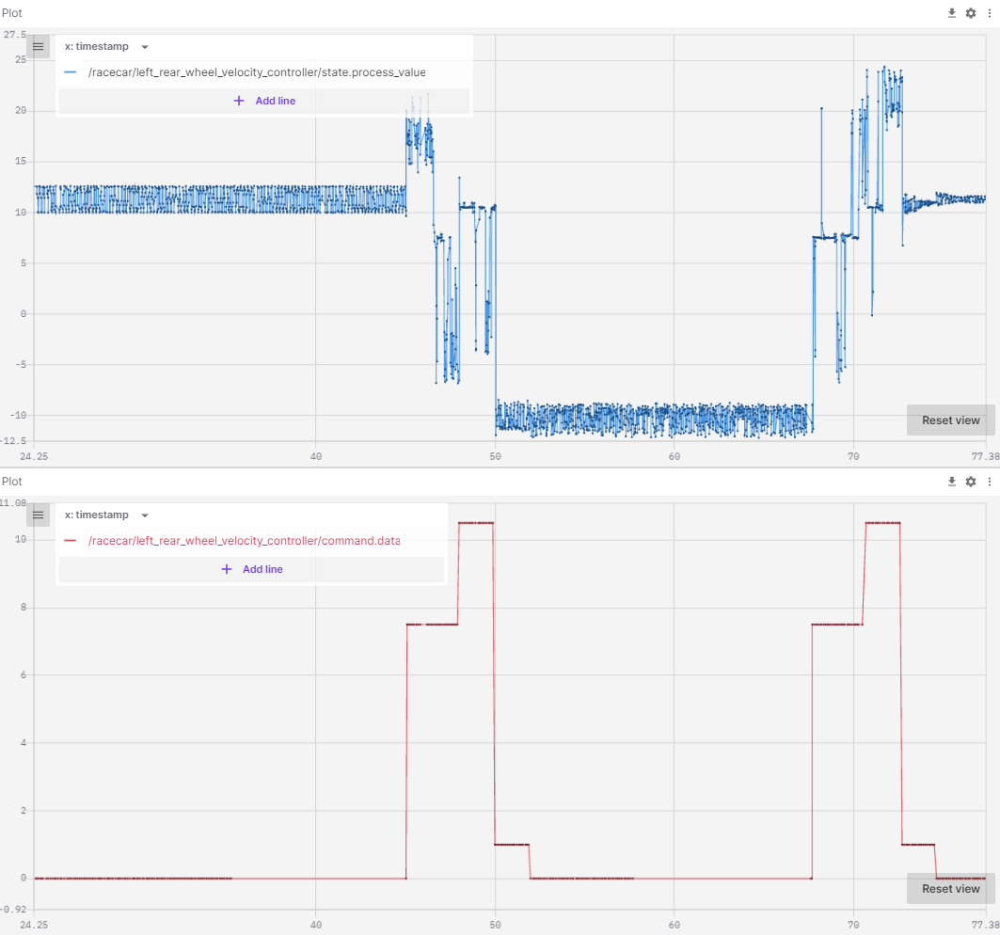

 

<details markdown="block">
  <summary>
    Tartalom
  </summary>
  {: .text-delta }
1. TOC
{:toc}
</details>

---


# Gyakorlat

A gyakorlaton a [robotverseny szimulációt](https://sze-info.github.io/arj/szimulacio/gazebo_robotverseny.html) fogjuk használni. A szimulátor linkenlt leírás alapján telepíthető.

Melodic
{: .label .label-green }

Noetic
{: .label .label-purple }


## Sebességszabályzó PID hangolása

A következő paranccsal egy üres (akadályok nélküli) szimuláció indul. Ez a PID sebességszabályzó hangolására alkalmas.

```
roslaunch racecar_gazebo racecar_empty.launch
```

```
roslaunch racecar_control cmd_vel_from_file.launch
```

Szükségünk lesz referencia jelek kiadására, megismételhető módon. Ezt a példában egy csv beolvasása, majd `/cmd_vel` topicon hirdetése jelenti. Vizsgáljuk meg a [python fájlt](https://github.com/sze-info/racecar_gazebo/blob/master/f1tenth/virtual/dependencies/racecar_control/scripts/cmd_vel_from_file.py). A  topic hirdetése, a node ROS-ben történő regisztrálása, a csv fájl beolvasása a fájl elején található:

```python
cmd_pub = rospy.Publisher('/cmd_vel', Twist, queue_size=1)
rospy.init_node('cmd_vel_from_file', anonymous=True)
rate = rospy.Rate(10) # 10hz
msg_twist = Twist()
csv_file = rospy.get_param('~csv')
rospack = rospkg.RosPack()
path = rospack.get_path('racecar_control')
rospy.loginfo('csv file is: %s/config/%s' % (path, csv_file))
array = pd.read_csv(path + '/config/' + csv_file, header = None).to_numpy()
start_time = rospy.Time.now()
```

A folyamatosan futó loop `/cmd_vel.linear.x` jeleket hirdet, a csv-ben található idő szerint. A `np.where` visszaadja, hogy az aktuális idő szerint (`current_time`) milyen sebesség indexnél (`itemindex`) tartunk. Ez egy 2D array, ami minden, a feltételnek megfelelő indexet tartalmaz, de számunkra persze csak ennek az első eleme a fontos, ezt fogjuk hirdetni. 

```python
while not rospy.is_shutdown():
    current_time = (rospy.Time.now() - start_time).to_sec()
    itemindex = np.where(array[:,0] >= current_time)
    try:
        msg_twist.linear.x = array[itemindex[0][0],1]
    except:
        msg_twist.linear.x = 0.0
    cmd_pub.publish(msg_twist)
    rate.sleep()
```

A `roscd` parancs segítségével lépjünk a `racecar_control` package `config` mappájába.

```
roscd racecar_control/config/
```

Ez valószínűleg a `~/sim_ws/src/racecar_gazebo/f1tenth/virtual/dependencies/racecar_control/config` helyen található, de elképzelhtő, hogy valaki máshova telepítette.

Innen betölthetünk különböző PID beállításokat, pl: 

```
rosparam load racecar_control01.yaml
rosparam load racecar_control02.yaml
rosparam load racecar_control03.yaml
```

Ellenőrizzük a `get` paranccsal, a következőhöz hasnonló eredményt fogunk kapni: 

``` c
rosparam get /racecar/left_rear_wheel_velocity_controller/pid/
{antiwindup: false, d: 0.0, i: 0.0, i_clamp: 0.0, i_clamp_max: 0.0, i_clamp_min: -0.0,
  p: 5.0}
```

{: .highlight }
Alternatívaként használhatjuk a `rosrun rqt_reconfigure rqt_reconfigure` parancsot is.

Futtassuk a következő parancsot a sebesség referencia kiadására:
```
roslaunch racecar_control cmd_vel_from_file.launch
```
A launch fájlba megadhatjuk, hogy pl a `01.csv`, `02.csv` stb fájlt töltse-e be. Többször futtathatjuk, akár más PID beállítások mellett is.


Figyeljünk meg két topicot pl Foxglove segítségével, különböző PID beállítások mellett:
- `/racecar/left_rear_wheel_velocity_controller/state.process_value`
- `/racecar/left_rear_wheel_velocity_controller/command.data`




## Kormányzás PID hangolása

A következő parancsra, már nem üres, hanem egy körbekerített versenypálya nyílik meg.

```
roslaunch racecar_gazebo racecar.launch
```

A pálya a következőképp néz ki:

