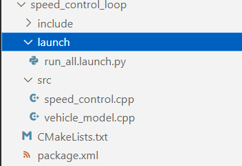
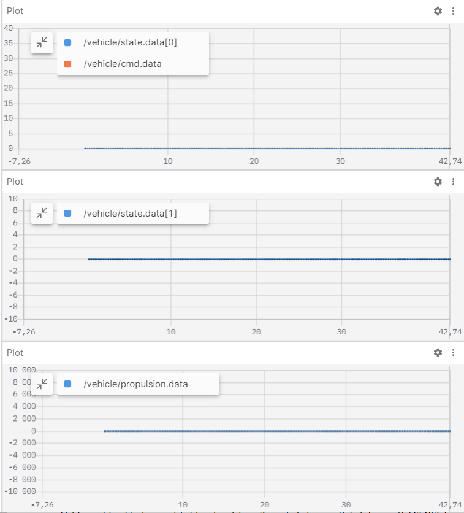
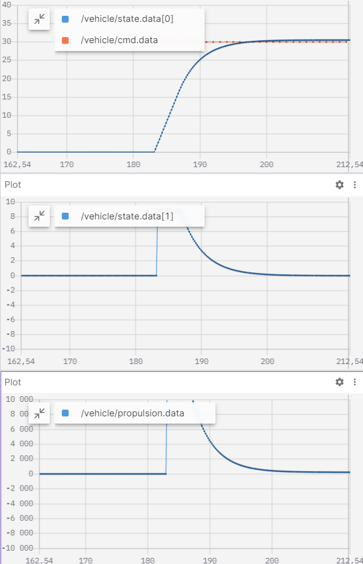
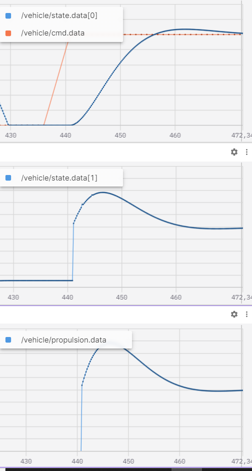
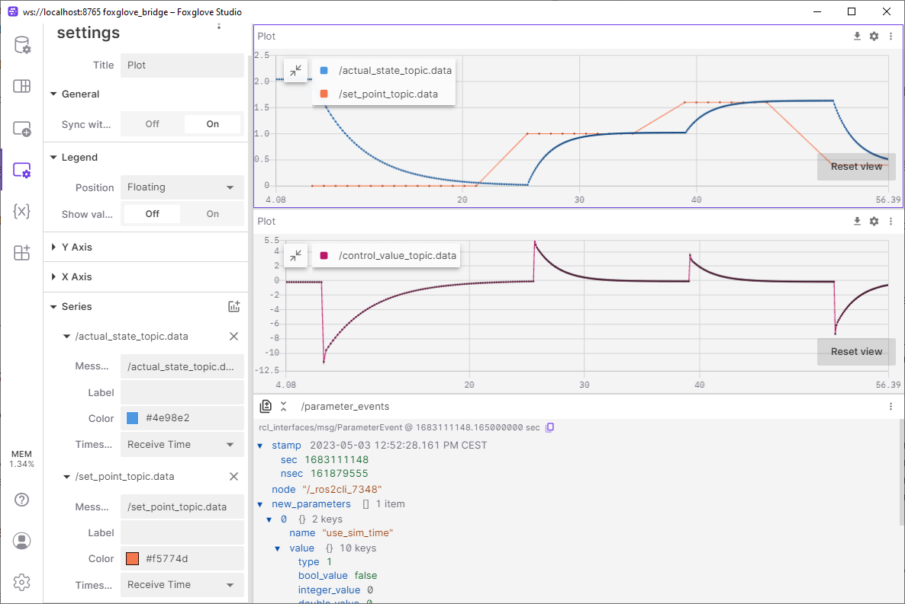
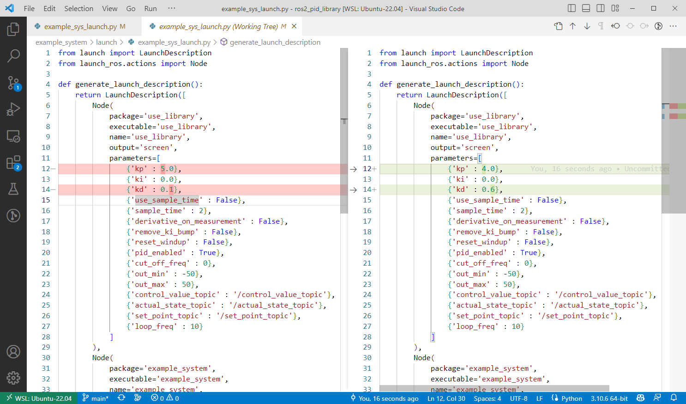
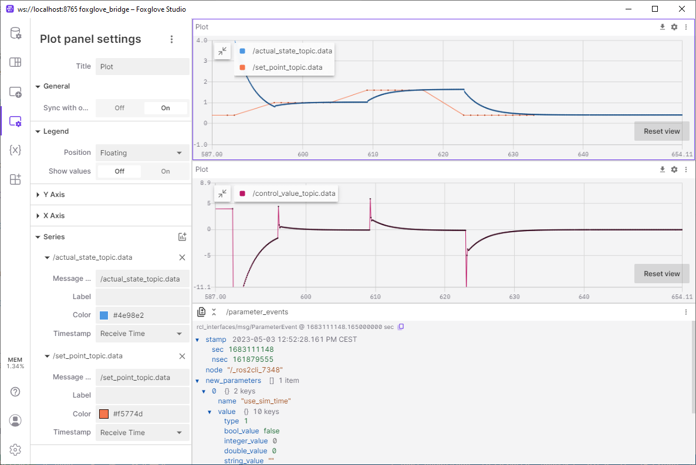

 

<details markdown="block">
  <summary>
    Tartalom
  </summary>
  {: .text-delta }
1. TOC
{:toc}
</details>

---


# Gyakorlat

A gyakorlat első részében egy példa első illetve másodrendű rendszert fogunk használni, erre fogunk PID szabályzót alkalmazni, majd hangolni.
A gyakorlat második részében egy szimulált trajektóriakövető robot / jármű működését nézzük át és hangoljuk.

[](https://docs.ros.org/en/humble/)

- [`1. feladat`: Trajektóriakövetés szimulációval](#1-feladat-trajektóriakövetés-szimulációval)
- [`2. feladat`:  Saját fejlesztésű szabályzó és jármű modell](#2-feladat--saját-fejlesztésű-szabályzó-és-jármű-modell)
- [`3. feladat`: PID hangolás](#3-feladat-pid-hangolás)


## `1. feladat`: Trajektóriakövetés szimulációval


[github.com/jkk-research/sim_wayp_plan_tools](https://github.com/jkk-research/sim_wayp_plan_tools)

### Követelmények
A gyakorlat hibamentes lefutásához a következő programok telepítése szükséges: 
- ROS 2 Humble: [docs.ros.org/en/humble/Installation.html](https://docs.ros.org/en/humble/Installation.html)
- Gazebo Fortress: [gazebosim.org/docs/fortress/install_ubuntu](https://gazebosim.org/docs/fortress/install_ubuntu), Több információ az integrálásról: [gazebosim.org/docs/fortress/ros2_integration](https://gazebosim.org/docs/fortress/ros2_integration)
- `ros-gz-bridge` Egy parancsal installálható: `sudo apt install ros-humble-ros-gz-bridge`
- Ellenőrizük, hogy a [`colcon_cd`](https://docs.ros.org/en/humble/Tutorials/Beginner-Client-Libraries/Colcon-Tutorial.html#setup-colcon-cd) megfelelően van telepítve. A csv fájlok a `colcon_cd`-vel töltődnek be.

### Package-ek és build

Az alapértelmezett workspace a következő legyen:`~/ros2_ws/`.

### Klónozuk le a package-eket

``` bash
cd ~/ros2_ws/src
```

```
git clone https://github.com/jkk-research/wayp_plan_tools
```

```
git clone https://github.com/jkk-research/sim_wayp_plan_tools
```

### ROS 2 -es package-ek buildelése

``` bash
cd ~/ros2_ws
```
```
colcon build --packages-select wayp_plan_tools sim_wayp_plan_tools
```
### `wayp_plan_tools` használata szimulátorként

#### 1. A gazebo indítása
```
ign gazebo -v 4 -r ackermann_steering.sdf
```

#### 2. A Gazebo bridge indítása

Ha esetleg nem lenne telepítve a bridge, a következő parancsok segítenek:
``` bash
sudo apt update
```

``` bash
sudo apt install ros-humble-ros-gz -y
```

Tanteremben pedig:

```
cd /mnt/kozos/script
```

```
./gz_bridge.sh
```

Ne felejtsünk el `source`-olni az ROS-es parancsok előtt.

``` r
source ~/ros2_ws/install/local_setup.bash
```

``` r
ros2 launch sim_wayp_plan_tools gazebo_bridge.launch.py
```

Ez a `launch` fájl a következő node-okat indítja el egyben:

``` r
ros2 run ros_gz_bridge parameter_bridge /world/ackermann_steering/pose/info@geometry_msgs/msg/PoseArray[ignition.msgs.Pose_V
```
``` r
ros2 run ros_gz_bridge parameter_bridge /model/vehicle_blue/cmd_vel@geometry_msgs/msg/Twist]ignition.msgs.Twist
```
``` r
ros2 run ros_gz_bridge parameter_bridge /model/vehicle_blue/odometry@nav_msgs/msg/Odometry[ignition.msgs.Odometry --ros-args -r /model/vehicle_blue/odometry:=/odom
```
Több információ a bridge-ről: [github.com/gazebosim/ros_gz/blob/ros2/ros_gz_bridge/README.md](https://github.com/gazebosim/ros_gz/blob/ros2/ros_gz_bridge/README.md)

Ez a `launch` a `PoseArray`-ből egy `/tf`-et is készít a `pose_arr_to_tf`.

#### *Opcionális*: A gazebo-ban lévő robot irányítása billentyűzettel:

``` r
ros2 run teleop_twist_keyboard teleop_twist_keyboard --ros-args -r /cmd_vel:=/model/vehicle_blue/cmd_vel
```

#### 3. Waypointok betöltése

**Megjegyzés:** A waypointok egy ponthalmaz, amely az útvonal pozíció, orientáció és sebesség adatait tartalmazza diszkrét pontokra osztva. Ezeket az adatokat jellemzően úgy nyerjük ki hogy az útunk során ROS-ben rögzítjük a gps-től vagy az odometriától az x,y esetleg z koordinátákat, az aktuálishoz képest a következő pontra mutató orientációt és az éppen aktuális sebesség adatot. Végül az imént felsoroltakat csv fájlokban rögzítjük.  

Használjuk a ROS 2-es workspacet `file_dir`-ként:
``` r
ros2 run wayp_plan_tools waypoint_loader --ros-args -p file_name:=sim_waypoints1.csv -p file_dir:=$HOME/ros2_ws/src/sim_wayp_plan_tools/csv -r __ns:=/sim1
```
Vagy az alapparaméterekel:

``` r
ros2 launch sim_wayp_plan_tools waypoint_loader.launch.py
```
#### 4. Waypoint goal pose-ként
Ahogy az elméleti rész 4. fejezetben az ábrákon látható, minden szabályozási algoritmushoz tartozik egy vagy több goal pose amire az éppen működő szabálzó szabályoz. 

``` r
ros2 run wayp_plan_tools waypoint_to_target --ros-args -p lookahead_min:=2.5 -p lookahead_max:=4.5 -p mps_alpha:=1.5 -p mps_beta:=3.5 -p waypoint_topic:=waypointarray -p tf_frame_id:=base_link -p tf_child_frame_id:=map -r __ns:=/sim1
```
Vagy az alapparaméterekel:

``` r
ros2 launch sim_wayp_plan_tools waypoint_to_target.launch.py
```
#### 5. A szabályzás indítása:

Több lehetőség van:
- `single_goal_pursuit`: Pure pursuit (for vehicles / robots), a simple cross-track error method
- `multiple_goal_pursuit`: Multiple goal pursuit for vehicles / robots an implementation of our [paper](https://hjic.mk.uni-pannon.hu/index.php/hjic/article/view/914)
- `stanley_control`: Stanley controller, a heading error + cross-track error method
- `follow_the_carrot`: Follow-the-carrot, the simplest controller

Egy példa a pure pursuit-ra :

``` r
ros2 run wayp_plan_tools single_goal_pursuit --ros-args -p cmd_topic:=/model/vehicle_blue/cmd_vel -p wheelbase:=1.0 -p waypoint_topic:=targetpoints -r __ns:=/sim1
```
Vagy az alapparaméterekel:

``` r
ros2 launch sim_wayp_plan_tools single_goal_pursuit.launch.py
```
#### 6. Az eredmények vizualizálása `RViz2`-ben:
``` r
ros2 launch sim_wayp_plan_tools rviz1.launch.py
```
**Vagy futtasunk mindent együtt egyetlen parancsal:**

After `ign gazebo -v 4 -r ackermann_steering.sdf` (terminal 1) and `source ~/ros2_ws/install/local_setup.bash` (terminal 2), run this command (also in terminal 2): 
``` r
ros2 launch sim_wayp_plan_tools all_in_once.launch.py
```

### Hibaelhárítás

A `ign gazebo server` leállítása:

``` r
ps aux | grep ign
```

``` r
ab  12345 49.9  1.2 2412624 101608 ?      Sl   08:26  27:20 ign gazebo server
ab  12346  518  6.6 10583664 528352 ?     Sl   08:26 283:45 ign gazebo gui
ab  12347  0.0  0.0   9396  2400 pts/2    S+   09:21   0:00 grep --color=auto ign
```

Ha azonosítva van a PID a folyamat leállításához használd a kill parancsot. Például a gazebo szerver leállításához:

``` r
kill 12345
```

## `2. feladat`:  Saját fejlesztésű szabályzó és jármű modell
Ebben a feladatban elkészítjük az elméleten bemutatott sebesség szabályzót, és az ahhoz kapcsolódó egyszerű járműmodellt.

Ha ezt eddig nem tettük meg, frissítsük az arj_packages repository-t:

``` r
git pull
```

Navigáljunk a workspace src mappájában a repo gyökérmappájába:

``` r
cd ~ros2_ws/src/arj_packages
```

Vizsgáljuk meg a repository tartalmát:

``` r
dir
```
Látjuk, hogy megjelent egy speed_control_loop nevű almappa. Ez a mappa tartalmazza a szabályzáshoz használt járműmodellt és a szabályzót. Nyissuk meg a forráskódot VS Code segítségével.



A mappa tartalmazza a szokásos package xml-t és a CMakeList-et, továbbá két cpp forrásfájlt. A vehicle_model.cpp értelemszerűen a járműmodellt, a speed_controller.cpp a szabályzót tartalmazza. Vizsgáljuk először a jármű modell forráskódját!

### Járműmodell

``` r
class VehicleModel : public rclcpp::Node
{
public:
    VehicleModel() : Node("vehicle_model")
    {
        timer_ = this->create_wall_timer(std::chrono::milliseconds(200), std::bind(&VehicleModel::loop, this));  
        state_pub_ = this->create_publisher<std_msgs::msg::Float32MultiArray>("/vehicle/state", 10);
        cmd_sub_ = this->create_subscription<std_msgs::msg::Float32>("/vehicle/propulsion", 10,  std::bind(&VehicleModel::propulsion_callback, this, std::placeholders::_1));
        RCLCPP_INFO(this->get_logger(), "vehicle_model has been started");
    }
```

A szokásos #include-ok és névdefiníciók után a járműmodell osztály konstruktora látható. A node neve "vehicle_model". Egy topic-ra iratkozunk fel, a ```/vehicle/propulsion``` nevűre, amely a nevéből is adódódan a járműre ható hajtóerőt adja meg. Ezen kívül hirdetjük a ```/vehicle/state``` nevű topicot, mely megadja a jármű mozgásállapotát.

Ezt követően definiálunk néhány változót. 
1. Először egy lokális változót, melyben a bemeneti erőt tároljuk el.
2. Ezt követi egy tömb, mely tartalmazni fogja a jármű sebességét és gyorsulását, a két állapotváltozót, melyekkel a jármű állapotát leírjuk.
3. Definiálunk egy Fload nevű változót, amelyben megadhatjuk, milyen extra terhelések hassanak a járműre.
4. Végül definiálunk néhány nem változtatható paramétert, pl. a jármű súlyát, homlokfelületének nagyságát...stb.

``` r
private:
    // input command
    float Fprop {0.0f};

    // vehicle state array
    std::vector<float> state; //speed, acceleration
    float vx{0.0f};
    float ax{0.0f};

    // load
    float Fload{0.0f};

    // params
    float m {1350.0}; // kg
    float A {1.5f}; // m^2
    float rho {1.0f}; // kg/m^3
    float c {0.33f}; // aerodynamic factor
    float b {0.1f}; // rolling friction, viscosous
```

A topic callback függvény kizárólag a bejövő adatot másolja a lokális változónkba.

``` r
void propulsion_callback(const std_msgs::msg::Float32 input_msg)
{
    Fprop = input_msg.data;
}
```

Végezetül a loop() függvény, melyben először számítjuk az ellenállási erőket (légellenállás és viszkózus súrlódás), majd számítjuk az eredő erőt és ebből a jármű gyorsulását. A jármű gyorsulását integrálva kapjuk a jármű sebességét.

``` r
void loop()
{
    // calculate new state based on load, prop force, mass and aerodynamic drag
    float Faero = 0.5*A*rho*c*pow(vx,2);
    float Ffric = b*vx;
    ax = (Fprop - Ffric - Fload - Faero)/m;
    vx = std::max(0.0f, vx + ax*0.1f); // 0.1s is the time step of the model

    // Publish state
    state.clear();
    std_msgs::msg::Float32MultiArray state_msg;
    state.push_back(vx); // m/s
    state.push_back(ax); // m/s^2

    state_msg.data = state;
    state_pub_->publish(state_msg);
}
```

### Szabályzó

A speed_control.cpp-ben a jármű sebességének PID szabályzását láthatjuk.
A node neve "speed_control", feliratkozik a ```/vehicle/state``` topicra, melyet a jármű modell hirdet.
Ezen kívül hirdetjük a ```/vehicle/propulsion``` command topicot, egyúttal feliratkozunk a ```/vehicle/cmd``` célsebességet megadó topicra.
A szabályzó lényege, hogy a user által megadott sebességet szabályozza úgy, hogy előállítja a járműhajtás számára a célerőt. A modell állapotától függően növeljük vagy csökkentjük a célerőt.

``` r
class SpeedControl : public rclcpp::Node
{
public:
    SpeedControl() : Node("speed_control")
    {
        timer_ = this->create_wall_timer(std::chrono::milliseconds(200), std::bind(&SpeedControl::loop, this));  

        cmd_pub_ = this->create_publisher<std_msgs::msg::Float32>("/vehicle/propulsion", 10);
        state_sub_ = this->create_subscription<std_msgs::msg::Float32MultiArray>("/vehicle/state", 10, std::bind(&SpeedControl::state_callback, this, std::placeholders::_1));
        cmd_sub_ = this->create_subscription<std_msgs::msg::Float32>("/vehicle/cmd", 10, std::bind(&SpeedControl::cmd_callback, this, std::placeholders::_1));

        this->declare_parameter("/control/P", 100.0f);
        this->declare_parameter("/control/I", 5.0f);
        this->declare_parameter("/control/D", 10.0f);

        RCLCPP_INFO(this->get_logger(), "speed_control has been started");
    }
```

A szabályzást a loop() függvényben láthatjuk. A P, I és D paraméterek ROS paraméterként állíthatók. A hajtó erő 3 tényezőből tevődik össze: a derivatív tagból (Fprop_D), az arányos tagból (Fprop_P) és az integrált tagból (Fprop_I). Ez egy párhuzamos PID struktúra, tehát a három tag összege adja ki a célerőt.

``` r
void loop()
    {
        P = (float)this->get_parameter("/control/P").as_double();
        I = (float)this->get_parameter("/control/I").as_double();
        D = (float)this->get_parameter("/control/D").as_double();
        // calculate new state based on load, prop force, mass and aerodynamic drag
        float Fprop_D = D*((vSet-vx)-error)/0.1;

        float error = vSet-vx;
        float Fprop_P = P*error;
        float Fprop_I = I*integrated_error;

        Fprop = Fprop_P+Fprop_I+Fprop_D;

        Fprop = std::min(std::max(-Fprop_max, Fprop), Fprop_max);

        // Publish cmd
        std_msgs::msg::Float32 cmd_msg;
        cmd_msg.data = Fprop;

        cmd_pub_->publish(cmd_msg);

        integrated_error+= error*0.1f;
    }
```

### Teszt

A teszthez először buildeljük a speed_control_loop packaget!

``` r
colcon build --packages-select speed_control_loop
```

Egy másik terminálban, source-olás után indítsuk el először a vehicle_model node-ot, majd a speed_control node-ot!
Ezt megtehetjük egyszerűen az előre elkészített run_all.launch.py launch fájl segítségével is!

``` bash
cd ~/ros2_ws/src/arj_packages/speed_control_loop
```

``` r
ros2 launch launch/run_all.launch.py
```

Nyissuk meg a Foxglove studiot. És kapcsolódjunk a local host-hoz. Ahhoz, hogy a kapcsolat létrejöjjön, indítsuk el a megfelelő bridge-et! Tegyük ezt egy újabb terminálból!

``` r
cd ~/ros2_ws/
```
```
ros2 launch foxglove_bridge foxglove_bridge_launch.xml
```

Adjunk hozzá 3 plot panelt, majd válasszuk ki a képen látható topicokat.
Mivel még nem határoztuk meg a célsebességet, így az alapértéken zérus. A jármű gyakorlatilag áll, a szabályzó kimenete is zérus.



Hirdessünk kézzel egy topicot, amely megadja a kívánt sebességet (pl. tempomat esetén a kormányon beállított célsebesség)!

``` r
ros2 topic pub /vehicle/cmd std_msgs/msg/Float32 "data: 30.0"
```

Mit látunk? A szabályzó egy ideig a megengedett legnagyobb gyorsulással (kb. 9 m/s^2-el) gyorsítja a járművet, amíg az el nem éri a kívánt 30 m/s-os sebességet. További sebességekkel, illetve paraméter beállításokkal kísérletezhetünk.



Például 

``` r
rosparam set /speed_control /control/I 200.0
```

esetén a sebesség felfutása kevésbé lesz egyenletes, továbbá túllendülés is megfigyelhető. 




## `3. feladat`: PID hangolás

### Videó

A videóhoz hasonló módon szeretnénk szemléltetni a szabályozás kérdéskörét, azonban mi Plotjuggler helyett Foxglove Studio-t használunk.

<iframe width="560" height="315" src="https://www.youtube.com/embed/G-f2eyPifbc?rel=0" title="YouTube video player" frameborder="0" allow="accelerometer; autoplay; clipboard-write; encrypted-media; gyroscope; picture-in-picture; web-share" allowfullscreen></iframe>


A következő leírás azzal a feltételezéssel él, hogy a ROS 2 workspace a `~/ros2_ws/` helyen található.

### `Terminal 1` clone

Klónozzuk a repositoryt:

``` bash
cd ~/ros2_ws/src
```

``` bash
git clone https://github.com/dottantgal/ros2_pid_library
```

### `Terminal 1` build

Lépjünk vissza a workspace gyökerébe és build:

``` bash
cd ~/ros2_ws
```

``` bash
colcon build --packages-select use_library pid_library example_system
```

### `Terminal 2` run

Új terminált nyissunk és futtassuk a következő parancsokat:

``` bash
source ~/ros2_ws/install/local_setup.bash && source ~/ros2_ws/install/setup.bash
```

``` bash
ros2 launch example_system example_sys_launch.py
```

### `Terminal 3` set point

```
ros2 topic pub -r 1  /set_point_topic std_msgs/msg/Float32 "data: 0.0"
```

```
ros2 topic pub -r 1  /set_point_topic std_msgs/msg/Float32 "data: 1.0"
```

```
ros2 topic pub -r 1  /set_point_topic std_msgs/msg/Float32 "data: 1.4"
```

```
ros2 topic pub -r 1  /set_point_topic std_msgs/msg/Float32 "data: 0.6"
```

### `Terminal 4` foxglove

Ha esetleg eddig nem lett volna telepítve:
```
sudo apt install ros-humble-foxglove-bridge
```
Maga bridge így indítható:
```
source ~/ros2_ws/install/local_setup.bash && source ~/ros2_ws/install/setup.bash
```
```
ros2 launch foxglove_bridge foxglove_bridge_launch.xml
```
Ezután Foxglove Studió segítségével `ws://localhost:8765` címen elérhető minden adat.



### VS code

Szerkesszük a `example_sys_launch.py` fájlt, majd `colcon build` (terminal 1) `source` és futtatás.

```
code ~/ros2_ws/src/ros2_pid_library/
```



Futtassuk és figyeljük meg az eredményeket a beavatkozó jel (`control_value`) enyhén más jelleget mutat:




# Források / Sources
- [github.com/dottantgal/ros2_pid_library](https://github.com/dottantgal/ros2_pid_library/) - [MIT license](https://github.com/dottantgal/ros2_pid_library/blob/main/LICENSE)
