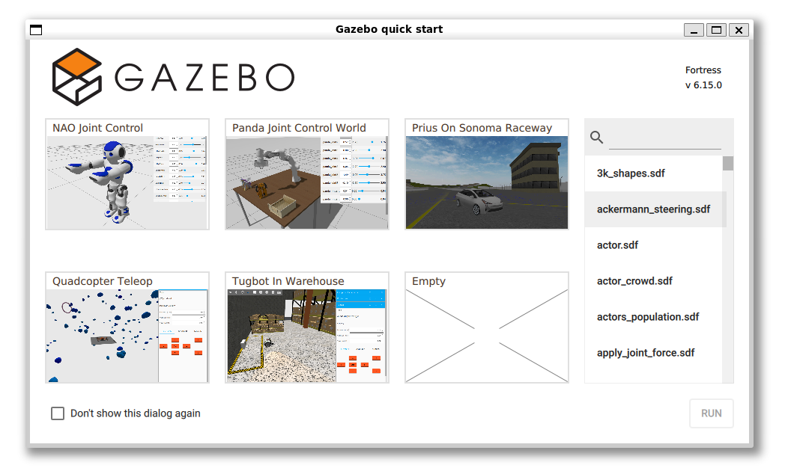

 

<details markdown="block">
  <summary>
    Tartalom
  </summary>
  {: .text-delta }
1. TOC
{:toc}
</details>

---


# Ignition Gazebo Fortress

Az Ignition Gazebo Fortress egy long-term support (LTS) release 2026 szeptemberéig támogatva. ROS 2 Humble kiadással kompatibilis, [lásd a kompatibiltási mátrixot](https://sze-info.github.io/arj/szimulacio/#gazebo-%C3%A9s-ros-kompatibilit%C3%A1s).

[](https://docs.ros.org/en/humble/)

# Telepítés

Ajánlott az Ubuntu és a binary telepítés: [gazebosim.org/docs/fortress/install_ubuntu](https://gazebosim.org/docs/fortress/install_ubuntu). Természetesen az előző linken továbbkattintva elérhetőek a Windowsos illetve a forráskódból fordított verziók is.


# ROS 2 integráció

- [gazebosim.org/docs/fortress/ros2_integration](https://gazebosim.org/docs/fortress/ros2_integration)
- [github.com/gazebosim/ros_gz/blob/ros2/ros_gz_bridge/README.md](https://github.com/gazebosim/ros_gz/blob/ros2/ros_gz_bridge/README.md)

## Megjegyzés `WSL` esetén

Gazebo szimulátort és Windows Subsystem for Linux-ot használva előfordulhat egy [issue](https://github.com/gazebosim/gz-sim/issues/1841), ami egy egyszerű környezeti változó beállításával javítható. A `~/.bashrc` fájlba a következőt kell beállítani:

``` php
export LIBGL_ALWAYS_SOFTWARE=1 ### GAZEBO IGNITION 
```

Új terminál vagy `source` után a `echo $LIBGL_ALWAYS_SOFTWARE` parancsra `1`-et fog kiíni.


# Példa: Gazebo Fortress beépített világok (world)

WSL elsetén első lépésként ellenőrizzük a beállítások helyességét:

``` bash
echo $LIBGL_ALWAYS_SOFTWARE 
```

Amennyiben a parancsra `1`-et ír válaszként, akkor helyes a beállításunk. 

Nézzük meg a telepített verziót:

``` bash
ign param --versions
```

A válasz pl `11.4.1` lehet.

Indítsuk el a Gazebo-t:

``` bash
ign gazebo
```




Nyissuk meg a `shapes.sdf` világot. Az SDF (Simulation Description Format), egy beépített  XML leírás. AKár egy parancsként is indítható: `ign gazebo shapes.sdf`.


# Példa: Ackermann robot

Ackermann robotnak a "személyautó-szerű" elől két kormányzott, hátul pedig két nem kormányzott kerékkel rendelkező járművet / robotot. Ebben a példában egy ilyen robotot szeretnénk mozgatni ROS 2-ből. Az `ign gazebo` parancsra a szimuláció-választó felület indul. Egy paranccsal indítható az Ackermann robot szimuláció:

```
ign gazebo -v 4 -r ackermann_steering.sdf
```


Az Ignition Gazebo ROS 2-től független, de jól támogatott, így `ros_gz_bridge` package segítségével indítható az a bridge, amin a szimmulációs topicok ROS 2 topicként látszanak, pl:

``` bash
sudo apt update
```

``` bash
sudo apt install ros-humble-ros-gz -y
```

Tanteremben pedig:

```
cd /mnt/kozos/script
```

```
./gz_bridge.sh
```

``` bash
ros2 run ros_gz_bridge parameter_bridge /model/vehicle_blue/cmd_vel@geometry_msgs/msg/Twist]ignition.msgs.Twist
```

``` bash
ros2 run ros_gz_bridge parameter_bridge /model/vehicle_blue/odometry@nav_msgs/msg/Odometry[ignition.msgs.Odometry --ros-args -r /model/vehicle_blue/odometry:=/odom
```

``` bash
ros2 run ros_gz_bridge parameter_bridge /world/ackermann_steering/pose/info@tf2_msgs/msg/TFMessage[ignition.msgs.Pose_V  --ros-args -r /world/ackermann_steering/pose/info:=/tf
```

Ez a 3 parancs egy hosszú parancsként is kiadható:

``` r
ros2 run ros_gz_bridge parameter_bridge /model/vehicle_blue/cmd_vel@geometry_msgs/msg/Twist]ignition.msgs.Twist /model/vehicle_blue/odometry@nav_msgs/msg/Odometry[ignition.msgs.Odometry   /world/ackermann_steering/pose/info@tf2_msgs/msg/TFMessage[ignition.msgs.Pose_V  --ros-args -r /world/ackermann_steering/pose/info:=/tf -r /model/vehicle_blue/odometry:=/odom
```

Hogy pontosan milyen szimulációs topicok vannak, az ezekkel a parancsokkal ellenőrizhatő:

``` bash
ign topic -l
```

``` bash
ign topic -et /model/vehicle_blue/tf
```

``` bash
ign topic -i --topic /model/vehicle_blue/tf
```

Billentyűzetről teleoperálhatjuk a járművet:

``` r
ros2 run teleop_twist_keyboard teleop_twist_keyboard --ros-args -r /cmd_vel:=/model/vehicle_blue/cmd_vel
```


# Linkek
- [gazebosim.org/docs/fortress](https://gazebosim.org/docs/fortress)
- [gazebosim.org/docs/fortress/manipulating_models](https://gazebosim.org/docs/fortress/manipulating_models)