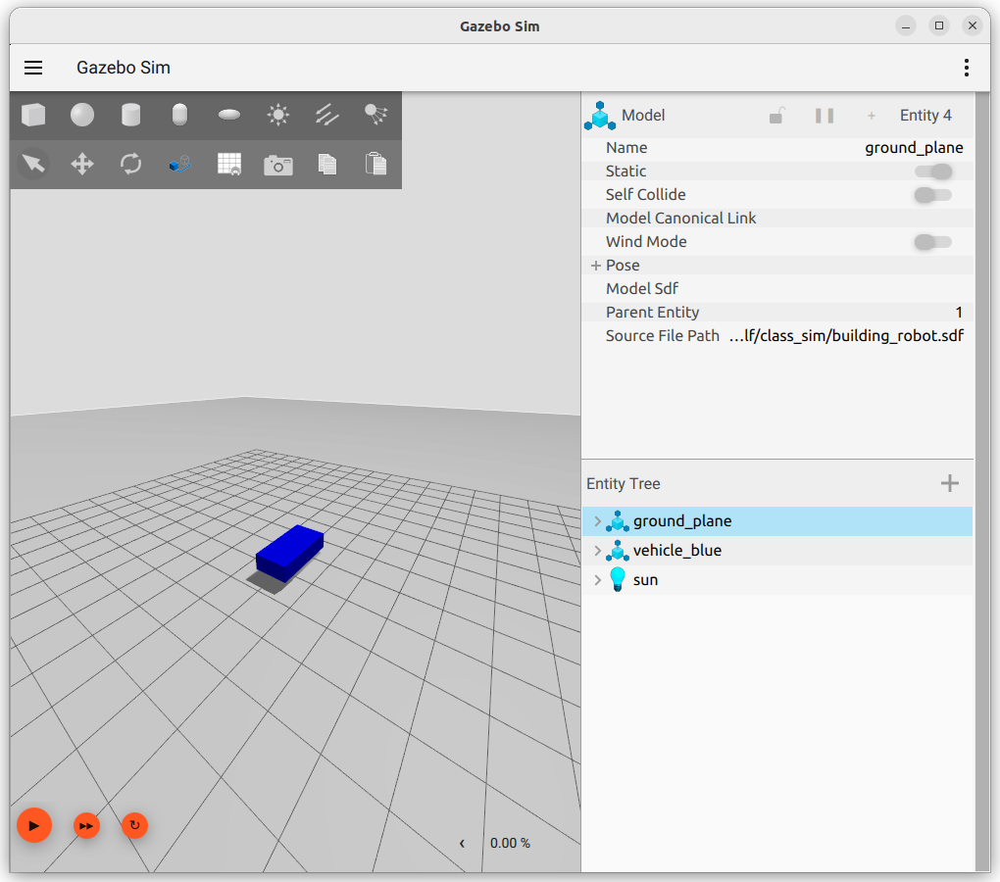

 

<details markdown="block">
  <summary>
    Tartalom
  </summary>
  {: .text-delta }
1. TOC
{:toc}
</details>

---


# Ignition Gazebo gyakorlat

## Saját robotszimuláció létrehozása

A következőkben létre fogunk hozni egy egyszerű környezetet (world), valamint egy robot modellt. Ennek érdekében hozzunk létre egy `simulation` mappát, majd ezen belül a `building_robot.sdf` nevű fájlt. A mappa bárhol létrehozható, illetve a fájl neve is szabadon választható, a követhetőség érdekében érdemes a megadott módon eljárni.

```
mkdir simulation
```
```
cd simulation
```
```
touch building_robot.sdf
```

## Környezet létrehozása

Nyissuk meg a létrehozott fájlt Visual Studio Code segítségével, majd másoljuk be az alábbi kódrészletet:

``` xml
<?xml version="1.0" ?>
<sdf version="1.10">
    <world name="car_world">
        <physics name="1ms" type="ignored">
            <max_step_size>0.001</max_step_size>
            <real_time_factor>1.0</real_time_factor>
        </physics>
        <plugin
            filename="gz-sim-physics-system"
            name="gz::sim::systems::Physics">
        </plugin>
        <plugin
            filename="gz-sim-user-commands-system"
            name="gz::sim::systems::UserCommands">
        </plugin>
        <plugin
            filename="gz-sim-scene-broadcaster-system"
            name="gz::sim::systems::SceneBroadcaster">
        </plugin>

        <light type="directional" name="sun">
            <cast_shadows>true</cast_shadows>
            <pose>0 0 10 0 0 0</pose>
            <diffuse>0.8 0.8 0.8 1</diffuse>
            <specular>0.2 0.2 0.2 1</specular>
            <attenuation>
                <range>1000</range>
                <constant>0.9</constant>
                <linear>0.01</linear>
                <quadratic>0.001</quadratic>
            </attenuation>
            <direction>-0.5 0.1 -0.9</direction>
        </light>

        <model name="ground_plane">
            <static>true</static>
            <link name="link">
                <collision name="collision">
                <geometry>
                    <plane>
                    <normal>0 0 1</normal>
                    </plane>
                </geometry>
                </collision>
                <visual name="visual">
                <geometry>
                    <plane>
                    <normal>0 0 1</normal>
                    <size>100 100</size>
                    </plane>
                </geometry>
                <material>
                    <ambient>0.8 0.8 0.8 1</ambient>
                    <diffuse>0.8 0.8 0.8 1</diffuse>
                    <specular>0.8 0.8 0.8 1</specular>
                </material>
                </visual>
            </link>
        </model>
    </world>
</sdf>
```
A fenti kódrészlet üres környezetet definiál, mindössze egy sík (talaj), valamint alapértelmezett világítás (napfény) található meg benne. Mentsük el a kódot, majd indítsuk el a szimulációt az alábbi módon, a `simulation` mappából:

```
cd ~/simulation
```
```
ign gazebo building_robot.sdf
```

Indítást követően a leírtaknak megfelelő üres környezetet kell látnunk:


## Robot modell létrehozása

Folytassuk a `building_robot.sdf` szerkesztését, a `</model>` címkét követően: 

``` xml
<model name='vehicle_blue' canonical_link='chassis'>
    <pose relative_to='world'>0 0 0 0 0 0</pose>
</model>
```
A robot modell megnevezése ebben az esetben `vehicle_blue` . A megnevezés szabadon megválasztható, viszont fontos figyelni arra, hogy a név egyedi legyen az azonos környezeten belül használt modellek között.

A modellt felépítő elemeket (pl. karosszéria, kerekek stb.) a továbbiakban linkeknek nevezzük.

Minden modellnek lehet egyetlen ún. `canonical_link` eleme. Minden további modellen belül alkalmazott link ehhez fog csatlakozni. Amennyiben nem definiálunk egyetlen `canonical_link` elemet sem, az első link alapértelmezetten `canonical` típusú lesz.

A `<pose>` címke használatával megadható egy link pozíciója és orientációja. A címke után megadott `relative_to` attribútummal megadható, hogy mihez képest szeretnénk a link pozícióját és orientációját definiálni. Az attribútum megadása nélkül a pozíció megadása a környezethez képest történik. A pozíció és orientáció megadásának formátuma `<pose>X Y Z R P Y</pose>`, ahol X, Y és Z a frame-en belüli pozíció koordinátái, R, P és Y pedig az orientációt adja meg radiánban. A robot definiálása során minden paraméternek zérus értéket adtunk, tehát a robot és a környezet frame-je egybeesik.

Minden modell (robot) `jointok` (csuklók / ízületek) által összekapcsolt `linkekből` áll.

## A robotot alkotó linkek definiálása

Minden link létrehozása során meg kell adnunk a következőket:
1. link neve, pozíciója
2. link inerciális tulajdonságai (tömeg és inerciamátrix)
3. vizuális és egyszerűsített (collision) geometria

- Karosszéria

Link létrehozása:

``` xml
<link name='chassis'>
        <pose relative_to='__model__'>0.5 0 0.4 0 0 0</pose>
</link>
```

Inerciális tulajdonságok (a mértékegységek ebben az esetben is SI-ben értendőek):

``` xml
<inertial>
    <mass>1.14395</mass>
    <inertia>
        <ixx>0.095329</ixx>
        <ixy>0</ixy>
        <ixz>0</ixz>
        <iyy>0.381317</iyy>
        <iyz>0</iyz>
        <izz>0.476646</izz>
    </inertia>
</inertial>
```

Vizuális és egyszerűsített (ütközési/collision) geometria megadása:

``` xml
<visual name='visual'>
    <geometry>
        <box>
            <size>2.0 1.0 0.5</size>
        </box>
    </geometry>
    <material>
        <ambient>0.0 0.0 1.0 1</ambient>
        <diffuse>0.0 0.0 1.0 1</diffuse>
        <specular>0.0 0.0 1.0 1</specular>
    </material>
</visual>
```

```
<collision name='collision'>
    <geometry>
        <box>
            <size>2.0 1.0 0.5</size>
        </box>
    </geometry>
</collision>
```

Indítsuk el a szimulációt ismét:


```
cd ~/simulation
```
```
ign gazebo building_robot.sdf
```

Ezt követően a szimulátorban a robot karosszériáját kell látnunk:



- Jobb és bal kerék

Hozzuk létre a robot jobb és bal (hajtott) kerekét képező linkeket. Ezt a robotot definiáló `<model>` címkék között kell megtennünk, ugyanis ide kerül minden olyan link definíciója, amely azonos modellen (a roboton) belül értendő.

A kerekeket hengerek (sphere) segítségével fogjuk létrehozni. A kerekeknek az Y tengely mentén kell elfordulniuk, ezért meg kell adnunk a helyes orientációjukat. 

``` xml
<link name='left_wheel'>
    <pose relative_to="chassis">-0.5 0.6 0 -1.5707 0 0</pose>
    <inertial>
        <mass>1</mass>
        <inertia>
            <ixx>0.043333</ixx>
            <ixy>0</ixy>
            <ixz>0</ixz>
            <iyy>0.043333</iyy>
            <iyz>0</iyz>
            <izz>0.08</izz>
        </inertia>
    </inertial>
```

Vizuális és egyszerűsített (ütközési/collision) geometria megadása:

``` xml
<visual name='visual'>
        <geometry>
            <cylinder>
                <radius>0.4</radius>
                <length>0.2</length>
            </cylinder>
        </geometry>
        <material>
            <ambient>1.0 0.0 0.0 1</ambient>
            <diffuse>1.0 0.0 0.0 1</diffuse>
            <specular>1.0 0.0 0.0 1</specular>
        </material>
    </visual>
    <collision name='collision'>
        <geometry>
            <cylinder>
                <radius>0.4</radius>
                <length>0.2</length>
            </cylinder>
        </geometry>
    </collision>
</link>
```

A bal kerék megadása analóg módon történik, csak a pozíció tekintetében (és természetesen a link nevében) tér el a jobb kerék megadásától: 

``` xml
<link name='right_wheel'>
    <pose relative_to="chassis">-0.5 -0.6 0 -1.5707 0 0</pose> <!--szögek radiánban-->
    <inertial>
        <mass>1</mass>
        <inertia>
            <ixx>0.043333</ixx>
            <ixy>0</ixy>
            <ixz>0</ixz>
            <iyy>0.043333</iyy>
            <iyz>0</iyz>
            <izz>0.08</izz>
        </inertia>
    </inertial>
    <visual name='visual'>
        <geometry>
            <cylinder>
                <radius>0.4</radius>
                <length>0.2</length>
            </cylinder>
        </geometry>
        <material>
            <ambient>1.0 0.0 0.0 1</ambient>
            <diffuse>1.0 0.0 0.0 1</diffuse>
            <specular>1.0 0.0 0.0 1</specular>
        </material>
    </visual>
    <collision name='collision'>
        <geometry>
            <cylinder>
                <radius>0.4</radius>
                <length>0.2</length>
            </cylinder>
        </geometry>
    </collision>
</link>
```

- Támasztógörgő hozzáadása

Van lehetőség enyéni frame-ek létrehozására is, a támasztógörgő felépítése során ezt fogjuk tenni:

```
<frame name="caster_frame" attached_to='chassis'>
    <pose>0.8 0 -0.2 0 0 0</pose>
</frame>
```
A létrehozott frame neve `caster_frame`, amely a `chassis` linkhez csatlakozik. A `<pose>` címke megadja a pozícióját és orientációját ehhez a linkhez képest, viszont a `relative_to` attribútumra az egyéni frame esetében nem volt szükség. 

Folytatódhad a támasztógörgő definiálása:

``` xml
<link name='caster'>
    <pose relative_to='caster_frame'/>
    <inertial>
        <mass>1</mass>
        <inertia>
            <ixx>0.016</ixx>
            <ixy>0</ixy>
            <ixz>0</ixz>
            <iyy>0.016</iyy>
            <iyz>0</iyz>
            <izz>0.016</izz>
        </inertia>
    </inertial>
    <visual name='visual'>
        <geometry>
            <sphere>
                <radius>0.2</radius>
            </sphere>
        </geometry>
        <material>
            <ambient>0.0 1 0.0 1</ambient>
            <diffuse>0.0 1 0.0 1</diffuse>
            <specular>0.0 1 0.0 1</specular>
        </material>
    </visual>
    <collision name='collision'>
        <geometry>
            <sphere>
                <radius>0.2</radius>
            </sphere>
        </geometry>
    </collision>
</link>
```

## Csuklók / ízületek (joints) definiálása

A korábban definiált linkek között összefüggéseket kell definiálnunk. Ezek az összefüggések fogják megadni, hogy a linkek milyen módon mozdulhatnak el egymáshoz képest. Ebből ered a definíció módjának neve is.

- Bal kerék joint

Megadjuk a joint nevét és típusát. A keréknek el kell fordulnia, ezért a `revolute` típust választjuk.

``` xml
<joint name='left_wheel_joint' type='revolute'>
    <pose relative_to='left_wheel'/>
```
Ezt követően megadjuk az alá-fölé rendelő viszonyt:
```
    <parent>chassis</parent>
    <child>left_wheel</child>
```
Végül meg kell adnunk a linkek közötti kényszerek definícióját. Ezek a definíciók bármely frame-re vonatkozóan megadhatóak, nem csak a szülő-gyerek frame-ek között. 

Jelen esetben a keréknek az Y tengely körül kell elfordulnia. Teljesen, többször is körbefordulhat, ezért a mozgás korlátjai pozitív és negatív végtelen lesz.

``` xml
 <axis>
        <xyz expressed_in='__model__'>0 1 0</xyz>
        <limit>
            <lower>-1.79769e+308</lower>    <!--negatív végtelen-->
            <upper>1.79769e+308</upper>     <!--pozitív végtelen-->
        </limit>
    </axis>
</joint>
```

- Jobb kerék joint

A jobb kerék joint definiálása a bal kerékéhez hasonló módon történik:

``` xml
<joint name='right_wheel_joint' type='revolute'>
    <pose relative_to='right_wheel'/>
    <parent>chassis</parent>
    <child>right_wheel</child>
    <axis>
        <xyz expressed_in='__model__'>0 1 0</xyz>
        <limit>
            <lower>-1.79769e+308</lower>    <!--negatív végtelen-->
            <upper>1.79769e+308</upper>     <!--pozitív végtelen-->
        </limit>
    </axis>
</joint>
```

- Támasztókerék joint

Mivel a támasztókerék gömb, minden tengely mentén elfordulhat. Ebből adódóan esetében eltérő típusú joint kerül alkalmazásra: 

``` xml
<joint name='caster_wheel' type='ball'>
    <parent>chassis</parent>
    <child>caster</child>
</joint>
```

Indítsuk el a szimulációt ismét:

```
cd ~/simulation
```
```
ign gazebo building_robot.sdf
```

Ezt követően a szimulátorban a robotot kell látnunk:


Az eddig bemutatottakat tartalmazó XML leíró fájl tartalma:

``` xml
<?xml version="1.0" ?>
<sdf version="1.8">
    <world name="car_world">
        <physics name="1ms" type="ignored">
            <max_step_size>0.001</max_step_size>
            <real_time_factor>1.0</real_time_factor>
        </physics>
        <plugin
            filename="gz-sim-physics-system"
            name="gz::sim::systems::Physics">
        </plugin>
        <plugin
            filename="gz-sim-user-commands-system"
            name="gz::sim::systems::UserCommands">
        </plugin>
        <plugin
            filename="gz-sim-scene-broadcaster-system"
            name="gz::sim::systems::SceneBroadcaster">
        </plugin>

        <light type="directional" name="sun">
            <cast_shadows>true</cast_shadows>
            <pose>0 0 10 0 0 0</pose>
            <diffuse>0.8 0.8 0.8 1</diffuse>
            <specular>0.2 0.2 0.2 1</specular>
            <attenuation>
                <range>1000</range>
                <constant>0.9</constant>
                <linear>0.01</linear>
                <quadratic>0.001</quadratic>
            </attenuation>
            <direction>-0.5 0.1 -0.9</direction>
        </light>

        <model name="ground_plane">
            <static>true</static>
            <link name="link">
                <collision name="collision">
                <geometry>
                    <plane>
                    <normal>0 0 1</normal>
                    </plane>
                </geometry>
                </collision>
                <visual name="visual">
                <geometry>
                    <plane>
                    <normal>0 0 1</normal>
                    <size>100 100</size>
                    </plane>
                </geometry>
                <material>
                    <ambient>0.8 0.8 0.8 1</ambient>
                    <diffuse>0.8 0.8 0.8 1</diffuse>
                    <specular>0.8 0.8 0.8 1</specular>
                </material>
                </visual>
            </link>
        </model>

        <model name='vehicle_blue' canonical_link='chassis'>
            <pose relative_to='world'>0 0 0 0 0 0</pose>   <!--alapbeállítás szerint a megadott póz a világ koordinátáihoz képest értendő-->

            <!--karosszéria-->
            <link name='chassis'>
                <pose relative_to='__model__'>0.5 0 0.4 0 0 0</pose>
                <inertial>
                    <mass>1.14395</mass>
                    <inertia>
                        <ixx>0.095329</ixx>
                        <ixy>0</ixy>
                        <ixz>0</ixz>
                        <iyy>0.381317</iyy>
                        <iyz>0</iyz>
                        <izz>0.476646</izz>
                    </inertia>
                </inertial>
                <visual name='visual'>
                    <geometry>
                        <box>
                            <size>2.0 1.0 0.5</size>
                        </box>
                    </geometry>
                    <!--Az összetevő anyagjellemzői (színe)-->
                    <material>
                        <ambient>0.0 0.0 1.0 1</ambient>
                        <diffuse>0.0 0.0 1.0 1</diffuse>
                        <specular>0.0 0.0 1.0 1</specular>
                    </material>
                </visual>
                <collision name='collision'>
                    <geometry>
                        <box>
                            <size>2.0 1.0 0.5</size>
                        </box>
                    </geometry>
                </collision>
            </link>
            
            <!--Bal kerék-->
            <link name='left_wheel'>
                <pose relative_to="chassis">-0.5 0.6 0 -1.5707 0 0</pose>
                <inertial>
                    <mass>1</mass>
                    <inertia>
                        <ixx>0.043333</ixx>
                        <ixy>0</ixy>
                        <ixz>0</ixz>
                        <iyy>0.043333</iyy>
                        <iyz>0</iyz>
                        <izz>0.08</izz>
                    </inertia>
                </inertial>
                <visual name='visual'>
                    <geometry>
                        <cylinder>
                            <radius>0.4</radius>
                            <length>0.2</length>
                        </cylinder>
                    </geometry>
                    <material>
                        <ambient>1.0 0.0 0.0 1</ambient>
                        <diffuse>1.0 0.0 0.0 1</diffuse>
                        <specular>1.0 0.0 0.0 1</specular>
                    </material>
                </visual>
                <collision name='collision'>
                    <geometry>
                        <cylinder>
                            <radius>0.4</radius>
                            <length>0.2</length>
                        </cylinder>
                    </geometry>
                </collision>
            </link>

            <!--Jobb kerék (ugyanaz, mint a bal kerék, a pozíció tükrözésével)-->
            <link name='right_wheel'>
                <pose relative_to="chassis">-0.5 -0.6 0 -1.5707 0 0</pose>
                <inertial>
                    <mass>1</mass>
                    <inertia>
                        <ixx>0.043333</ixx>
                        <ixy>0</ixy>
                        <ixz>0</ixz>
                        <iyy>0.043333</iyy>
                        <iyz>0</iyz>
                        <izz>0.08</izz>
                    </inertia>
                </inertial>
                <visual name='visual'>
                    <geometry>
                        <cylinder>
                            <radius>0.4</radius>
                            <length>0.2</length>
                        </cylinder>
                    </geometry>
                    <material>
                        <ambient>1.0 0.0 0.0 1</ambient>
                        <diffuse>1.0 0.0 0.0 1</diffuse>
                        <specular>1.0 0.0 0.0 1</specular>
                    </material>
                </visual>
                <collision name='collision'>
                    <geometry>
                        <cylinder>
                            <radius>0.4</radius>
                            <length>0.2</length>
                        </cylinder>
                    </geometry>
                </collision>
            </link>

            <!--Tetszőleges frame-->
            <frame name="caster_frame" attached_to='chassis'>
                <pose>0.8 0 -0.2 0 0 0</pose>
            </frame>

            <!--Támasztógörgő-->
            <link name='caster'>
                <pose relative_to='caster_frame'/>
                <inertial>
                    <mass>1</mass>
                    <inertia>
                        <ixx>0.016</ixx>
                        <ixy>0</ixy>
                        <ixz>0</ixz>
                        <iyy>0.016</iyy>
                        <iyz>0</iyz>
                        <izz>0.016</izz>
                    </inertia>
                </inertial>
                <visual name='visual'>
                    <geometry>
                        <sphere>
                            <radius>0.2</radius>
                        </sphere>
                    </geometry>
                    <material>
                        <ambient>0.0 1 0.0 1</ambient>
                        <diffuse>0.0 1 0.0 1</diffuse>
                        <specular>0.0 1 0.0 1</specular>
                    </material>
                </visual>
                <collision name='collision'>
                    <geometry>
                        <sphere>
                            <radius>0.2</radius>
                        </sphere>
                    </geometry>
                </collision>
            </link>

            <!--Bal kerék joint-->
            <joint name='left_wheel_joint' type='revolute'>
                <pose relative_to='left_wheel'/>
                <parent>chassis</parent>
                <child>left_wheel</child>
                <axis>
                    <xyz expressed_in='__model__'>0 1 0</xyz> 
                    <limit>
                        <lower>-1.79769e+308</lower>    <!--negatív végtelen-->
                        <upper>1.79769e+308</upper>     <!--pozitív végtelen-->
                    </limit>
                </axis>
            </joint>

            <!--Jobb kerék joint-->
            <joint name='right_wheel_joint' type='revolute'>
                <pose relative_to='right_wheel'/>
                <parent>chassis</parent>
                <child>right_wheel</child>
                <axis>
                    <xyz expressed_in='__model__'>0 1 0</xyz>
                    <limit>
                        <lower>-1.79769e+308</lower>    <!--negatív végtelen-->
                        <upper>1.79769e+308</upper>     <!--pozitív végtelen-->
                    </limit>
                </axis>
            </joint>

            <!--Támasztógörgő joint-->
            <joint name='caster_wheel' type='ball'>
                <parent>chassis</parent>
                <child>caster</child>
            </joint>
        </model>
    </world>
</sdf>
```
## A robotplatform mozgatása

A korábbiakban összeállított robot mozgatásához egy plugint, pontosabban a `diff_drive` plugint fogunk alkalmazni. 

Nyissuk meg a korábban létrehozott `building_robot.sdf` fájlt, és a `vehicle_blue` `<model>` címkéin belül hívjuk meg a plugint, valamint definiáljuk a használatához szükséges alapvető paramétereket:

``` xml
<plugin
    filename="libignition-gazebo-diff-drive-system.so"
    name="ignition::gazebo::systems::DiffDrive">
    <left_joint>left_wheel_joint</left_joint>
    <right_joint>right_wheel_joint</right_joint>
    <wheel_separation>1.2</wheel_separation>
    <wheel_radius>0.4</wheel_radius>
    <odom_publish_frequency>1</odom_publish_frequency>
    <topic>cmd_vel</topic>
</plugin>
```

A `<plugin>` címkének két attribútuma van. Az egyik a könyvtár megnevezése, amelyből a plugin származik (`filename`), a másik a plugin neve (`name`). A további címkék a differenciálhajtású robot jellemzői:
- `<left_joint>` és `<right_joint>`: azok a jointok, amelyek kapcsolatot definiálnak a robot bal- illetve jobboldali kereke, és a robot karosszériája között.
- `<wheel_separation>`: a hajtott kerekek közötti távolság, vagyis a nyomtáv. Mivel korábban úgy adtuk meg, hogy a jobb és bal kerék pozíciója az Y tengely mentén -0,6m és 0,6m, a kerekek távolsága 1,2m. 
- `<wheel_radius>`: a hajtott kerekek sugara.
- `<odom_publish_frequency>`: az a frekvencia, amellyel a plugin által számolt odometriát publish-olni szeretnénk.

A paraméterek beállításával a modellünk kész a mozgatásra. A következő lépés az, hogy utasításokat küldjünk neki, ami a `cmd_vel` topic segítségével hajtható végre.

1. Indítsuk el a robotot kézi parancsmegadással

- Az egyik terminálban indítsuk el a szimulációt:
```bash
ign gazebo building_robot.sdf
```

- Egy másik terminálból küldjünk utasítást a robotnak:
```bash
ign topic -t "/cmd_vel" -m ignition.msgs.Twist -p "linear: {x: 0.5}, angular: {z: 0.05}"
```

- Nyomjuk meg a lejátszás gombot a szimulátorban. 

A fenti lépéseket követően a robotmodellnek mozognia kell.

2. Mozgassuk a robotot a billentyűzet segítségével

Most a billentyűzet olvasásával, szintén ROS2 topic által fogjuk irányítani a robotot. Ehhez további két plugin alkalmazása lesz szükséges: `KeyPublisher` és `TriggeredPublisher`.

A `KeyPublisher` egy `ign-gui` plugin, amely beolvassa a billentyűzet billentyűinek lenyomását, és a `/keyboard/keypress` topic-ra küldi. Próbáljuk ki ezt a plugint:

- Egyik terminálban ismét indítsuk el a szimulátort: 

```bash
ign gazebo building_robot.sdf
```

- A szimulátor ablakának jobb felső sarkában klikkeljünk a `plugins` legördülő listára, majd a `Key Publisher` opcióra.

- Egy másik terminálban adjuk meg a következőt, ezzel kiírva az összes billentyűzet-lenyomást:

```bash
ign topic -e -t /keyboard/keypress
```

A következő lépés az, hogy a billentyűzet leütéseit megfeleltessük a robot irányítására alkalmas parancsoknak. Erre fogjuk használni a `TriggeredPublisher` plugint. 

A `TriggeredPublisher` plugin általunk definiált módon hoz létre kimenetet egy adott bemenetnek megfelelően. A `building_robot.sdf` fájlban a `<world>` címkéken belül adjuk meg a következő megfeleltetést:

```xml
<plugin filename="libignition-gazebo-triggered-publisher-system.so"
        name="ignition::gazebo::systems::TriggeredPublisher">
    <input type="ignition.msgs.Int32" topic="/keyboard/keypress">
        <match field="data">16777235</match>
    </input>
    <output type="ignition.msgs.Twist" topic="/cmd_vel">
        linear: {x: 0.5}, angular: {z: 0.0}
    </output>
</plugin>
```

Próbáljuk ki a robot irányítását:

- Indítsuk el a szimulátort ismét:

```bash
ign gazebo building_robot.sdf
```

- Válasszuk ki a `Key Publisher` plugint. 

- Győződjünk meg róla, hogy fut a szimuláció, szükség esetén nyomjuk le a Lejátszás gombot.

- Nyomjuk le a `Fel` (↑) nyílbillentyűt. A robotnak el kell indulnia előre.

## Önálló feladat

Készítsük el az összes nyílbillentyű funkcióját a korábbi kódrészlet kibővítésével. A feladat analóg módon, csak a paraméterek módosításával megoldható, az alábbi megfeleltetések segítségével:

- Balra nyíl, értéke: `16777234`, paraméterek: `linear: {x: 0.0}, angular: {z: 0.5}`
- Fel nyíl, értéke: `16777235`, paraméterek: `linear: {x: 0.5}, angular: {z: 0.0}`
- Jobbra nyíl, értéke: `16777236`, paraméterek: `linear: {x: 0.0}, angular: {z: -0.5}`
- Le nyíl, értéke: `16777237`, paraméterek: `linear: {x: 0.5}, angular: {z: 0.0}`

## Környezet kibővítése

Az eddig létrehozott szimulált környezet csak egy talajsíkot és napfényt tartalmaz. Hozzunk létre további környezeti elemeket primitív statikus elemek hozzáadásával. Kezdjük egyetlen téglatest, "fal" létrehozásával:

```xml
<model name='wall'>
    <static>true</static>
    <pose>5 0 0 0 0 0</pose><!--póz a világhoz képest-->
    <link name='box'>
        <pose/>
        <visual name='visual'>
            <geometry>
                <box>
                    <size>0.5 10.0 2.0</size>
                </box>
            </geometry>
            <!--adjunk hozzá anyagot (színt)-->
            <material>
                <ambient>0.0 0.0 1.0 1</ambient>
                <diffuse>0.0 0.0 1.0 1</diffuse>
                <specular>0.0 0.0 1.0 1</specular>
            </material>
        </visual>
        <collision name='collision'>
            <geometry>
                <box>
                    <size>0.5 10.0 2.0</size>
                </box>
            </geometry>
        </collision>
    </link>
</model>
```

## Önálló feladat

Adjunk hozzá a környezethez további két elemet az alábbi paraméterekkel:
1. elem
    - neve (name): wall1
    - helyzete (pose): (0 12 0 0 0 1.5707)
    - mérete: (0.5 10.0 2.0)
    - anyaga, színe tetszőleges

2. elem
    - neve (name): wall2
    - helyzete (pose): (0 -12 0 0 0 1.5707)
    - mérete: (0.5 10.0 2.0)
    - anyaga, színe tetszőleges

## Szenzor hozzáadása

Az előző részekben kialakítottunk egy mozgatható robotszimulációt, viszont az autonóm működtetéséhez mindenképp szükséges valamilyen szenzor(ok) szimulációja is. A következő lépésekben IMU (Inertial Measurement Unit) szenzort, valamint LiDAR szenzort fogunk hozzáadni a korábban kialakított robothoz. 

- IMU szenzor

Az IMU szenzor három elkülöníthető információt ad:
- A szenzor orientációja kvaternion formátumban.
- A szenzor szögsebessége (X, Y, Z) tengelyek körül.
- A szenzor lineáris gyorsulása (X, Y, Z) tengelyek mentén.

Az IMU szenzor szintén plugin segítségével adható hozzá. Definiáljuk az IMU szenzort a korábban létrehozott fájl szerkesztésével, a `<world>` címkék között:

```xml
<plugin filename="libignition-gazebo-imu-system.so"
        name="ignition::gazebo::systems::Imu">
</plugin>
```

A plugin definiálását követően definiáljuk a szenzorra vonatkozó paramétereket. A szenzor azon link paramétereit adja vissza, amelyhez hozzárendeljük. Mivel a robotra, vagyis a robot karosszériájára vonatkozó méréseket szeretnénk végezni, ezt a linket adjuk meg:

```xml
<sensor name="imu_sensor" type="imu">
    <always_on>1</always_on>
    <update_rate>1</update_rate>
    <visualize>true</visualize>
    <topic>imu</topic>
</sensor>
```

Az alkalmazott paraméterek a következőek:
- `<always_on>`: ha az értéke 1, a szenzor mindig frissíteni fogja a kimenő adatát a frissítési rátának megfelelően.
- `<update_rate>`: a kimenő adat frissítési frekvenciája.
- `<vizualize>`: ha az értéke 1, a szenzor reprezentációja vizuálisan megjelenítésre kerül.
- `<topic>`: a kimenő adatokat tartalmazó topic neve.

Próbáljuk ki a létrehozott szenzort. 

- Mentés után indítsuk el a szimulátort:

```bash
ign gazebo building_robot.sdf
```

- Egy másik terminálban írjuk ki az IMU adatait. Ha a billentyűzettel mozgatjuk a robotot, változás lesz megfigyelhető a szenzoradatokban:

```bash
ign topic -e -t /imu
```

# Források
- [gazebosim.org/docs/fortress/sdf_worlds](https://gazebosim.org/docs/fortress/sdf_worlds)
- [gazebosim.org/docs/fortress/building_robot](https://gazebosim.org/docs/fortress/building_robot)
- [gazebosim.org/docs/fortress/moving_robot](https://gazebosim.org/docs/fortress/moving_robot)