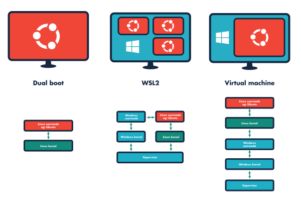

# Telepítés

{: .note-title }
> ROS 2
>
> ROS 1 verziókat csak történelmi okokból tárgyalunk, a jelenlegi fejlesztésekhez a ROS 2-t ajánljuk.

`ROS 1` alapvetően Linux rendszereken támogatott, bár voltak próbálkozások más operációs rendszerekre is. Ezzel szemben az `ROS 2` már támogatja a natív Windows, Mac OS vagy egyéb Real-Time operációs rendszen történő futtatást. Tehát alapvetően négy lehetőség adott:

1. Dual boot, Windows mellé telepített natív Linux (leginkább Ubuntu) ✅ [leírás](https://sze-info.github.io/arj/telepites/ubuntu.html)
2. Windows WSL2, könnyűsúlyú Linux virtuális gép ✅ [leírás](https://sze-info.github.io/arj/telepites/win10.html)
3. Virtuális gép Windowsra 🟠
4. Windows build 🟠

Ebből a 4 lehetőségből az első kettőt ajánljuk, de telmészetesen a többi sem tiltott. A dual boot betekintést nyújt a Linux világba, ami egy mérnöknél hasznos tudást jelent manapság. Telepítésnél körültekintően kell eljárni, hiszen egy rossz beállítás adatvesztést okoz, így a biztonsági mentés is ajánlott. A WSL (Windows Subsystem for Linux) egy könnyűsúlyú kompatibilitási réteg Linux-alapú elemek futtatásához Windows 10, vagy Windows 11 alapú rendszereken. Ahogy a következő ábrán is látszik, a Linux kernel ugyanolyan egyszerűen érheti el a hardverelemeket (CPU, memória, GPU), mint a Windows kernel. Ehhez képest a virtuális gép (3. lehetőség) egy jóval lassabb , több absztrakciós réteget használó megoldás, annak ajánlott, akinek vagy nagyon modern, gyors gépe van, vagy már eleve telepített ilyen rendszereket. A natív Windows build (4. lehetőség) elvileg adott, de mivel a dokumenátió túlnyomó része Linuxra érhető el, így nagyon sok extra munkát fog jelenteni.

Az első három opció szemléltetése:

# Támogatott operációs rendszerek és `ROS` disztibúciók 

| Operációs rendszer| támogatott | támogatott | támogatott |
|:---|:---:|:---:|:---: |
| Ubuntu 18.04  | ROS melodic |  | |
| Ubuntu 20.04  |  | ROS noetic | ROS2 humble|
| Ubuntu 22.04  |  |  | ROS2 humble|
| Windows 10 (natív)| |  | ROS2 humble|
| Windows 11 (natív)| |  | ROS2 humble|
| Windows 10 (WSL2)|ROS melodic  | ROS noetic | ROS2 humble|
| Windows 11 (WSL2)|ROS melodic | ROS noetic | ROS2 humble|

{: .warning }
> Az ROS 1 melodic python 2.7-et támogat, ez nem ajánlott.

# Ubuntu és Python

- Ubuntu `18.04.6 LTS` Python `2.7.17`
- Ubuntu `20.04.4 LTS` Python `3.8.10`
- Ubuntu `22.04.1 LTS` Python `3.10.6`
