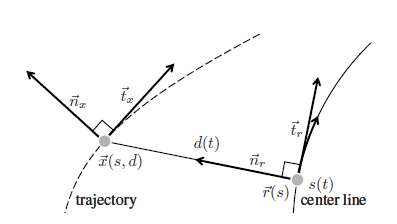
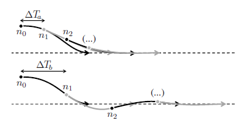
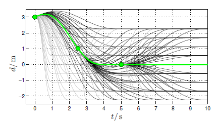

# Tervezés

A tervezés mint fogalom arra a kérdésre ad választ, hogy hogyan jutunk el A-ból B pontba a megfelelő kritériumok mellett. A tervezésnek két alrésze van a **pálya-** vagy **útvonaltervezés**, amely megmondja hogy az adott szakaszon merre kell menni illetve a **trajektóriatervezés**, amely azt mondja meg hogy az adott szakaszon milyen sebességel kell haladnia az adott járműnek. 

A tervezési feladat jellege szerint megkülönböztettünk globális és lokális tervezést. A két tervezési módszer különbségeit az alábbi táblázat foglalja össze: 

Globális tervezés | Lokális tervezés
-----|-----
Térkép alapú | Szenzor alapú
Ismert terep/munkaterület | Ismeretlen terület
Az út tervezés előbb történik mint a mozgás | Az út tervezés és a mozgás egyszerre történik
Nincs szigorú követelmény a számítási időre | Követelmény hogy valós időben működjön 

A tervezés végeredménye mind lokális és globális esetben egy diszkrét pontokra osztott szakasz, amelynek minden pontja tartalmaz pozíció, orientáció és sebesség információkat:
.

# Globális tervezés

## utazó ügynök probléma

Az utazó ügynök probléma egy jól ismert kombinatorikus optimalizációs probléma, amely a számítástudomány és a matematika területén jelent meg. A probléma lényege az, hogy az utazó ügynöknek egy adott városokból álló halmazt kell meglátogatnia, és vissza kell térnie a kiindulási városba a lehető legrövidebb úton úgy, hogy minden várost pontosan egyszer látogat meg.

Formálisan megfogalmazva, legyen adott egy irányított súlyozott gráf, ahol a csomópontok reprezentálják a városokat, az élek a városok közötti utakat jelölik, és a súlyok az élek hosszát jelölik. A cél az, hogy találjunk egy olyan Hamilton-kört (kör, amely minden csomópontot pontosan egyszer érint), amelynek összsúlya minimális. A probléma az NP-nehéz osztályba tartozik, ami azt jelenti, hogy nincs ismert hatékony algoritmus, amely mindig garantáltan megtalálja a legoptimálisabb megoldást polinomiális időben a városok számával arányosan.

# Lokális tervezés

## Motiváció

A lokális tervezés voltaképp a valós időben mért, dinamikusan változó körülményekre adott tervezési válasz. Mit értünk ez alatt? A legegyszerűbb példa, ha a globális tervezést gyakorlatilag egy útvonal megtervezéséhez (pl. hogyan jussak el A-ból B-be) hasonlítjuk, a lokális tervezést pedig az adott sávban, adott forgalmi helyzetben történő feladathoz hasonlítjuk. Azonban láthatjuk, hogy egy tervezési szint "lokális" és "globális" mivoltja nem mindig különül el 100%-ban egymástól. Pl. megtervezzük, hogy az M1-es autópályán szeretnénk haladni. Ezen belül több sáv is van, így melyiket válasszuk? Alapból a külső sávot választjuk, ezt tekinhetjük a globális trajektóriának. Ugyanakkor menetközben sávot kell váltanunk, és így a belső sávot követjük. Ezt egy út során többször megtesszük. A teljes útra vetítve így a követni kívánt sáv időnként a belső, időnként a külső sáv lesz. Ezt előre nem tudjuk megmondani, így a legelső globális trajektória definíciót nem elégítjük ki. Tekinthetjük lokális tervezési problémának, viszont az, hogy a belső vagy külső sávot követjük, nem függ külső tényezőktől, kizárólag a döntés maga függ attól (pl. sávot váltunk egy előttünk haladó autó miatt), viszont ha már sávot váltottunk, az új sáv által kijelölt útvonal megintcsak nem függ dinamikus tényezőktől.
Ezeket az ellentmondásokat többféleképpen is feloldhatjuk:
- egy előre eltervezett útvonalat tekintünk globálisnak (ez esetben ez a külső sáv), mind módosítás lokális, vagy
- magát az autópályán haladást tekintjük globális útvonalnak, ami így nem függ a sávoktól, bevezetünk egy középső szintet, nevezzük globális trajektóriának, amely ez esetben két alternatív útvonalat jelent (külső vagy belső sáv), és egy lokális trajektóriát, ami ennek a módosítása valós idejű információk alapján, vagy
- a globális trajektória sem fix, hanem időben változhat, de csak ritkán, ha erre külső trigger jelt ad (pl. sávváltás).

Ebben a fejezetben a lokális trajektória megtervezéséhéz szükséges alapokat vesszük át, így a következőkben kizárólag erre a szintre koncentrálunk. A fenti példában szereplő lokális tervezési feladatról mind elmondható, hogy:
- adott hozzá valamilyen globális útvonal (pl. sáv), amit alapul veszünk,
- figyelembe kell venni a valósidejű változókat (pl. más járművek),
- mindig a jármű által befutható útvonalat kell tervezni, azaz a lekövető szabályzás szempontjából stabil, az utasok számára pedig komfortos; ezt röviden mondhatjuk "kinetikailag jól kondicionált" útvonalnak is,
- az útvonal legyen biztonságos, azaz ne sértsen határokat illetve kellő távolságot tartson más objektumoktól.

Ahhoz, hogy ezeket a célokat teljesíteni tudjuk, tudni kell, pontosan a globális útvonalat, mérni kell a dinamikus változókat, ismernünk kell a járművet illetve tudnunk kell, pontosan mit jelent az utasok számára a "komfort".
Emellett fontos kiemelni, hogy a lokális útvonal a legtöbbször nem kizárólag pontok halmaza. A trajektória reprezentálására valamilyen modellt használunk, azaz geometriailag kompakt formában írjuk le. Ez a gyakorlatban jelenthet pl. polinomiális formát, Euler-görbét, Spline-t...stb. Ezek a görbe leírások mind véges számú paraméterrel írnak le egy görbét. Ahhoz, hogy a görbe egy pontját megkapjuk, a görbét leíró függvényt kiértékeljük egy adott X távolságon. Ez a megközelítés azért hasznos, mert így hosszú görbéket is kevés paraméter segítségével tudunk leírni, és így a megvalósítás során memóriát és futásidőt spórolunk. Továbbá az egyenlet deriváltjai további mennyiségeket (pl. orientáció, görbület) adnak meg, és így a szabályzás számára ezeket könnyen elő tudjuk állítani.

## Tervezési példa

Az ebben a fejezetben szereplő példát Werling és mtsai. munkájából vettük [1]. Ez a példa egy általános tervezési problémát mutat be, amely tartalmazza fenti szempontok legtöbbjét. Két fontos dologra hívjuk fel a figyelmet:
- a kereszt- illetve hosszirányú tervezési problémát szétválasztjuk, illetve
- a keresztirányú tervezés az ún. Frenét-rendszerben történik.

### Keresztirányú tervezés
A keresztirányú tervezés az útvonal görbéjének megtervezését jelenti. Először a Frenét-rendszer fogalmát vezetjük be. Az illusztárciója az 1. ábrán látható. A Frenét-rendszer egy olyan koordinátarendszer, amely egy tetszőleges görbén (ez esetben pl. a sávközép, vagy a globális trajektória) fut végig az $$s(t)$$ paraméter függvényében.
A tetszőleges görbét nevezzük referencia vonalnak. A Frenét-rendszerben a referencia görbe koordinátája csupa zérus (önmagához képest vett eltérése nulla). Egy tervezett trajektória pontjait ebben a koordinátarendszerben értelmezve könnyű kifejezni azt, ha a trajektóriát egyelővé szeretnénk tenni a referencia görbével. Pl. ha egy tervezett trajektóriát szeretnénk, ha a referencia útvonalban végződne, ebben az esetben a végpontja $$[0; 0]$$, a Frenét-rendszerben. A nem zérus távolság a referencia vonaltól vett távolságot adja meg. Pl. ha a sávközépet tekintjük referenciának, az ettől vett eltérés lett a Frenét-rendszerben vett távolság, amely egy jó intuitív megközelítés is, hiszen az ember maga is sokszor tekinti a sáv közepét referenciának, az attól való eltérést pedig mérvadó mennyiségnek.

  
*1. Ábra: a Frenet frame illusztrálása a tervezett trajektória mentén, forrás: [1]*

A kereszirányú tervezés problémáját kizárólag magas (>30-40kph) sebességekre vizsgáljuk. Erre az esetre Werling és mtsai. egy optimalizációs problémaként tekintenek. A lényeg, hogy a mindenkori állapotban meghatározunk egy polinomot, amelynek a költsége a legkisebb. A költségek illetve súlyok megválasztásával lehet különféle trajektóriákat megtervezni. A tervezés két lehetséges kimenetelét a Frenét-rendszerben a 2. ábra mutatja. Tegyük fel, hogy a szagatott vonal a sáv közepe, ez lesz a referencia vonal, vagyis a globális trajektória. A vastag vonal a lokálisan tervezett trajektória, aminek a célja, hogy rávezesse a járművet a globális trajektóriára. A kezdőpont lehet egy tetszőlegesen választott pont (pl. a jármű pozíciója, vagy a legutóbbi érvényes lokális trajektória utolsó pontja...stb.). A vízszintes irány testesíti meg a független változót. Ennek értéke 0 és egy maximális érték között változik, ezt a tartományt tekinthetjük a görbét leíró egyenlet értelmezési tartományának. Mi számunkra a fontos a görbe megtervezésénél? Egyrészt, hogy a kezdőpontban kezdődjön és a végpontban érjen véget (meglepő módon). Emellett feltételként kezelhetjük azt is, hogy a kezdeti is végorientáció legyen egy adott érték (pl. a kezdeti orientáció egyezzen meg a jármű orientációjával, a végorientáció a referencia vonal orientációjával). A kezdeti és végfeltételeket nevezzük peremfeltételeknek. Szükség esetén további peremfeltételeket szabhatunk meg.

  
*2. Ábra: tervezés lehetséges kimenetei a Frenét-rendszerben, forrás: [1]*

A polinom illesztés során olyan polinomokat keresünk, amelyek kielégítek a peremfeltételeket. A 2. ábrán láthatjuk, hogy egyszerre több polinom is kielégítheti ezeket a feltételeket. A 3. ábra ilyen lehetséges polinomokat mutat. Látható, hogy nem mindegyik görbe éri el ugyanott a referencia vonalat (a vízszintes tengelyt), tehát a hossz függvényében különböztethetünk más-más alakú görbéket. Ezek mindegyike kielégíti a peremfeltételeket, ugyanakkor más alakjuk miatt ezen végigvezetve az autót más kinematikai tulajdonságokat fognak eredményezni. Ahhoz, hogy eldöntsük, melyik a számunkra legjobb görbe, bevezetjük az ún. költségfüggvényt. A költségfüggvény egy olyan függvény, amely szabadon választott szempontjaink szerint eldönti, hogy az adott szempont szerint mennyire jó az adott görbe. A költségeket összegezzük. Azonban nem mindegyik szempont egyformán fontos, így a költsége sem egyformán releváns. Így súlyokat használunk hogy eldöntsük, melyek a legjelentősebb, és melyek a legkevésbé érdekes szempontok. Az összes lehetséges görbére meghatározzuk az összköltséget, majd kiválasztjuk a legkisebb költségű görbét. Ez lesz a végső trajektóriánk, amely így a probléma optimális megoldása (optimális, azaz nem nulla költségű, de a körülményeket figyelembe véve a legkisebb költségű megoldás). A folyamatot optimalizációnak, a trajektória hosszát az optimalizáció változójának nevezzük. 

  
*3. Ábra: tervezés lehetséges kimenetei a Frenét-rendszerben, forrás: [1]*

Az, hogy mit tekintünk optimálisnak, a költségfüggvénytől függ. Ebben általában egymásnak ellentmondó tagok szerepelnek: a trajektória hossza legyen minél kisebb (minél gyorsabban érjük el a célt), de a kialakuló oldalirányú járműgyorsulás legyen minél kisebb (komfort feltétel). Ezek egymásnak ellentmondanak, így egy köztes jó, azaz optimális trajektória fog születni. További költségeket vezethetünk be, pl. a túllendülés mértéke (a sáv másik oldalára való áttérés mértéke), a kezdeti rántás, a beállás gyorsasága stb. A súlyok változtatásával más-más preferenciát valósíthatunk meg. Pl. agresszív manőver vagy kényelmes manőver. Ezen kívül kizárjuk azokat a trajektóriákat, amelyek nem felelnek meg a biztonsági követelményeknek, pl. áttérnek a másik sávba.

Werling és mtsai. ötödfokú polinomot határoztak meg, ez írja le a görbét. A Frenét-rendszerben így a görbe egyenlete:

$$ x(s) = c_{0} + c_{1}s + c_{2}s^{2}+c_{3}s^{3}+c_{4}s^{4}+c_{5}s^{5} $$

Láthatjuk, hogy a görbét 6 db paraméter adja meg, a 6 együttható c0-tól c5-ig. Ahhoz, hogy az összes együtthatót meg tudjuk határozni, 6 peremfeltételre van szükségünk:
- a kezdeti és végpont eltérése a referencia vonaltól,
- a kezdeti és végpont orientációjának eltésére a referencia vonaltól,
- illetve a kezdeti és végpontban a tervezett trajektória görbülete.

Ezeket vektoros formába rendezve:
$$ [d_{0} d_{1} \theta_{0} \theta_{1} \kappa_{0} \kappa_{1}] $$

Ezeket tetszőlegesen megválaszthatjuk. A fenti magyarázat alapján legyen:
$$ [d_{0} d_{1} \theta_{0} \theta_{1} \kappa_{0} \kappa_{1}]  = [d_{0} 0 \theta_{0} 0 0 0] $$, azaz a kezdeti pontban a jármű helyzete a referenciavonaltól, a végpontban a referencia vonal, a görbületek pedig nullák, azaz a referencia vonal görbületei a kezdeti és végpontban.
A peremfeltételek segítségével felírható egy 6 ismeretlent és 6 egyenletet tartalmazó egyenletrendszer:
$$ x(s=0) = c_{0} = d_{0}$$
$$ x'(s=0) = c_{1} = \theta_{1}$$
$$ x''(s=0) = 2c_{2} = \kappa_{1}$$
$$ x(s=s_{1}) = c_{0} + c_{1}s + c_{2}(s_{1})^b2}+c_{3}(s_{1})^{3}+c_{4}(s_{1})^{4}+c_{5}(s_{1})^{5} $$
$$ x'(s=s_{1}) = c_{1}s + 2c_{2}(s_{1})+3c_{3}(s_{1})^{2}+4c_{4}(s_{1})^{3}+5c_{5}(s_{1})^{4} $$
$$ x''(s=s_{1}) = 2c_{2}+6c_{3}s_{1}+12c_{4}(s_{1})^{2}+20c_{5}(s_{1})^{3} $$

ahol $$ s_(1) $$ a végpont távolsága. Ez lesz a fenti optimalizációs probléma változója. Ezt a mennyiséget tetszőleges tartományon variálva (pl. $$ s_{1,max} $$ és $$ s_{1,min} $$ között) keressük azt az együttható halmazt, amelyre $$ J $$ költségfüggvény a legkisebb.
Hogyan válasszuk meg a $$J$$ függvényt? Erre Werling és mtsai. a következő formulát ajánlják:

$$ C_{d} = k_{j}J_{t}(d(t)) + k_{t}T + k_{d}(d_{1})^{2} $$

Ahol $$ T = s_{1} / v_{x}$$ a trajektória hossza időben kifejezve, $$J_{t}$$ az ún. jerk (magyarul rántás) az oldalirányú gyorsulás deriváltja, $$d_{1}$$ a végső pontban a távolság a referencia vonaltól. Mi ezt $$d_{1} = 0 $$ értékre választottuk, így ez a tag kiesik. 

# Irodalom jegyzék

[1] Moritz Werling, Julius Ziegler, Sören Kammel, and Sebastian Thrun: Optimal Trajectory Generation for Dynamic Street Scenarios in a
Frenét Frame, 2010 IEEE International Conference on Robotics and Automation, Anchorage Convention District, May 3-8, 2010, Anchorage, Alaska, USA, pp. 987-993

