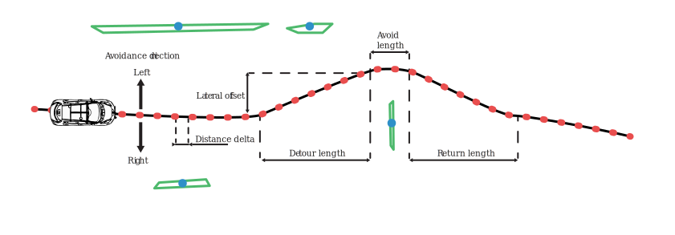

# Tervezés

A tervezés mint fogalom arra a kérdésre ad választ, hogy hogyan jutunk el A-ból B pontba a megfelelő kritériumok mellett. A tervezésnek két alrésze van a **pálya-** vagy **útvonaltervezés**, amely megmondja hogy az adott szakaszon merre kell menni illetve a **trajektóriatervezés**, amely azt mondja meg hogy az adott szakaszon milyen sebességel kell haladnia az adott járműnek. 

A tervezési feladat jellege szerint megkülönböztettünk globális és lokális tervezést. A két tervezési módszer különbségeit az alábbi táblázat foglalja össze: 

Globális tervezés | Lokális tervezés
-----|-----
Térkép alapú | Szenzor alapú
Ismert terep/munkaterület | Ismeretlen terület
Az út tervezés előbb történik mint a mozgás | Az út tervezés és a mozgás egyszerre történik
Nincs szigorú követelmény a számítási időre | Követelmény hogy valós időben működjön 

A tervezés végeredménye mind lokális és globális esetben egy diszkrét pontokra osztott szakasz, amelynek minden pontja tartalmaz pozíció, orientáció és sebesség információkat:
.

# Globális tervezés

## utazó ügynök probléma

Az utazó ügynök probléma egy jól ismert kombinatorikus optimalizációs probléma, amely a számítástudomány és a matematika területén jelent meg. A probléma lényege az, hogy az utazó ügynöknek egy adott városokból álló halmazt kell meglátogatnia, és vissza kell térnie a kiindulási városba a lehető legrövidebb úton úgy, hogy minden várost pontosan egyszer látogat meg.

Formálisan megfogalmazva, legyen adott egy irányított súlyozott gráf, ahol a csomópontok reprezentálják a városokat, az élek a városok közötti utakat jelölik, és a súlyok az élek hosszát jelölik. A cél az, hogy találjunk egy olyan Hamilton-kört (kör, amely minden csomópontot pontosan egyszer érint), amelynek összsúlya minimális. A probléma az NP-nehéz osztályba tartozik, ami azt jelenti, hogy nincs ismert hatékony algoritmus, amely mindig garantáltan megtalálja a legoptimálisabb megoldást polinomiális időben a városok számával arányosan.

