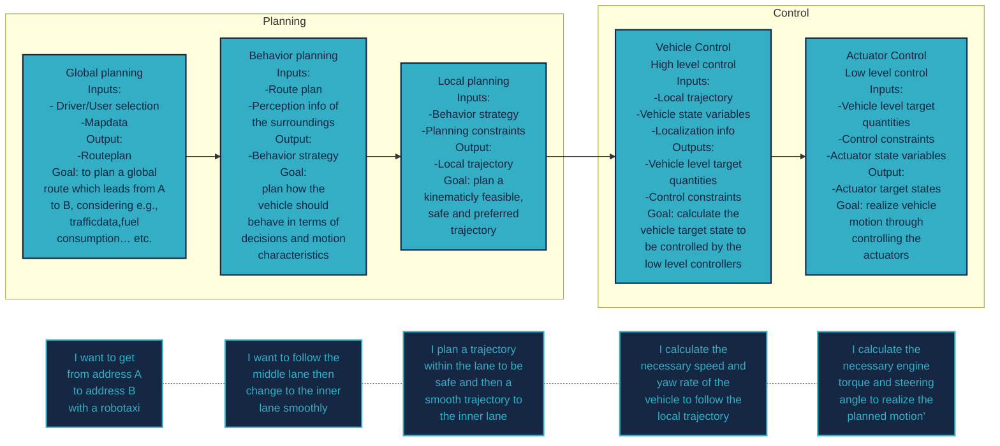

```mermaid
flowchart LR

GP1[Global planning
  Inputs:
  - Driver/User selection
  -Mapdata
  Output:
  -Routeplan
  Goal: to plan a global 
  route which leads from A
  to B, considering e.g., 
  trafficdata,fuel
  consumption… etc.]:::light 
GP2[I want to get 
  from address A 
  to address B 
  with a robotaxi]:::dark

BP1[Behavior planning
    Inputs:
    -Route plan
    -Perception info of
    the surroundings
    Output:
    -Behavior strategy 
    Goal: 
    plan how the 
    vehicle should 
    behave in terms of 
    decisions and motion 
    characteristics
]:::light 

BP2[I want to follow the
middle lane then
 change to the inner
 lane smoothly]:::dark

LP1[
    Local planning
    Inputs:
    -Behavior strategy
    -Planning constraints
    Output:
    -Local trajectory
    Goal: plan a 
    kinematicly feasible,
    safe and preferred
    trajectory]:::light 
LP2[I plan a trajectory
within the lane to be
safe and then a
smooth trajectory to
the inner lane]:::dark


VC1[ Vehicle Control 
    High level control
    Inputs:
    -Local trajectory
    -Vehicle state variables
    -Localization info 
    Outputs:
    -Vehicle level target 
    quantities
    -Control constraints 
    Goal: calculate the
    vehicle target state to 
    be controlled by the
    low level controllers]:::light 
VC2[ I calculate the
 necessary speed and 
 yaw rate of the 
 vehicle to follow the 
 local trajectory]:::dark


AC1[ Actuator Control
Low  level control
Inputs:
-Vehicle level target 
quantities
-Control constraints
-Actuator state variables
Output:
-Actuator target states 
Goal: realize vehicle 
motion through 
controlling the 
actuators]:::light 
AC2[ I calculate the 
necessary engine 
torque and steering
angle to realize the 
planned motion’]:::dark


subgraph Plan [Planning]
  GP1
  BP1
  LP1
end
subgraph Control [Control]
  VC1
  AC1
end
GP1-->BP1-->LP1-->VC1-->AC1
GP2-.-BP2-.-LP2-.-VC2-.-AC2


classDef light fill:#34aec5,stroke:#152742,stroke-width:2px,color:#152742  
classDef dark fill:#152742,stroke:#34aec5,stroke-width:2px,color:#34aec5
classDef white fill:#ffffff,stroke:#152742,stroke-width:2px,color:#152742
classDef red fill:#ef4638,stroke:#152742,stroke-width:2px,color:#fff

```

