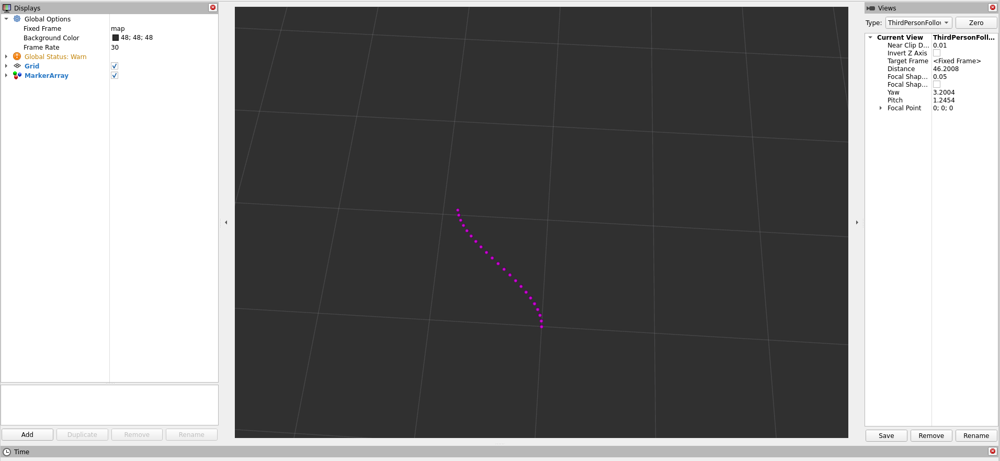
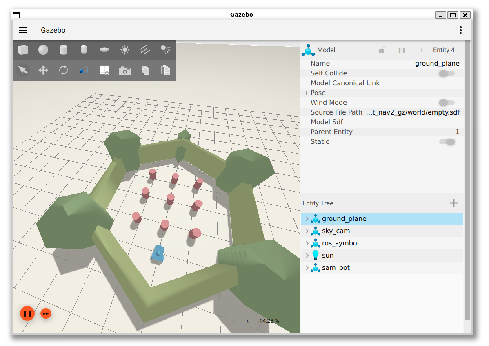

 

<details markdown="block">
  <summary>
    Tartalom
  </summary>
  {: .text-delta }
1. TOC
{:toc}
</details>

---


# `1.` feladat

Ebben a feladatban az elméleti órán bemutatott polinom alapú lokális tervező megvalósítását fogjuk bemutatni.
Ehhez elsőként frissítsük az arj_packages repository-t!

## Clone és build

``` r
cd ~/ros2_ws/src/arj_packages/
``` 
``` r
git pull
```
Ezek után buildeljük az arj_local_planner nevű package-t!

``` r
cd ~/ros2_ws
``` 
``` r
colcon build --packages-select arj_local_planner
```
## Futtatás

Ezek után futtassuk a planner-t a launch fájl segítségével, source-olás után.

``` r
source ~/ros2_ws/install/setup.bash
``` 
``` r
ros2 launch arj_local_planner run_all.launch.py
```

Nézzük meg, milyen topicok jöttek létre (új terminálban)!

``` r
ros2 topic list
```

Létrejött a /goal_pose topic illetve a /planner/trajectory topic. A goal_pose az a célpozíció, amelyre a tervező tervez, a planner/trajectory pedig a waypoint list, maga a tervezett trajektória.
Indítsünk egy rviz-t!

``` r
ros2 run rviz2 rviz2
```

Válasszuk ki a map frame-t, illetve adjuk hozzá a /planner/trajectory topicot. Ezek után a fenti sávból a 2D Goal Pose opciót használva vegyünk fel egy goal pose-t a griden úgy, hogy az a pozitív koordináták irányában helyezkedjen el! Ekkor a tervező automatikusan ráilleszt egy polinomot a célpozícióra.



Ezt az egyszerű tervezőt használhatjuk pl. mozgó célpontra (másik jármű, sáv közepe, globális trajektória egy pontja...stb) illetve statikus célpontra (pl. parkolóhely).

# `2.` feladat


A második feladat a ROS 2 Navigation stack-jének beüzemelése szimulátorban, üres pályán. Részletes dokumentáció a [navigation.ros.org](https://navigation.ros.org/) oldalon.

<iframe width="560" height="315" src="https://www.youtube.com/embed/gjaXRG1d2Fw?si=Xf2iOuBe8ihZnKuV?rel=0" title="YouTube video player" frameborder="0" allow="accelerometer; autoplay; clipboard-write; encrypted-media; gyroscope; picture-in-picture; web-share" allowfullscreen></iframe>

## Clone és build

``` r
cd ~/ros2_ws/src
``` 
``` r
git clone https://github.com/rosblox/nav2_outdoor_example
```

``` r
cd ~/ros2_ws
``` 
``` r
rosdep install -y --from-paths src --ignore-src --rosdistro $ROS_DISTRO
```

``` r
cd ~/ros2_ws
``` 
``` r
colcon build --packages-select nav2_outdoor_example
```

## Futtatás

``` r
source ~/ros2_ws/install/setup.bash
``` 
``` r
ros2 launch nav2_outdoor_example bringup.launch.py
```

# `3.` feladat


A harmadik feladat a ROS 2 Navigation stack-jének beüzemelése szimulátorban, a turlebot egyik pályáján. Részletes dokumentáció a [navigation.ros.org](https://navigation.ros.org/) oldalon.

<video src="https://user-images.githubusercontent.com/2298371/226628768-818a7c3f-e5e1-49c6-b819-112c2cfa668b.webm" type="video/webm" width="560" controls>
</video>

[Videó direkt link](https://user-images.githubusercontent.com/2298371/226628768-818a7c3f-e5e1-49c6-b819-112c2cfa668b.webm)

Megjegyzés: előfordulhat, hogy az `ign_ros_control` package másik feladatban is buildelt package, ha ez már létezik, akkor a build / apt install kihagyható. A helyek, ahol ez lehetséges, hogy megtalálható:
``` r
ros2_ws/src/gz_ros2_control/ign_ros2_control
ros2_ws/src/navigation2_ignition_gazebo_example/src/gz_ros2_control/ign_ros2_control
/opt/ros/humble/share/ign_ros2_control
```


## Clone és build

```r
sudo apt install ros-humble-navigation2 ros-humble-nav2-bringup ros-humble-turtlebot3-gazebo
```


``` r
cd ~/ros2_ws/src
``` 
``` r
git clone https://github.com/ros-controls/gz_ros2_control
``` 
``` r
git clone https://github.com/art-e-fact/navigation2_ignition_gazebo_example
``` 
``` r
cd ~/ros2_ws/src/gz_ros2_control
``` 
``` r
git checkout humble
``` 
``` r
cd ~/ros2_ws
``` 
``` r
rosdep install -y --from-paths src --ignore-src --rosdistro humble
```

``` r
cd ~/ros2_ws
``` 
``` r
colcon build --packages-select sam_bot_nav2_gz
```
## Futtatás

Gazebo, RViz2 és Navigation2
``` r
source ~/ros2_ws/install/setup.bash
``` 
``` r
ros2 launch sam_bot_nav2_gz complete_navigation.launch.py
```

Célpont kijelölése RViz2-ben:
``` r
source ~/ros2_ws/install/setup.bash
``` 
``` r
ros2 run sam_bot_nav2_gz follow_waypoints.py
``` 
``` r
source ~/ros2_ws/install/setup.bash
``` 
``` r
ros2 run sam_bot_nav2_gz reach_goal.py
``` 





## Navigáció


   


# Sources
- [navigation.ros.org/getting_started/index.html](https://navigation.ros.org/getting_started/index.html)
- [navigation.ros.org](https://navigation.ros.org)
- [github.com/ros-controls/gz_ros2_control](https://github.com/ros-controls/gz_ros2_control)
- [github.com/art-e-fact/navigation2_ignition_gazebo_example](https://github.com/art-e-fact/navigation2_ignition_gazebo_example)