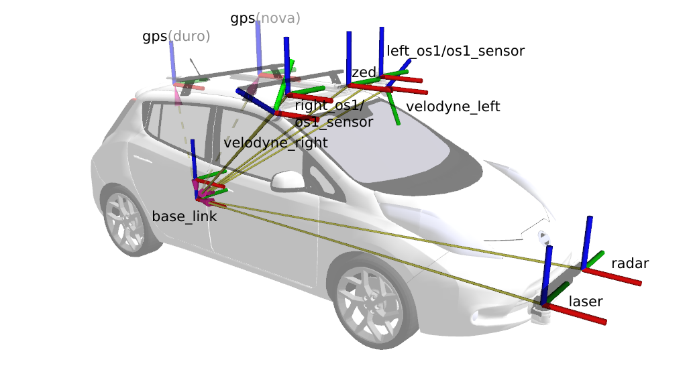
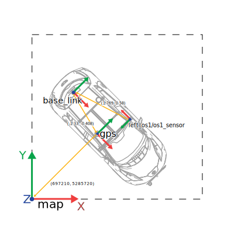
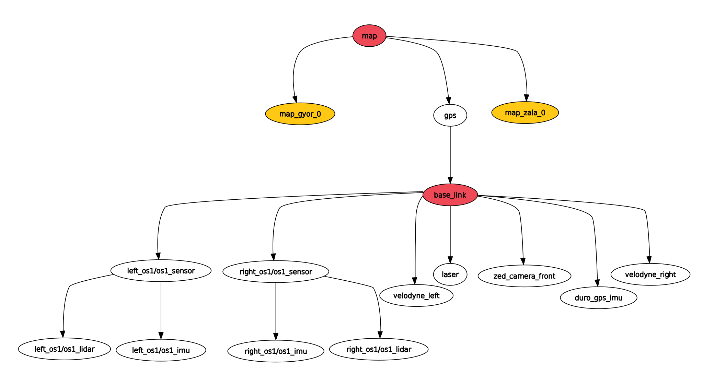
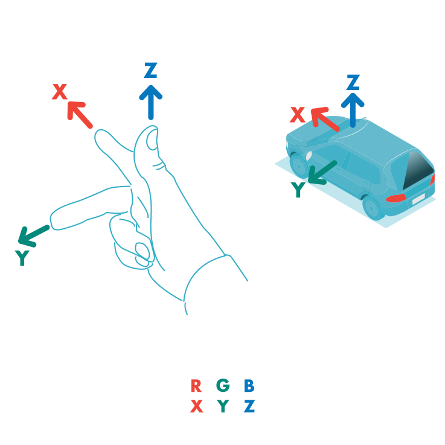
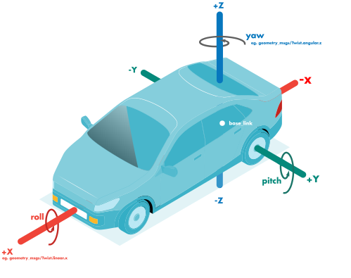
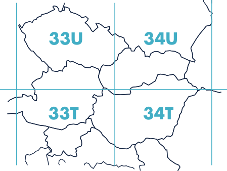

 

<details markdown="block">
  <summary>
    Tartalom
  </summary>
  {: .text-delta }
1. TOC
{:toc}
</details>

---


# Bevezetés

ROS-ben (és álatalában robotikában) a transformok határozzák meg a hogy, mi merre található az adott vonatkozatási ponttól (frame). Több transzform leírhatja például egy robotkar mozgását vagy épp egy jármű és szenzorai helyzetét a térben.

# Merev test mozgása

Merevnek tekinthető az a test, mely pontjainak távolsága mozgás során nem változik, vagyis bármely két pontjának távolsága időben állandó.


- Merev test alakja, térfogata állandó.
- Merev test térbeli helyzete megadható bármely 3 nem egy egyenesbe eső pontjának helyzetével.
- A test **helyzetét** szemléletesebben megadhatjuk egy tetszőleges pontjának 3 koordinátájával (_pozíció_) és a test _orientációjával_.
- Merev testek mozgásai két elemi mozgásfajtából tevődnek össze: **haladó mozgás (transzláció)** és **tengely körüli forgás (rotáció)**
  - **Transzlációs mozgás** során a test minden pontja egymással párhuzamos, egybevágó pályát ír le, a test orientációja pedig nem változik.
  - **Rotáció**  során a forgástengelyen lévő pontok pozíciója nem változik, a test többi pontja pedig a forgástengelyre merőleges síkokban körpályán mozog.


*Rotáció szemléltetése [Forrás: University of Illinois](http://motion.cs.illinois.edu/RoboticSystems/CoordinateTransformations.html)*


Az alábbiakban egy rövid (~9 perc), de hasznos videó látható a témáról:

<iframe width="560" height="315" src="https://www.youtube.com/embed/NGPn9nvLPmg?si=nd182aJPvKvUjxhk" title="YouTube video player" frameborder="0" allow="accelerometer; autoplay; clipboard-write; encrypted-media; gyroscope; picture-in-picture; web-share" referrerpolicy="strict-origin-when-cross-origin" allowfullscreen></iframe>

# Transzformációk

A pose (póz) a pozíció (elhelyezkedés) és orientáció (irány) összessége. Amennyiben egy térbeli pose-t transzformálunk (mozgatunk és forgatunk) egy másik pose keletkezik. Ez a két pose egymáshoz képest két transzformációs frame. Ilyen transzformációs frame-k írják le a teljes robotikai rendszert.

- **Pozíció:** 3 elemű offszet vektor (`x`, `y` és `z` 3D-ben).
- **Orientáció:** több reprezentációt használhatunk:
  - 4 elemű quaternion _(erről később)_
  - 3 elemű Euler-szögek: roll (dőlés, gurulás, ψ): pitch (bólintás, θ), yaw (legyezőmozgás, φ) [wolfram alpha](https://mathworld.wolfram.com/EulerAngles.html)
  - 3 x 3 elemű rotációs matrix

Például a Nissan Leaf `base_link` framejéhez képest a következő fontosabb framek találhatóak meg:


*Frame-k a járművön*

Például a járműves és mobil robotos környezetben gyakran szeretnénk tartani magunkat ahhoz a konvencióhoz, hogy a globális térképet `map` frame-nek, a jármű / robot hátsó tengelyét `base_link`-nek hívjuk. A `map` és a `base_link` közötti megfeleltetés történehet GPS, NDT matching, Kálmán filter, odometria és számos további módon. Ezt a követező példa szemlélteti:


*Példa TF tree*

GPS használata esetén nagyvonalakban a következő példa alapján kell elképzelni a frameket. A `map` a globális térkép, viszont a `gps` helyzetét is tudjuk ehhez képest. (**Megjegyzés**: *a `2020.A` senzor összeállításban 2 GPS is van, ezek kölönböző helyen találhatóak, mérni tudnak párhuzamosan, de csak egy transzform határozhatja meg a `base_link` helyzetét. Ezt az 1. ábrán a szaggatott nyilak jelzik.*) Innen már egy további (statikus) transzformációval kapható a `base_link` (a hátsó tengely). További statikus transzformációkkal kaphatók a szenzorok a példában a `left_os1/os1_sensor` látható.


*A TF tree 2d koordinátarendszerben, vizuális példa*

A transformok a `tf` topicaban hirdetődnek, azonban például az MPC szabályzó egy `current_pose` nevű topicot használ a szabályzás megvalósításához. Ezt úgy oldottuk meg, hogy a `base_link` frame értékeit `current_pose` topic-ként is hirdetjük. A frame transzlációja a topic pozícója, illetve a frame rotációja a topic orientációja.

Nagy transzformoknál az RVIZ megjelenítője nem működik pontosan (https://github.com/ros-visualization/rviz/issues/502). Mivel az ROS SI mértékegységeket használ, így métert is, a GPS esetén célszerű az UTM ([wikipedia-utm](https://en.wikipedia.org/wiki/Universal_Transverse_Mercator_coordinate_system)) koordinátarendszer használata. Ez értelemszerűen nagy értékű koorinátákkal számol. Ahhoz, hogy ezt az ellentmondást feloldjuk célszerű kisebb traszformokat megjeleníteni. Így például Győrhöz (`map_gyor_0`) és Zalához (`map_zala_0`) egy fix statikus transformot, hirdetni, amihez képest már szépen működik az RVIZ megjelenítője. A következő ábra ezt szemlélteti, illetve egy kicsit részletesebb szenzorrendszert mutat be.

*Az `rqt_tf_tree` által megjelenített TF fa*

Az ábrán csak a `map` `gps` transzform változó, a többi statikus. Statikus transzformot hirdetni launch fájlban például a `/base_link` és a `left_os1/os1_sensor` következőképp lehet (lásd 3. ábra)

``` python
Node(
    package='tf2_ros',
    executable='static_transform_publisher',
    name='ouster_left_tf_publisher',
    output='screen',
    arguments=['1.769', '0.58', '1.278','3.1415926535', '0', '0', '/base_link', 'left_os1/os1_sensor'],
),

```


Ugyanez régen `ROS 1`-ben:
``` xml
<node args="1.769 0.58 1.278 3.1415926535 0.0 0.0 /base_link left_os1/os1_sensor 50" name="ouster_left_tf_publisher" pkg="tf" type="static_transform_publisher"/>
``` 
Vagy ugyanez parancsként `ROS 2`-ben statikus transzformként quaternionokkal: 
``` c
ros2 run tf2_ros static_transform_publisher --x 1.769 --y 0.58 --z 1.278 --qx 0.0 --qy 0.0 --qz 1.0 --qw 0.0 --frame-id left_os1/os1_sensor --child-frame-id base_link
``` 

Vagy ugyanez parancsként `ROS 2`-ben roll/pitch/yaw: 
``` c
ros2 run tf2_ros static_transform_publisher --x 1.769 --y 0.58 --z 1.278 --roll 0.0 --pitch 0.0 --yaw 3.1415926535 --frame-id left_os1/os1_sensor --child-frame-id base_link
``` 

Ugyanez régen `ROS 1`-ben (50 ms = 20 Hz):
``` c
rosrun tf static_transform_publisher 1.769 0.58 1.278 3.1415926535 0.0 0.0 /base_link left_os1/os1_sensor 50  
``` 
Itt az utolsó argumentum `ROS 1`-nél 50 ms, tehát 20 Hz-en hirdette a ugyanazt a transzformációt. Ez nem a legszerencsésebb, az `ROS 2` ebben is fejlődött, ott elég egyszer hirdetni ugyanezt.

Példa a statikus transzform launch fájlra: [tf_static.launch](https://github.com/jkk-research/lexus_bringup/blob/main/launch/tf_static.launch.py)


# Mátrix szorzás

A 3D  transzformáció (de természetesen a 2D is) egy mátrix segítségével, egész pontosan mátrisx szorzással írható le. Például, ha egy objektumot elmozdítunk egy adott távolságra, akkor azt egy forgatómátrix segítségével írhatjuk le. A forgatómátrix 3 dimenzióban egy 3x3-as mátrix, amely a forgatás irányát és mértékét határozza meg. 

Forrás: [Robotic Systems, University of Illinois](http://motion.cs.illinois.edu/RoboticSystems/CoordinateTransformations.html)


[matrixmultiplication.xyz](http://matrixmultiplication.xyz/){: .btn .btn-blue .mr-4 }

[Python notebook](https://nbviewer.org/github/horverno/sze-academic-python/blob/master/eload/ealeshtranszformaciok.ipynb){: .btn .btn-blue .mr-4 }


{: .warning }
A python notebook-ot és a mátrixszozás vizualizációt oktatási céllal linkeltük. ROS 2-ben rengeteg funkciót ad a `tf2` és kapcsolódó megoldásai, így nem kell "kézzel" transzlációt és rotációt írni. Transzformációkat például le lehet kérdezni 2 frame között anélkül is, hogy tudnánk pontosan hány frame-n kereszül kapcsolódnak. Az ROS 2 ezt kényelmesen biztosítja. [Erről bővebben itt lehet olvasni](https://docs.ros.org/en/humble/Tutorials/Intermediate/Tf2/Tf2-Main.html)

# Homogén koordináták

A homogén koordináták kényelmes reprezentációt nyújtanak a merevtest transzformációkhoz, mint a lineáris transzformációk egy kibővítéseként a térben. Ráadásul kompaktan reprezentálják a helyzetfüggő és irányfüggő mennyiségek közötti különbséget. Az ötlet az, hogy minden pontot kiegészítünk egy további homogén koordinátával, amely 1, ha helyzetfüggő, és 0, ha irányfüggő. Ezt az műveletet a "hat" (kalap) operátorral (`^`) jelöljük.

# Quaternion (kvaterniók)
A roll pitch yaw (Euler szögek) alternatívája, a komplex számokhoz hasonló kiterjesztéssel. 

Demonstáció: [www.quaternions.online](https://quaternions.online/)

Előnyei:
- __Numerikus stabilitás__:  A lebegőpontos reprezentációból adódó kis numerikus hibák sokszor ismétlődve egyre nagyobb hibákhoz vezethetnek Euler szögek esetén. Például egy forgatás pár század fokos pontatlansága ezrez vagy tízezres ismétléssel komoly hibává adódhat össze. Quaternion-oknál ez a komlex reprezentáció és a normált alak miatt sokkal kisebb.
- __Gyors számítás__: A kvaterniók hatékonyan reprezentálják a 3D térbeli forgatásokat, és sokszor gyorsabbak és stabilabbak lehetnek, mint más reprezentációs módszerek, például Euler-szögek.
- __Pontosság__:
- __Nem érzékeny a "Gimbal lock" prblémára__: Az Euler-szögek esetében előfordulhat egy olyan helyzet, amikor a rotációk szenzitívekké válnak bizonyos irányokban, ami korlátozhatja a számítások pontosságát. A kvaterniók ezt a problémát elkerülik.
- __Könnyen interpolálhatók__: A kvaterniók segítségével könnyen lehet interpolálni a két rotációt közöttük, ami fontos az animációk simaságának megőrzése szempontjából. Sőt nem lineáris interpolációkhoz is használhatók. A kvaterniók lehetővé teszik a nem lineáris interpolációkat is, ami olyan animációk létrehozásához hasznos, ahol a rotáció nem lineárisan változik az időben.


Hátrány:
- __Nem intuitív az ember számára__: Nehezebben érthetők, mint például az Euler-szögek, amiket megszoktunk a 3 tengely körüli forgatásra.

$$tan(\frac{\pi}{2}) = \infty $$

`ROS 2`-ben például így lehet átalakítani roll, pitch, yaw értékeket quaternion-ra.

``` cpp
#include <tf2_geometry_msgs/tf2_geometry_msgs.hpp>
tf2::Quaternion tf2_quat;
tf2_quat.setRPY(roll, pitch, yaw);
```

További információ erről  [itt olvasható](https://docs.ros.org/en/humble/Tutorials/Intermediate/Tf2/Quaternion-Fundamentals.html).
<iframe width="560" height="315" src="https://www.youtube.com/embed/zjMuIxRvygQ?rel=0" title="YouTube video player" frameborder="0" allow="accelerometer; autoplay; clipboard-write; encrypted-media; gyroscope; picture-in-picture; web-share" allowfullscreen></iframe>

# Konvenciók




# Koordinátarendszerek (GPS/GNSS)

A `WGS84` vagy World Geodetic System 1984 egy globális referencia rendszer a térképészetben, geolokációban, navigációban és a GPS (Global Positioning System) rendszerben történő használatra. Ez egy szabványos koordináta rendszer, amelyet a földrajzi szélesség, hosszúság és tengerszint feletti magasság megadására használnak. A földrajzi szélességi (latitude) körök vízszintesen futnak, és fokokban adják meg egy pont helyét a Föld felszínén az egyenlítőtől (0 fok szélesség) északra vagy délre. A hosszúsági körök (longitude) függőlegesen futnak, és fokokban adják meg egy pont helyét a Föld felszínén a keleti vagy nyugati nullameridiántól (0 fok hosszúság). A nullameridián a 0 fok hosszúságánál található, és Londonon Greenwich városrészén keresztül halad. A hosszúsági értékek -180 foktól +180 fokig terjednek, az 180 foknál pedig az Északi és Dél-Keleti hosszúságok összekapcsolódnak. A mérésadat fájl navsatfix topicja (sensor_msgs/msg/NavSatFix) ebben a formátumban került mentésre.
Ennek alternatívája az `UTM` vetületi rendszer, amely nem fokokban, hanem méterekben számol. Az `UTM`, vagyis az Egyesített Térképi Projekció (Universal Transverse Mercator), egy térképi projekciós rendszer, amelyet a térképek készítésére és a navigációhoz használnak. A világ különböző zónáit egy sor speciális hengertérképen ábrázolják, ahol a hosszúsági és szélességi vonalak egyenesek. Ahogy lejjebb látható, Magyarország 4 `UTM` zónába esik: `33U`, `34U`, `33T` és `34T`. Az UTM zónák 6 fokos szélességi sávokra oszlanak szét, ahol minden sávban az ábrázolás egy transzverzális Merkátor-projekción alapuló hengertérképen történik. Az UTM rendszer előnye, hogy egyszerű koordináta-rendszert biztosít, ami kis torzulással rendelkezik a zónákon belül. Ezért sokszor használják katonai térképek, topográfiai térképek, navigációs rendszerek és más térképkészítési alkalmazásoknál. Például a mérésadatoknál a jellemzően current_pose végződésű topicja (`geometry_msgs/msg/PoseStamped`) ebben a formátumban érkező adat.




# Források
- [articulatedrobotics.xyz/ready-for-ros-6-tf](https://articulatedrobotics.xyz/ready-for-ros-6-tf/)
- [Kris Hauser: Robotic Systems University of Illinois at Urbana-Champaign](http://motion.cs.illinois.edu/RoboticSystems/CoordinateTransformations.html)
- [Óbudai Egyetem ABC-iRobotics](https://abc-irobotics.github.io/ros_course_materials_hu/05_da_vinci/)
- [docs.ros.org/en/humble/Tutorials/Intermediate/Tf2/Tf2-Main.html](https://docs.ros.org/en/humble/Tutorials/Intermediate/Tf2/Tf2-Main.html)
- [docs.ros.org/en/humble/Tutorials/Intermediate/Tf2/Quaternion-Fundamentals.html](https://docs.ros.org/en/humble/Tutorials/Intermediate/Tf2/Quaternion-Fundamentals.html)
- [mathworld.wolfram.com/EulerAngles.html](https://mathworld.wolfram.com/EulerAngles.html)